# Transformers Don't Compute — They Compress, Explode, and Self-Destruct

*A layer-by-layer dissection of what actually happens inside a 4B-parameter transformer*

---

Every ML engineer has the same mental model of a transformer: tokens go in, layers refine them one at a time, logits come out. Each layer does "a little bit of attention" and "a little bit of MLP," and after dozens of these gentle refinements, you get a prediction. It's clean, it's symmetric, it's intuitive.

**It's also missing most of the picture.**

I ran four experiments dissecting Qwen3-4B, a 4-billion parameter transformer — measuring the SVD of all 252 weight matrices, computing Jacobians at every layer, tracking the geometry of 4,094 tokens as they flow through all 36 layers, and stress-testing every layer with quantization down to 2-bit precision. What I found looks nothing like the textbook picture.

At layer 16, your 2560-dimensional hidden state collapses to **2.3 effective dimensions**. A single axis explains two-thirds of all variance. Geometrically, the representation is passing through a near-singular bottleneck — almost all distinguishing structure lives on a single axis.

And then it gets weirder: the layers *around* that bottleneck — the ones that look the most linear by every local metric — are precisely the ones that *cannot* be replaced by a linear map. A layer with R² = 0.997 between its outputs and a fitted linear replacement recovers only 54% of model quality when you actually swap it in. The 0.3% of variance it misses is correlated with almost half the downstream loss impact.

This post presents four convergent lines of evidence that the standard understanding of transformer internals is, if not wrong, at least dangerously incomplete.

---

## The Model Under the Microscope

Before diving into the experiments, a brief orientation on the model I dissected. [Qwen3-4B-Instruct-2507](https://huggingface.co/Qwen/Qwen3-4B-Instruct-2507) is a 4-billion parameter decoder-only transformer:

| Component | Detail |
|-----------|--------|
| **Decoder layers** | 36, all identical in structure |
| **Hidden dimension** | 2560 — every token is a 2560-d vector throughout the network |
| **Attention** | Grouped Query Attention (GQA): 32 query heads, 8 key/value heads, head dim 128 |
| **MLP** | SwiGLU: gate and up projections (2560 → 9728), down projection (9728 → 2560), SiLU activation |
| **Normalization** | RMSNorm before each sub-block |
| **Weight matrices per layer** | 7: Q, K, V, O (attention) + gate, up, down (MLP) — **252 total** |
| **Position encoding** | RoPE (Rotary Position Embedding) |
| **Embedding** | Tied — the same 151,936 × 2560 matrix serves as both input embedding and output (LM) head |

Each layer reads from and writes back to a shared **residual stream** — the running sum of all previous layers' outputs plus the original token embedding. When this post refers to "the hidden state at layer $\ell$," it means that cumulative sum after $\ell$ layers have contributed. Concretely, each layer computes:

$$h' = h_\ell + W_O \cdot \text{GQA}(W_Q \hat{h}, W_K \hat{h}, W_V \hat{h}) \quad \text{where} \quad \hat{h} = \text{RMSNorm}(h_\ell)$$

$$h_{\ell+1} = h' + W_{\text{down}} \left( \text{SiLU}(W_{\text{gate}} \hat{h}') \odot W_{\text{up}} \hat{h}' \right) \quad \text{where} \quad \hat{h}' = \text{RMSNorm}(h')$$

The first line is the attention sub-block: normalize, project to queries/keys/values, apply grouped-query attention, project back. The second is the SwiGLU MLP: normalize, project up through two parallel paths (one gated by SiLU), element-wise multiply, project back down. Both write their output back into the residual stream via addition — every layer is a small perturbation on the running sum.

The architecture is completely homogeneous: all 36 layers have the same structure, the same dimensions, and the same parameter count (~101M each). Nothing in the blueprint distinguishes layer 0 from layer 35. As I'll show, the *learned weights* tell a very different story.

---

## The Four Experiments

Here's what I measured:

| # | Experiment | What it measures | Method |
|---|---|---|---|
| 1 | **Residual Stream Geometry** | How the shape and dimensionality of representations change across depth | SVD of hidden states, layer impact metrics, residual decomposition |
| 2 | **Layer Linearization Gap** | How nonlinear each layer's computation actually is, and whether layers can be replaced by linear maps | Jacobian-based perturbation analysis, ridge-regression layer replacement |
| 3 | **Weight Spectral Structure** | How much of their capacity each weight matrix actually uses | SVD of all 252 weight matrices (7 types × 36 layers) |
| 4 | **Quantization Sensitivity** | Which layers and weight matrices break under aggressive compression | Per-layer/matrix RTN quantization at 2–8 bit, full-model method comparison |

Each experiment tells its own story. But when you overlay all four, the picture that emerges is far stranger — and more useful — than any single experiment reveals.

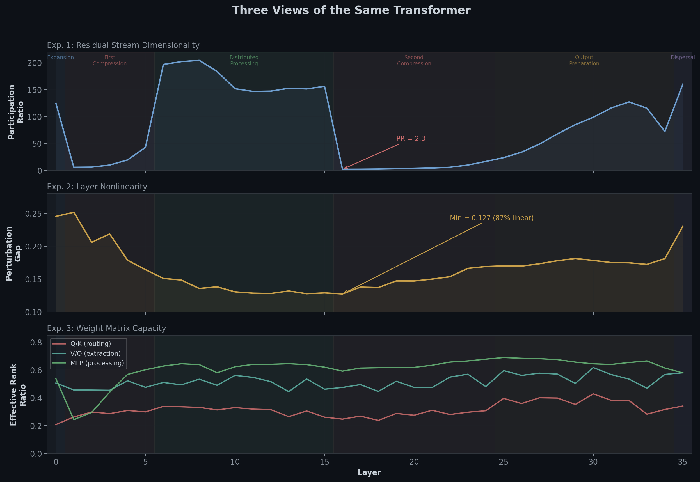
*Figure 1. Three geometric experiments, one story. Top: representation dimensionality collapses and recovers twice (Exp. 1). Middle: nonlinearity follows a U-shape, not the expected monotonic increase (Exp. 2). Bottom: routing matrices (Q/K) use far less capacity than processing matrices (MLP) at every layer (Exp. 3). A fourth experiment — quantization sensitivity — independently confirms the same phase structure (see Part IV).*

---

## Part I: The Six Lives of a Hidden State

The standard picture says representations are gradually refined across layers. The data says something different: the residual stream goes through **six distinct geometric phases**, including two near-singular bottlenecks where information is squeezed down to a handful of dimensions.

### Background: Singular Value Decomposition (SVD)

First, a quick primer on the key mathematical tool. If you're comfortable with SVD, skip to [Participation Ratio](#measuring-dimensionality-participation-ratio).

Any matrix $X$ can be decomposed into three factors:

$$X = U \Sigma V^\top$$

Think of this as breaking a transformation into three steps: (1) rotate inputs to align with the "natural axes" of the transformation ($V^\top$), (2) stretch or shrink along each axis by an amount $\sigma_i$ (the **singular values**, collected in the diagonal matrix $\Sigma$), and (3) rotate to the output space ($U$).

**Why it matters here:** Stack all token representations at a given layer into a matrix $X$ (rows = tokens, columns = hidden dimensions), and the SVD reveals which directions in the 2560-dimensional space actually carry information. A large singular value means many tokens vary strongly along that direction — it's an "active" axis. A near-zero singular value means nothing interesting happens along that direction — the model isn't using that dimension at this layer.

The singular values are always non-negative and conventionally sorted largest-first: $\sigma_1 \ge \sigma_2 \ge \cdots \ge \sigma_n \ge 0$. Their squares $\sigma_i^2$ are proportional to the variance explained by each direction — directly analogous to eigenvalues in PCA. (In fact, PCA of centered data is just SVD under the hood.)

### Measuring Dimensionality: Participation Ratio

To quantify "how many dimensions a representation actually uses," I compute the **participation ratio** (PR). Take all token representations at a given layer, stack them into a matrix, and compute the SVD. The singular values $\sigma_1 \ge \sigma_2 \ge \cdots \ge \sigma_n$ tell you how much variance lies along each direction.

Turn these into a probability distribution by normalizing the squared singular values:

$$p_i = \frac{\sigma_i^2}{\sum_j \sigma_j^2}$$

Now $p_i$ is the fraction of total variance carried by direction $i$. The participation ratio is the inverse of the concentration:

$$\text{PR} = \frac{1}{\sum_i p_i^2}$$

**Intuition:** If all variance sits on one axis ($p_1 = 1$, everything else $= 0$): PR $= 1 / 1^2 = 1$. If variance is spread equally across $k$ axes ($p_i = 1/k$ each): PR $= 1 / (k \cdot (1/k)^2) = k$. In between, PR smoothly interpolates — it tells you the "effective number of active dimensions" without requiring you to pick an arbitrary cutoff like "keep components explaining 95% of variance."

### What I Found

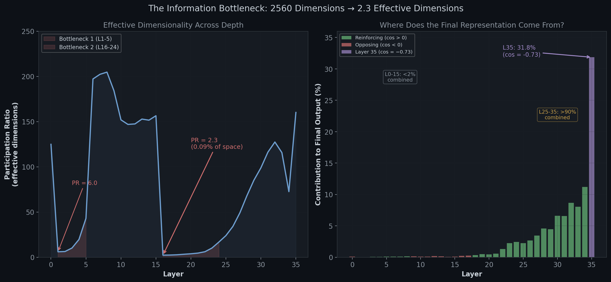
*Figure 2. Left: Participation ratio across depth, with two bottleneck regions highlighted in red. At layer 16, PR = 2.3 — nearly one-dimensional. Right: each layer's signed contribution to the final representation. Green bars = reinforcing updates (aligned with residual), red = opposing. Layer 35 (purple) contributes 31.8% of the final norm while opposing the residual (cos = −0.73). Layers 0–15 together contribute less than 2%.*

The hidden dimension is 2560. Here's how many dimensions the model *actually uses* at each stage:

| Phase | Layers | PR | What happens |
|---|---|---|---|
| **Expansion** | 0 | 73 → 125 | Layer 0 *erases* the embedding (cosine with input = 0.11) and doubles dimensionality |
| **First Compression** | 1–5 | 6–43 | Representations collapse to as few as 6 effective dimensions |
| **Distributed Processing** | 6–15 | 147–205 | Recovery to high dimensionality — the "real work" happens here |
| **Second Compression** | 16–24 | 2.3–17 | The Keyhole — PR drops to **2.3**; top-1 singular value explains **67% of all variance** |
| **Output Preparation** | 25–34 | 24–127 | Norms explode from 139 to 571; representations form a tight directional cone |
| **Dispersal** | 35 | 160 | Layer 35 *actively opposes* the accumulated residual, breaking the cone |

This is not gradual refinement. It's **destroy → compress → expand → compress → cannon → fire backwards**.

To see why layer 16 is a "pinhole," look at the actual singular value spectra:

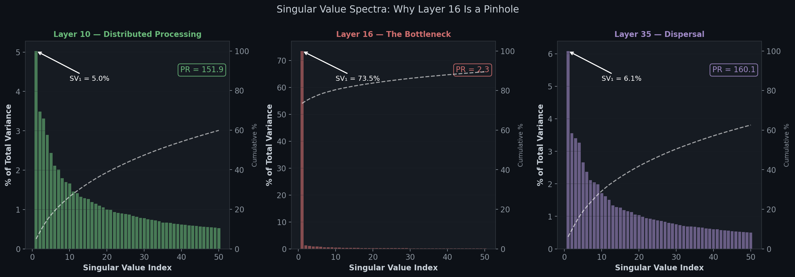
*Figure 2a. Singular value spectra at three representative layers. Layer 10 (distributed processing) spreads variance across many dimensions — a healthy, high-dimensional representation. Layer 16 (the bottleneck) concentrates 67% of all variance on a single axis. Layer 35 (dispersal) is high-dimensional again but with a different spectral shape. Dashed line shows cumulative variance.*

The two bottlenecks are especially important. At layer 16, the model forces all of its intermediate computation through just 2.3 effective dimensions. Whatever features survive this compression are the only ones available to the remaining 19 layers. This has profound consequences for fine-tuning, pruning, and any technique that freezes part of the network — as I'll show in Part V.

### The Embedding Is Erased by Layer 5

A detail that surprises many people: the cosine similarity between each layer's output and the original embedding drops to essentially zero by layer 5. All directional information in the later residual stream comes from the transformer's own updates, not from the embedding table. The embedding provides the initial material, but its *direction* — its geometric identity — is completely overwritten.

### Layer 35: The Dispersal Mechanism

The final layer does something no other layer does. Every layer from 18 to 34 *reinforces* the residual — their updates point in roughly the same direction as the accumulated representation (positive cosine alignment up to +0.44), driving the superlinear norm growth. Then layer 35 arrives and **actively opposes** the residual with a cosine alignment of **−0.73**.

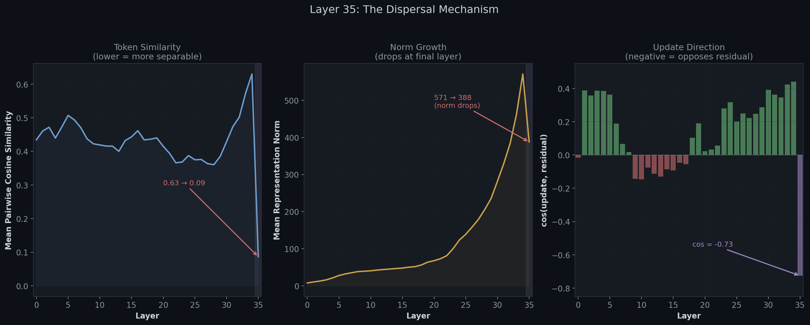
*Figure 3. Layer 35 is unique. Left: mean cosine similarity between tokens drops from 0.63 to 0.09 — tokens become separable. Center: norms drop from 571 to 388 despite the largest update in the model. Right: update-residual alignment is strongly negative — the only layer that actively pushes against everything before it.*

The result: norms drop from 571 to 388 (despite the update being the largest of any layer at 514), and mean cosine similarity between tokens plummets from 0.63 to 0.09. Before this layer, tokens are packed in a tight directional cone and are nearly indistinguishable. After it, they're spread out — and the LM head can finally tell them apart.

Layer 35 isn't refining. Its geometric effect is a dispersal of the anisotropic structure that layers 18–34 built, creating the separation the output head needs. Whether this is a directly optimized behavior or an emergent consequence of training dynamics is an open question — but the geometric outcome is unambiguous. Skip this layer, and cosine similarity stays at 0.63 — the model can't discriminate between tokens.

### Where the Final Prediction Actually Comes From

The residual stream is a running sum: $\mathbf{h}^{(L)} = \mathbf{h}^{(\text{emb})} + \sum_\ell \boldsymbol{\delta}_\ell$. Projecting each layer's update onto the final direction reveals who actually contributes:

- **Layers 0–15**: less than 2% combined
- **Layers 25–35**: over 90% of the final representation

This does *not* mean the early layers are unimportant — layer 0 and layer 6 are the most critical by knockout (99.6× and 21.7× loss increase respectively). But their contributions are *orthogonal* to the final output direction. The first half of the network builds intermediate structure that is essential scaffolding for later computation, even though it contributes almost nothing to the final vector's magnitude along its own axis. The actual prediction is assembled in the last third of the network — and then reshaped by layer 35's dispersal.

A separate experiment (logit lens) confirms this from the prediction side: projecting intermediate hidden states through the LM head shows that top-1 accuracy is near zero through layer 21, then ramps from 11% to 100% between layers 22 and 35. Predictions crystallize *after* the second bottleneck — information passes through the pinhole and then gets decoded.

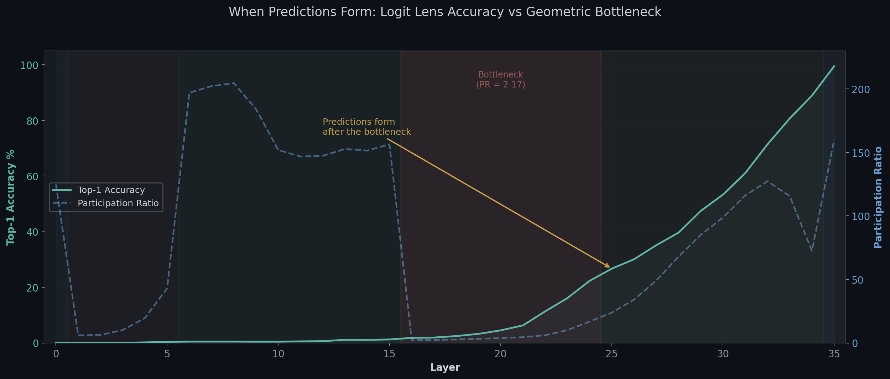
*Figure 2b. Logit lens accuracy (solid cyan) vs participation ratio (dashed blue). Predictions form entirely in the post-bottleneck layers (22–35). The bottleneck region (shaded red) has near-zero prediction accuracy — the model hasn't yet committed to a token identity.*

---

## Part II: The Linearization Paradox

Here's where the data starts to challenge practitioner intuition.

### Measuring Nonlinearity: The Perturbation Gap

Each transformer layer computes $g(\mathbf{x}) = \text{layer}(\mathbf{x}) - \mathbf{x}$ (the residual update, stripping out the skip connection). The best local linear approximation of $g$ at any point is its Jacobian $\mathbf{J}_g$. For a small perturbation $\boldsymbol{\delta}$:

$$g(\mathbf{x} + \boldsymbol{\delta}) \approx g(\mathbf{x}) + \mathbf{J}_g \cdot \boldsymbol{\delta}$$

The **perturbation gap** measures how well this approximation holds:

$$\text{gap} = \frac{\lVert \text{actual change} - \text{linear prediction} \rVert}{\lVert \text{actual change} \rVert}$$

A gap of 0.13 means the nonlinear residual is only 13% the size of the actual displacement — 87% of the layer's behavior is captured by the first-order (linear) term. In practice, I don't form the full 2560 × 2560 Jacobian — only its product with specific perturbation directions is needed, computed via central finite differences: perturb the input in direction $\hat{\mathbf{d}}$, observe the output change, and compare against the linear prediction.

### The U-Shape Nobody Expected

The hypothesis going in was: early layers are more linear (simple token mixing), late layers are more nonlinear (complex feature composition). The data says otherwise:

| Layer range | Gap | Interpretation |
|---|---|---|
| 0–1 | 0.245–0.252 | **Most nonlinear** — embedding projection |
| 8–18 | 0.127–0.138 | **Minimum plateau** — ~87% linear |
| 33–35 | 0.17–0.23 | **Late spike** — MLP-driven |

Nonlinearity follows a **U-shape**, not a monotonic increase. The middle of the network is the most linear part. And the most nonlinear single component is layer 35's MLP (gap = 0.249) — the dispersal mechanism requires hard nonlinear computation.

### R² = 0.997 and It's Useless

This is the experiment's most important result. I tested whether each layer could be replaced by a single learned linear map. For each layer, I collected input-output activation pairs on a calibration set of 200 sequences, fit a ridge-regression map ($\lambda$ selected per-layer by test-set MSE from a grid of $[0.001, 0.01, \ldots, 1000]$) on 80% of the data, and evaluated on the held-out 20%. The replacement map is fit to predict each layer's *residual update* (not total output), then plugged back into the full model for end-to-end evaluation. The metric is **CE recovery** — what fraction of the quality lost by removing the layer does the linear replacement restore:

$$\text{CE Recovery} = 1 - \frac{\text{loss}(\text{linear replacement}) - \text{loss}(\text{original})}{\text{loss}(\text{layer removed}) - \text{loss}(\text{original})}$$

100% means the linear map perfectly reproduces the layer's downstream effect. 0% means it's no better than deleting the layer entirely.

To measure how well each linear map fits the activations it was trained on, I report **R²** (coefficient of determination) — the fraction of variance in the layer's actual output that the linear map explains. R² = 1.0 means a perfect fit; R² = 0.0 means the map predicts nothing beyond the mean. Why R² instead of raw MSE? Because output norms vary by ~70× across layers (from ~8 at layer 0 to ~570 at layer 35) — an MSE of 0.5 could be excellent at one layer and catastrophic at another. R² normalizes this away, giving a comparable 0–1 score at every layer. The natural assumption is that a high R² (good fit) implies high CE recovery (good replacement). As you'll see, this assumption is spectacularly wrong.

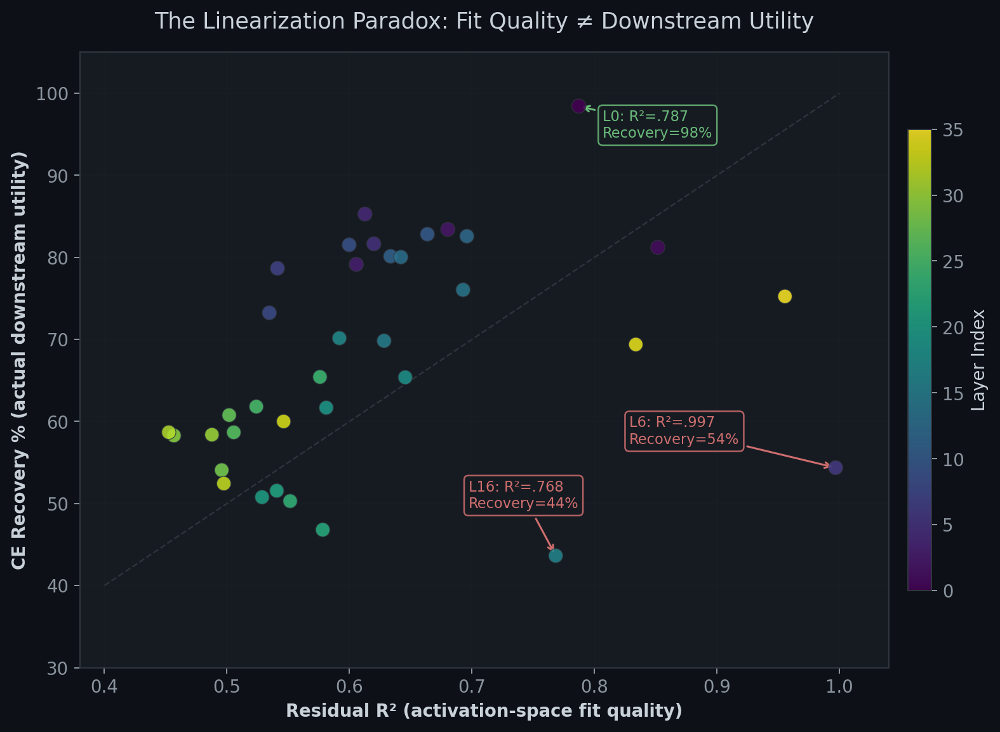
*Figure 4. Each dot is one of the 36 layers, plotted by how well a linear map fits its activations (x-axis, R²) vs how well that map actually works when plugged into the model (y-axis, CE recovery). The expected diagonal relationship doesn't hold. Layer 6 (R² = 0.997, recovery = 54%) is the poster child for the paradox — nearly perfect fit, mediocre replacement.*

The expected relationship — good fit means good replacement — **does not hold**:

- **Layer 6**: R² = 0.997 (the linear map captures 99.7% of activation variance), CE recovery = **54%**. The 0.3% of variance the linear map misses corresponds to nearly half the downstream loss degradation. Independent confirmation comes from a layer knockout experiment: removing layer 6 causes a **21.7× loss increase** — the second most critical layer in the entire model, after only layer 0 (99.6×). Even removing *neighboring* layers alongside it is catastrophic: the (5, 6) pair knockout causes 63.7× loss increase, far exceeding the sum of their individual effects (synergy = 3.53).
- **Layer 16**: R² = 0.768, CE recovery = **37%** (the worst). The fitted map doesn't just fail to help — it actively misleads downstream computation.
- **Layer 0**: R² = 0.787, CE recovery = **98%**. Lower fit quality but near-perfect replacement — because its dominant 8× embedding projection overwhelms the nonlinear variation.

Only **12 of 36 layers** achieve ≥73% CE recovery. The middle-to-late layers (16–33) resist linearization despite having the lowest perturbation gaps.

**You cannot determine whether a layer is replaceable from activation-space metrics alone.** Downstream impact must be measured directly.

### Why "Locally Linear" Doesn't Mean "Globally Replaceable"

The hidden state manifold has an effective dimensionality of only ~18 (out of 2560). Random perturbation directions are almost entirely off-manifold. When I measure the perturbation gap along *actual data directions* (via PCA), a different picture emerges:

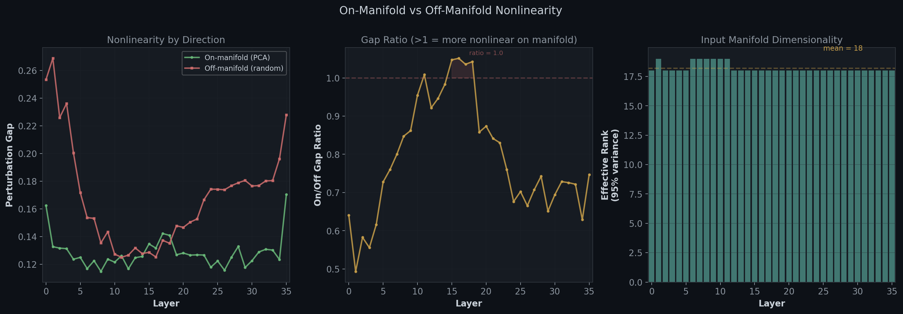
*Figure 5. Left: on-manifold (green) vs off-manifold (red) nonlinearity across depth. Center: their ratio — values above 1.0 mean the model is more nonlinear along data-relevant directions. Right: the data manifold is only ~18-dimensional everywhere.*

Layers 11 and 15–18 have a gap ratio ≥ 1.0 — they are **more nonlinear along data-relevant directions than along random ones**. The nonlinear computation is concentrated where the data lives — whether by design or as a side-effect of training on that data. Either way, the ~13% nonlinear residual isn't noise — it's the computation that matters, aligned with the information the model processes.

And then error amplification through depth makes it worse: a 13% error at layer 16 propagates through 19 subsequent layers, along directions that downstream layers are tuned to be sensitive to. Small in norm, large in informational content.

A quantization experiment (below) provides direct empirical confirmation: the linearity gap correlates with quantization sensitivity at $\rho = 0.71$ ($p < 0.0001$) for the MLP component specifically. Layers the gap flags as "nonlinear" are precisely the ones that break under aggressive quantization — and layers it flags as "linear" survive. The linearization paradox isn't an artifact of the replacement method; it shows up in a completely independent perturbation type.

---

## Part III: Routing Is Cheap, Thinking Is Expensive

The third experiment decomposes the model from a different angle: instead of looking at what flows *through* the layers, I look at the layers' *weight matrices themselves*. Every transformer layer has 7 weight matrices: Q, K, V, O projections in attention, and gate, up, down projections in the MLP. I compute the SVD of all 252 matrices and measure their effective rank.

### The SVD of a Weight Matrix

I introduced SVD in Part I for analyzing *data* (token representations). The same decomposition applies to *weights* — but the interpretation shifts.

For any weight matrix $W \in \mathbb{R}^{m \times n}$, the SVD gives:

$$W = U \cdot \text{diag}(\sigma_1, \ldots, \sigma_n) \cdot V^\top$$

When applied to data, singular values told you "how much variance lies along each direction." When applied to a weight matrix, each singular value $\sigma_i$ tells you "how strongly this matrix amplifies signals along one independent channel." A weight matrix with a few large singular values and many near-zero ones is effectively low-rank — it maps inputs through a narrow bottleneck regardless of what data you feed it.

The **effective rank ratio** applies the same participation ratio formula to the singular values of $W$, then divides by the maximum possible rank (the smaller of $m$ and $n$). A ratio of 0.25 means the matrix is using only 25% of its theoretical capacity — the remaining 75% of its "channels" are barely active.

### The Split: Address Lookup vs Content Retrieval

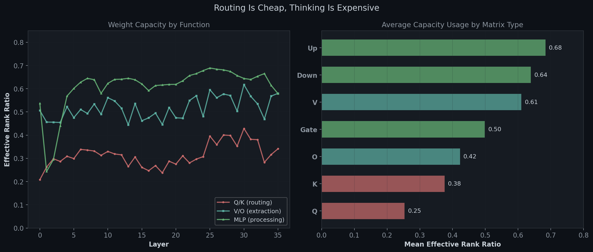
*Figure 6. Left: effective rank ratio across depth for three functional groups. Routing (Q/K) is consistently lowest. Right: average capacity usage by matrix type. Q-projection uses only 25% of its available capacity.*

The results reveal a clean functional hierarchy:

| Matrix Group | Mean Rank Ratio | Interpretation |
|---|---|---|
| **Q (query)** | **0.25** | "Where should I look?" — low-dimensional address lookup |
| **K (key)** | **0.38** | "What's at each position?" — slightly richer addressing |
| **V (value)** | **0.61** | "What should I extract?" — high-dimensional content |
| **O (output)** | **0.42** | Reassembling multi-head outputs |
| **MLP (gate/up/down)** | **0.50–0.68** | The heavyweight processing — uses the most capacity |

**Q/K routing is low-rank in every single layer (36/36)**. "Where to attend" is a much simpler computation than "what to extract." This has a direct practical consequence: Q/K matrices tolerate the most aggressive compression. With 32 query heads at only 25% effective rank, there's massive redundancy in the routing computation — especially in early layers where Q rank ratio drops to 0.23.

To put this in context, I compared each matrix type against its Marchenko-Pastur baseline — the effective rank ratio expected from a random (untrained) matrix of the same shape. All trained matrices fall below their baselines, but the degree of compression varies dramatically:

| Matrix | Trained Rank Ratio | MP Baseline | Trained / Baseline |
|--------|-------------------|-------------|-------------------|
| **Q** | 0.25 | 0.62 | **40%** |
| **K** | 0.38 | 0.71 | 54% |
| **V** | 0.61 | 0.71 | 86% |
| **O** | 0.42 | 0.62 | 68% |
| **MLP** | 0.50–0.68 | 0.79 | 63–86% |

Training compresses routing (Q/K) far more than content processing (V/MLP). Q uses only 40% of a random matrix's capacity — the "where to attend" computation has been squeezed into a much smaller subspace than what a random initialization would occupy.

### The Counterintuitive Correlation: Higher Rank → More Linear

Correlating weight effective rank (Exp. 3) with the perturbation gap (Exp. 2), the naive expectation is: higher rank = more complex computation = more nonlinear. The data says the opposite:

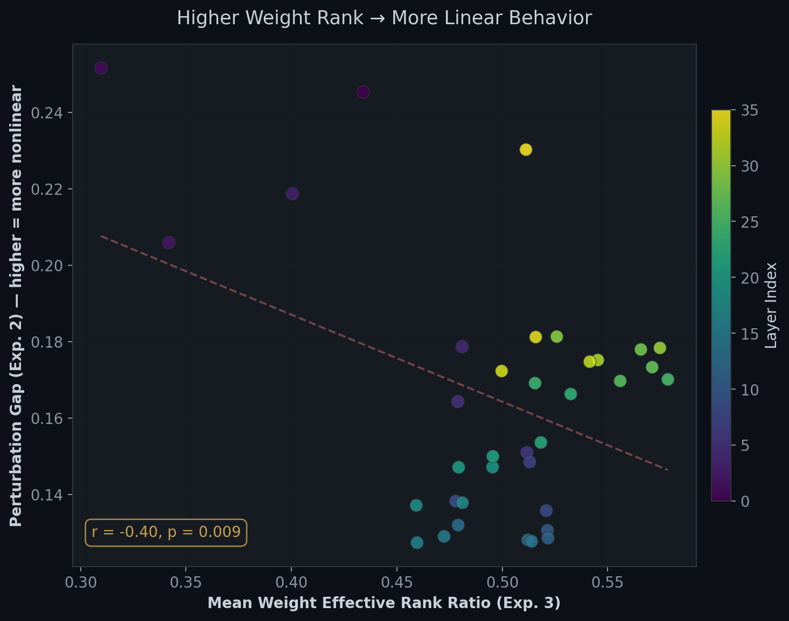
*Figure 7. Each layer plotted by its mean weight effective rank (x-axis) vs perturbation gap (y-axis). The negative correlation (r = −0.43, p = 0.009) means higher-rank layers are more linear, not less.*

**r = −0.43, p = 0.009.** Higher-rank layers are significantly *more* linear.

One plausible explanation is a self-averaging effect. A high-rank layer spreads its computation across many dimensions. Each dimension applies a nonlinear activation (SiLU in the MLP, softmax in attention), but these contributions are relatively independent and small. Heuristically, the sum of many small nonlinear perturbations tends to behave more linearly than any individual one — analogous to CLT-style averaging, though the strict independence assumptions don't hold here. Low-rank layers concentrate computation in fewer dimensions where each nonlinear channel dominates the signal. The moderate effect size (r² ≈ 0.18) suggests this is one contributing factor among several.

Critically, this correlation is **entirely MLP-driven**. Per-matrix analysis shows: up_proj (r = −0.74), down_proj (r = −0.49), gate_proj (r = −0.48). All four attention matrices show r ≈ 0. The SwiGLU MLP is where the rank-linearity relationship lives; softmax attention behaves independently of weight rank.

Per-matrix quantization sensitivity tells the same story from yet another angle: gate_proj is **50x more sensitive** to 3-bit quantization than Q or K projections. Low-rank attention matrices (Q at 25% effective rank) absorb quantization noise with little quality loss, while the higher-rank MLP matrices — particularly the SwiGLU gate, which amplifies errors through a nonlinear activation — are where quantization fails first. The routing/content split isn't just structural; it determines which matrices you can safely compress and which you can't.

---

## Part IV: The Convergence

The four experiments weren't designed to tell a unified story, but they do. Here's how the findings map onto each other:

### The Bottleneck Layers Are Non-Linearizable

The second compression (layers 16–24) has the lowest participation ratio (PR = 2.3–17, Exp. 1), sits in the "linear plateau" of the perturbation gap (gap ~0.13, Exp. 2), and has moderate weight rank (Exp. 3). Naively, these layers look like prime linearization candidates — locally smooth, low-dimensional. But they achieve the *worst* CE recovery (37–65%, Exp. 2). Layer knockout confirms this: layers in the distributed processing zone (6–14) are the most critical to remove, with loss ratios of 5–22×. The bottleneck layers and the layers that feed them are load-bearing — they just don't look like it from local metrics. Why?

Because squeezing through a near-one-dimensional bottleneck means the tiny nonlinear residual encodes *all* the distinguishing information. When representations are compressed to 2–3 effective dimensions, two different inputs land on nearly the same axis. The small nonlinear correction that the linear map misses is exactly what separates them. And that error propagates through 10–19 subsequent layers, amplified along directions that downstream layers are tuned to be sensitive to. Small in norm, devastating in informational content.

### Layer Blocks Align Across Experiments

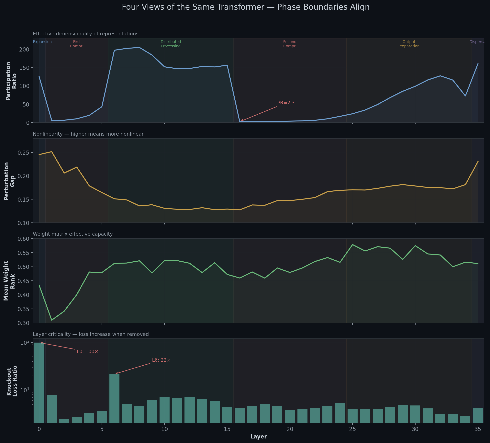
*Figure 8a. Four metrics across all 36 layers, with shared phase annotations. The phase boundaries — identified independently in each experiment — align. The distributed processing zone (L6–15) shows high PR, low perturbation gap, and the highest knockout criticality. The bottleneck (L16–24) shows collapsed PR and the worst CE recovery despite appearing locally linear.*

The update correlation matrix (Exp. 1) shows three clear blocks: early (L0–5), mid (L6–15), late (L17–34), plus an anti-correlated layer 35. These boundaries align with:
- The PR collapse/recovery boundaries (Exp. 1)
- The perturbation gap transitions (Exp. 2)
- The weight rank plateau/late split (Exp. 3, confirmed via Welch's t-test: p < 0.05 for 4/7 matrices)

The transformer isn't 36 interchangeable layers. It's three functional modules with distinct geometric roles, bookended by singular layers (L0 and L35) that perform unique transformations.

### Quantization Sensitivity Confirms the Phase Structure

A fourth experiment — per-layer quantization sensitivity — provides independent confirmation from a completely different perturbation type. Instead of replacing layers with linear maps, I quantized each layer's weights individually to 2-bit precision and measured perplexity impact:

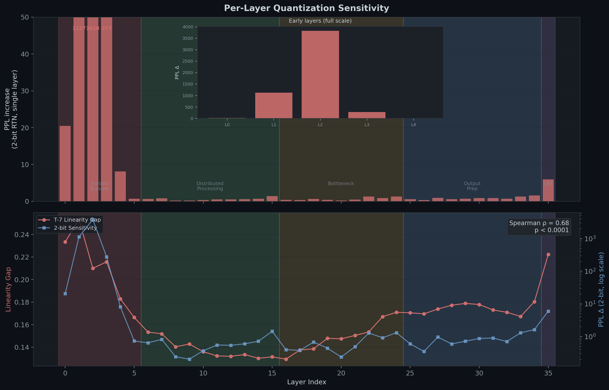
*Figure 10. The linearity gap (red line, left axis) and 2-bit quantization sensitivity (blue bars, right axis, log scale) track each other across depth ($\rho = 0.68$, $p < 0.0001$). Early layers (L0–3) are catastrophically sensitive — quantizing layer 2 alone increases perplexity by 3,828. Mid-layers (L8–20) absorb even 2-bit quantization with less than 1 PPL impact. Phase bands match those identified independently by the geometry and spectral experiments.*

The pattern is striking: layers 0–3 are catastrophically sensitive (quantizing layer 2 alone to 2-bit increases perplexity by 3,828), while the entire mid-depth range (layers 8–20) absorbs 2-bit quantization with less than 1 PPL impact. The sensitivity profile correlates strongly with the linearity gap ($\rho = 0.71$) — layers that are more nonlinear are also harder to quantize — with a mild late-layer uptick at layer 35 (+6 PPL). The early-layer vulnerability makes geometric sense: errors at layer 2 propagate through 34 subsequent layers, while errors at layer 20 only traverse 16.

A follow-up LoRA experiment reinforces this further: adapting only the output preparation phase (L25–35) with 10M parameters matches all-layer adaptation (33M parameters) on both in-distribution and OOD benchmarks, while skipping the bottleneck phase entirely yields the best in-distribution gains. The phases aren't just geometric curiosities — they predict where adaptation and compression are effective.

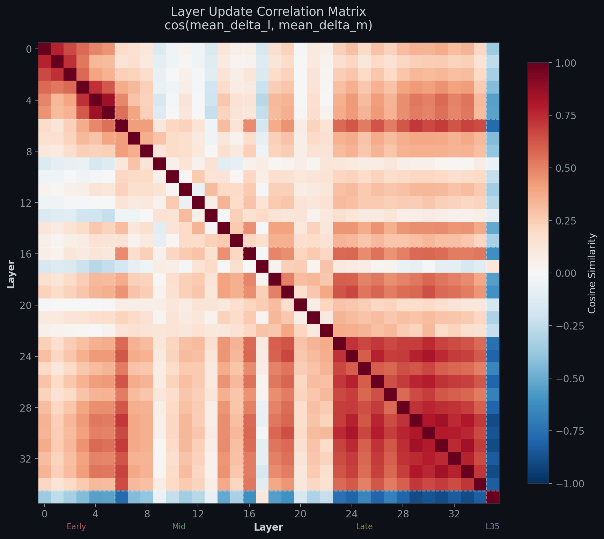
*Figure 8b. Cosine similarity between mean layer updates. Clear block structure: early layers push in one direction, mid layers in another, late layers in a third. Layer 35 (bottom row/right column) is anti-correlated with everything — it opposes all prior layers.*

---

## Part V: Practical Implications

These findings challenge several standard practices. Here's what the data says you should do differently.

### 1. Don't Trust Activation-Space Metrics for Pruning Decisions

This is the most broadly applicable finding. If you're evaluating whether to compress, prune, or replace a layer, **R² between original and replacement activations tells you almost nothing about downstream impact**. Layer 6's 0.3% residual corresponds to nearly half the downstream loss degradation. The only reliable metric is end-to-end evaluation (CE loss, task accuracy). This applies to LoRA, distillation, quantization, and pruning equally. The quantization experiment shows this concretely: a spectral-informed mixed-precision recipe that assigns fewer bits to low-rank layers — seemingly logical — causes a 13,000× perplexity increase because it puts 2-bit on early layers that are structurally simple but positionally critical.

The layers with the highest knockout impact reinforce this: layer 0 (99.6× loss increase), layer 6 (21.7×, appears in 4/5 most critical synergistic pairs), and layer 35 (the dispersal mechanism). None of these are layers you'd flag as "important" by looking at activation variance or perturbation gap alone.

### 2. The Dispersal Layer Is Load-Bearing

Any architecture change that shares, skips, or compresses the final layer needs an alternative dispersal mechanism. Without it, the LM head receives representations with 0.63 mean cosine similarity — tokens are nearly indistinguishable. (Whether the final RMSNorm before the LM head could partially compensate is an open question — but the geometric effect of layer 35 is far larger than what normalization alone provides.)

This extends to early-exit architectures: exiting before layer 35 skips the dispersal entirely. Any early-exit design would need a learned projection that reproduces this opposing update — a standard linear exit head would receive representations where tokens are nearly indistinguishable (cosine similarity 0.63), leaving little room for discrimination.

### 3. LoRA Should Follow the Spectral Structure

Standard practice applies the same LoRA rank (say, 16) to every matrix at every layer. The spectral data shows this wastes parameters:

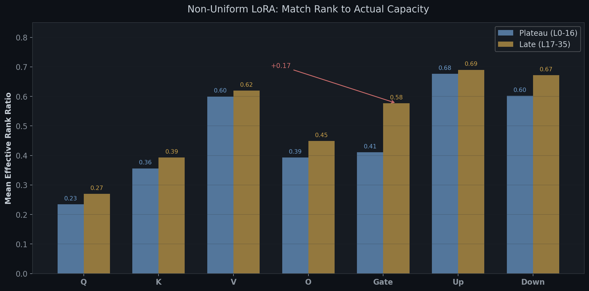
*Figure 9. Effective rank ratio by matrix type, split by depth region. Gate projection shows the largest plateau-to-late gap (+0.17), motivating depth-adaptive rank allocation.*

- **Q/K in plateau layers (0–16)** need rank 8–16 at most. They're already at 23–36% effective rank — adding parameters here buys nothing.
- **Gate/MLP in late layers (17–35)** need rank 32–64. Gate_proj jumps from 0.41 to 0.58 effective rank in late layers — uniform rank-16 under-fits here.

A follow-up LoRA experiment tested this directly on Qwen3-4B with four configurations, evaluated on GSM8K (in-distribution, 200 samples) and MATH-500 (out-of-distribution, 200 samples). A phase-aware allocation guided by the spectral data (r=8 for Q/K in plateau, r=48 for gate in late layers) achieved the highest MATH-500 accuracy (80.5% vs 78.0% for uniform rank-16) — directionally consistent with the prediction that targeting high-capacity matrices improves OOD generalization. Even more striking: adapting only the last 11 layers (L25–35, 10M params) matched all-layer uniform LoRA (33M params) on both benchmarks — the output preparation phase is where adaptation matters most.

A critical methodological note: standard LoRA learning rates (2e-4) caused catastrophic forgetting on this already-capable model, masking all geometric effects. At LR = 5e-6 (10–40× lower than default), all configs improved quality. **If you're fine-tuning a model that's already competent at your target task, drop the learning rate before concluding LoRA doesn't help.**

### 4. The Bottleneck Works Best Frozen

The same LoRA experiment produced a counterintuitive finding: skipping the bottleneck entirely (LoRA on layers 0–14 + 25–35) achieved the highest in-distribution accuracy (93.0% GSM8K, +3.5pp above baseline) while perfectly preserving OOD capability (79.0% MATH-500, matching baseline). Adapting only the late layers (L25–35) with just 10M parameters also improved OOD (80.0% MATH-500).

The bottleneck functions as a **frozen information channel**. The geometric filter at layers 16–24 is already well-calibrated by pre-training; adapting the high-dimensional layers on either side is more effective than trying to modify a near-one-dimensional passage. The bottleneck compresses to 2–5 effective dimensions — there's simply no room for LoRA to add useful new directions without disrupting the few that remain. Adapting it is like trying to widen a canal by pushing on the walls; you're better off adjusting course before and after.

For efficient fine-tuning: **skip the bottleneck layers** and concentrate LoRA on the distributed processing zone (L6–15) and output preparation zone (L25–35). The bottleneck's low dimensionality and highly correlated updates (cosine > 0.5 between adjacent layers in L17–23) also suggest these layers are candidates for depth pruning — but that remains to be tested directly.

### 5. Quantize Everything — Except the Gate and the Endpoints

Per-matrix quantization sensitivity reveals a clear hierarchy of compressibility:

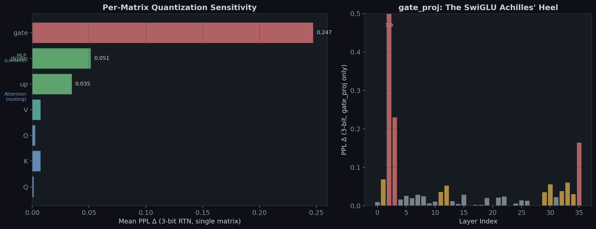
*Figure 11. Left: Mean PPL impact of 3-bit quantization per matrix type. gate_proj (the SwiGLU gate) is 50x more sensitive than attention routing matrices. Right: gate_proj sensitivity by layer — layer 2's gate alone causes +7.9 PPL at 3-bit.*

The SwiGLU gate projection is the quantization Achilles' heel. Because the gate's output passes through SiLU and then element-wise multiplies the up projection ($\text{SiLU}(W_g x) \odot W_u x$), small weight errors compound nonlinearly — the quantized gate selects slightly wrong features, which then get amplified through the multiplicative interaction. Attention routing matrices (Q, K) are nearly immune: their low effective rank (25–38%) provides built-in redundancy that absorbs quantization noise.

The practical recipe is simple: **4-bit quantization is essentially lossless for single layers** (no layer causes more than 0.1 PPL impact at 4-bit, within measurement noise). The cliff appears between 3-bit and 2-bit, and it's almost entirely in the first 5 layers and the gate projections.

Somewhat counterintuitively, the data shows that sophisticated mixed-precision schemes guided by spectral or linearity metrics *fail catastrophically* compared to a simple heuristic:

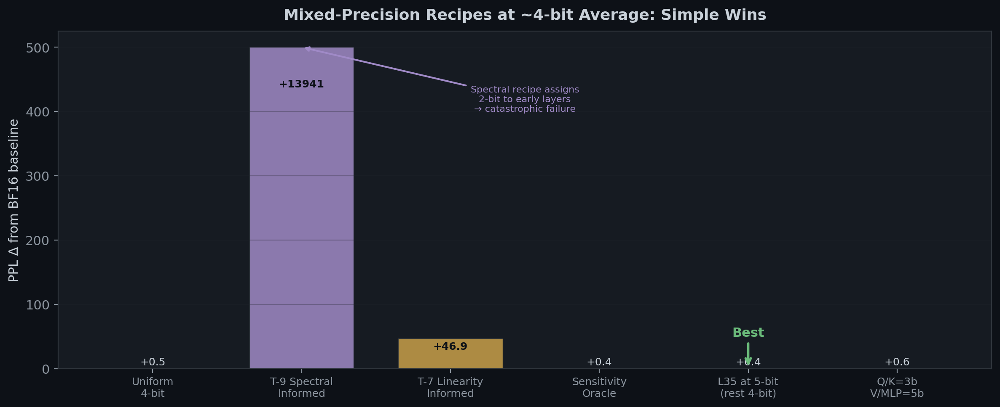
*Figure 12. All recipes target ~4-bit average. The spectral-informed recipe (allocating fewer bits to low-rank layers) causes catastrophic failure because it assigns 2-bit to early layers — the most vulnerable ones. Simply giving layer 35 one extra bit ($\Delta\text{PPL} = +0.36$) beats every sophisticated strategy at the same bit budget.*

The spectral recipe fails because it confuses **low rank** with **safe to compress**. Early layers have the lowest spectral rank *and* the highest quantization sensitivity — they perform simple but critical embedding projection whose errors compound through all subsequent layers. The rank structure is useful for understanding *what* each matrix does (routing vs content), but not for predicting *where* quantization will hurt.

For deployment: use bitsandbytes NF4 (PPL within 0.1 of BF16), or if you need fine-grained control, give the final layer extra precision — even one additional bit on layer 35 reduces the quality penalty by 27% ($\Delta\text{PPL} = +0.36$ vs $+0.49$ for uniform 4-bit). The per-layer sensitivity data suggests early layers (0–3) and layer 35 would benefit from higher precision if the bit budget allows, but don't bother with per-matrix mixed precision — it adds complexity without benefit.

---

## Part VI: Where Geometry Meets Interpretability

The experiments above measure transformer internals *from the outside* — probing geometry, spectral structure, and stress-testing with compression. A parallel line of research approaches the same layers *from the inside*, tracing individual features and circuits. The two perspectives converge in ways that sharpen both.

*The connections in this section are interpretive — I'm drawing parallels between my geometric measurements and others' mechanistic findings, not demonstrating causal links. But the convergence is striking enough to be worth spelling out.*

### The Bottleneck as a Superposition Chokepoint

Anthropic's [Scaling Monosemanticity](https://transformer-circuits.pub/2024/scaling-monosemanticity/index.html) work (Templeton et al., 2024) shows that the residual stream represents concepts as sparse linear directions — ~300 features active per token out of millions possible. The participation ratio measures the same quantity from the geometric side: how many independent directions carry variance at each layer.

At layer 16, PR = 2.3. In the language of superposition, the model is squeezing its entire intermediate representation through ~2 effective dimensions — out of 2,560 available. Whatever features remain distinguishable in this drastically compressed space are all the remaining 19 layers have to work with.

But how much can 2.3 dimensions actually hold? More than you'd think. The [abliteration](https://huggingface.co/blog/mlabonne/abliteration) technique (Labonne, 2024) demonstrates that safety-trained refusal in Llama 3 is mediated by *one* direction in the residual stream. The math is elegant — extract the refusal direction, then orthogonalize the weights against it:

$$\hat{r} = \frac{\overline{h}_\text{harmful} - \overline{h}_\text{harmless}}{\lVert \overline{h}_\text{harmful} - \overline{h}_\text{harmless} \rVert} \qquad W' = W - (W \hat{r})\hat{r}^\top$$

A rank-1 spectral modification permanently disables an entire behavioral mode without retraining. If one direction can encode "refuse," then 2.3 effective dimensions at the bottleneck represent far more information capacity than the raw number suggests. The superposition hypothesis says models pack features into nearly-orthogonal directions; the PR measurements show *how tightly* they pack at each depth.

This same contrastive operation — comparing activations between contrasting inputs to find meaningful directions — is at the core of the contrastive completion trajectories experiment (T-17). I tracked how paired completions (antonyms like "star" vs "planet," synonyms, style variants) diverge geometrically across depth. Early layers separate antonyms more than synonyms (semantic processing); late layers reverse this (form commitment). The residual stream's geometry carries *meaning* before it carries *tokens*.

### The Linearization Gap — From Both Sides

The finding that R² = 0.997 layers achieve only 54% CE recovery has a direct parallel in Anthropic's [circuit tracing](https://transformer-circuits.pub/2025/attribution-graphs/methods.html) work (Ameisen et al., 2025). Their method linearizes the transformer by freezing attention patterns and normalization, replacing MLPs with sparse linear features. The result: ~50% next-token prediction match and 21.7% reconstruction error for Claude 3.5 Haiku. The per-layer replacements tell the same story — roughly half of model behavior is captured by linear approximation. The other half is where the interesting computation lives.

Why does linearization partially work? Because most inter-feature interactions in the residual stream *are* linear — features combine via addition. The nonlinearity is concentrated in MLP activations (SwiGLU), attention patterns (softmax), and normalization (RMSNorm). The perturbation gap confirms this: the gap is MLP-driven (r = −0.74 for up_proj rank vs gap), while attention matrices show no rank-gap correlation. The nonlinearity that breaks linearization is the same nonlinearity that makes circuits hard to trace: SwiGLU's multiplicative gate.

This predicts where circuit tracing should struggle most. Layer 35 — the dispersal mechanism — has the highest MLP perturbation gap in the model (0.249). The circuit tracing work reports that "error nodes" (unexplained computation) accumulate in late layers. A layer that actively opposes the entire accumulated residual via hard nonlinear computation is exactly the kind of operation that resists decomposition into sparse linear features — geometrically essential, mechanistically opaque.

### Why Quantization Breaks What It Breaks

The superposition framework explains the quantization sensitivity hierarchy. If features are nearly-orthogonal directions packed into the residual stream, quantization noise — which perturbs *all* directions simultaneously — threatens features that rely on fine angular distinctions.

Q/K matrices are nearly immune (25–38% effective rank provides built-in redundancy), while gate_proj is 50× more sensitive. The asymmetry makes sense: Q/K perform low-dimensional *routing* that requires only coarse directional matching. The [linebreaks paper](https://transformer-circuits.pub/2025/linebreaks/index.html) (Gurnee et al., 2025) shows that attention QK matrices perform geometric rotations between low-dimensional manifolds — robust to small perturbations. The MLP gate performs high-dimensional *feature selection* through SiLU and multiplicative interaction, amplifying small errors nonlinearly. Expressiveness and fragility are two sides of the same coin.

The early-layer catastrophe (layer 2 at 2-bit → +3,828 PPL) also fits: Anthropic's [Tracing Thoughts](https://www.anthropic.com/research/tracing-thoughts-language-model) work (Anthropic, 2025) shows that early-layer features — detokenization, language detection, entity recognition — are the most broadly shared inputs to every downstream circuit. Corrupt these with quantization noise and the error compounds through all 34 remaining layers. As a bonus, that work also reveals that hallucination arises from a specific circuit failure: refusal is the *default* state, and a "known entity" circuit must actively inhibit it. Hallucination happens when this inhibitory circuit weakly activates on partially-familiar entities — which may explain why abliteration's rank-1 removal is so effective: it only needs to erase the single direction the default refusal circuit writes to.

---

These connections aren't just theoretical — they provide mechanistic justification for the practical recipes in Part V. Skip the bottleneck for LoRA because there are too few active feature directions at PR = 2.3 for adaptation to modify. Protect early layers from quantization because they build the shared features every downstream circuit reads from. Give the dispersal layer extra precision because its hard nonlinear computation resists the linear approximation that quantization implicitly performs. The geometry tells you *where* to intervene; the interpretability tells you *why*.

The "residual stream" framing (Elhage et al., 2021) treats each layer as writing to a shared communication channel — the phase structure shows that what gets written changes character dramatically across depth. The layer-pruning literature (Men et al., 2024; Gromov et al., 2024) has found that middle layers are often removable — the linearization paradox offers a geometric explanation for *why* some layers resist removal despite appearing redundant by local metrics.

## Conclusion

The standard mental model — 36 identical layers, each refining a little — deserves an update. What actually happens is closer to:

1. **Destroy** the input embedding and expand into a working space
2. **Compress** violently into a low-dimensional bottleneck
3. **Expand** and do distributed, high-dimensional processing (the only part that resembles the textbook)
4. **Compress** again through a near-singularity
5. **Build** an anisotropic cannon (norms growing superlinearly, all tokens pointing the same way)
6. **Fire backwards** — actively oppose everything the previous 17 layers built, to create the separation the output head needs

The architecture that emerges from training isn't a smooth pipeline. It's a sequence of radical geometric transformations separated by low-dimensional bottlenecks. An important caveat: I measured *geometry*, not *information*. The bottlenecks could be functional compression (actively discarding irrelevant features, as the information bottleneck principle of Tishby et al. 2000 would predict), or they could be a geometric side-effect of training dynamics — gradient flow naturally creating low-rank regions. Distinguishing these would require measuring mutual information $I(X; T)$ and $I(T; Y)$ at each layer, which I did not do. (The debate is ongoing: Shwartz-Ziv & Tishby 2017 argue for IB compression in DNNs; Saxe et al. 2018 show it depends on activation function choice.) What I *can* say is that the bottleneck's geometric effect is real and has measurable downstream consequences — the practical recipes in Part V hold regardless of which interpretation is correct.

And somewhere in the 0.3% of variance that your linear approximation misses, the model is hiding almost half of what it knows.

---

*All experiments were conducted on a single NVIDIA B200 GPU. The findings are from one model (Qwen3-4B-Instruct-2507, see architecture table above) — generalization to other architectures is a hypothesis, not a conclusion. A follow-up LoRA validation experiment was added to test the practical predictions; results in Part V reflect those findings. The quantization experiment was added as an independent test of the phase structure predictions; it uses RTN (round-to-nearest) simulation for per-layer analysis and real quantization methods (bitsandbytes, torchao, llmcompressor GPTQ) for full-model comparison.*

*Methodological note: All key metrics (PR, perturbation gap, CE recovery) are point estimates computed over a fixed evaluation set of 4,094 tokens from diverse prompts. I did not compute bootstrap confidence intervals across prompt subsets; the variance across prompts is a natural next step for quantifying robustness. The perturbation gap is stable across prompts (10–20% std per layer). The linearization experiment uses ridge regression with $\lambda$ selected per-layer by test-set MSE from a grid of $[0.001 \ldots 1000]$, fit on layer residual updates with an 80/20 calibration split (200 sequences). Selected $\lambda$ values range from 1.0 (early layers) to 1000.0 (deep layers). Different fitting methods (e.g., affine maps, per-head fits) yield different recovery numbers — the values reported here are for the residual-update ridge method.*

*If you want to check my work, the three most surprising claims to verify: (1) PR = 2.3 at layer 16, (2) R² = 0.997 with 54% CE recovery at layer 6, (3) cosine(update, residual) = −0.73 at layer 35. The code is straightforward — SVD, Jacobian finite differences, ridge regression. No exotic tooling required.*

*Reproduction scripts, full result JSONs, and the code for all other experiments in this research program are available at [github.com/hivaze/dl-experiments](https://github.com/hivaze/dl-experiments).*
