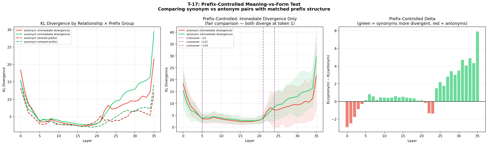

# T-17: Contrastive Completion Trajectories

## Motivation & Research Question

T-1 (logit lens) showed that token predictions evolve through four phases across depth, and T-4 (residual stream geometry) revealed how the hidden-state manifold changes layer-by-layer. But both experiments used a single greedy completion per prompt. A natural follow-up: **how do the model's internal representations differ when processing semantically similar vs. opposite completions?**

Specifically:
1. **At which layer do antonym completions first diverge in hidden-state space?** If the prompt is "Is the Sun a star or a planet?" and we force-decode "star" vs "planet", at what depth does the model's residual stream clearly separate the two?
2. **Do synonym completions maintain similar trajectories despite different surface forms?** "Fast", "swift", and "rapid" mean the same thing — do their hidden states converge at semantic layers even though their token embeddings differ?
3. **Does meaning crystallize before form?** If synonym trajectories stay similar longer than antonym trajectories, it suggests the model builds semantic representations first and only resolves surface-level token choice in later layers.
4. **How does the divergence profile differ across relationship types?** Antonyms, synonyms, style variants, and unrelated completions should each produce distinct divergence signatures.

## Theoretical Framework

### Why Do We Need This Framework?

Previous experiments looked at one completion at a time: T-1 asked "when does the model predict the right token?", T-4 asked "what shape does the hidden-state manifold have?" But neither can answer a comparative question: **if we feed the same prompt with two different continuations, at what depth does the model's internal state "know" they're different, and what kind of difference does it detect first — meaning or surface form?**

To answer this, we need to:
1. Define what it means for two completions to "diverge" inside the model (the trajectory formalism)
2. Measure that divergence in multiple complementary ways (because no single metric captures the full picture)
3. Connect internal divergence to testable predictions about semantic vs. surface-form processing

### Step 1: The Residual Stream as a Path Through Representation Space

**Intuition.** A transformer doesn't transform its input all at once. Each layer makes a small additive update to a running representation called the *residual stream*. Think of it like a message being passed through 36 editors: each editor reads the current draft, writes a small correction in the margin (attention finds relevant context, MLP transforms features), and the correction gets added to the draft. After all 36 editors, the final draft is decoded into the next token.

**Formally.** For a given token at position $t$, the hidden state after layer $\ell$ is:

$$h_t^{(\ell)} = h_t^{(0)} + \sum_{i=1}^{\ell} \Delta_i$$

where:
- $h_t^{(0)} \in \mathbb{R}^{d}$ is the token embedding (the initial draft — just looking up the token in a table, $d = 2560$ for Qwen3-4B)
- $\Delta_i = f_i(h_t^{(i-1)})$ is the residual update from layer $i$ — the "correction" that layer $i$ writes after reading the current state $h_t^{(i-1)}$. Each $f_i$ consists of self-attention followed by a SwiGLU MLP.
- The sum is cumulative: layer $\ell$'s output is the embedding plus all corrections from layers $1$ through $\ell$

**Why this matters.** Because updates are additive, the hidden state at each layer is a point in the same $d$-dimensional space. As we go deeper (increasing $\ell$), the hidden state traces out a *path* (trajectory) through this space — starting at the embedding, accumulating corrections, and ending at the representation that gets decoded into a token prediction. This is what we compare between two completions.

### Step 2: Setting Up the Comparison — Two Trajectories from a Shared Origin

**The setup.** Given a prompt like *"Is the Sun a star or a planet?"*, we force-decode two completions:
- Completion A: *"Star"*
- Completion B: *"Planet"*

Both completions share the same prompt prefix, so their token sequences are identical up to some position $t^*$ — the **pivot position**, where the first differing token appears. At and after the pivot, the two sequences contain different tokens.

**The key insight.** Even though both completions pass through the same 36 layers of the same model with the same weights, the hidden states at the pivot position will differ — because the token embedded at that position is different ("Star" vs "Planet"). We get two trajectories through the same space:

$$\mathbf{a}_\ell = h_{t^*}^{(\ell, A)} \quad \text{(hidden state at the pivot, completion A, after layer } \ell\text{)}$$

$$\mathbf{b}_\ell = h_{t^*}^{(\ell, B)} \quad \text{(hidden state at the pivot, completion B, after layer } \ell\text{)}$$

Both trajectories $\mathbf{a}_0, \mathbf{a}_1, \ldots, \mathbf{a}_L$ and $\mathbf{b}_0, \mathbf{b}_1, \ldots, \mathbf{b}_L$ live in $\mathbb{R}^{2560}$ and are shaped by the same context (identical prefix) but seeded with different tokens at the pivot. Our question becomes: **how does the distance between $\mathbf{a}_\ell$ and $\mathbf{b}_\ell$ evolve as $\ell$ goes from 0 to 35?**

### Step 3: Why One Metric Isn't Enough

Two vectors in $\mathbb{R}^{2560}$ can differ in multiple independent ways, and no single number captures all of them. Consider three scenarios:

| Scenario | Cosine similarity | L2 distance | Same next-token prediction? |
|---|---|---|---|
| Vectors point the same direction but have different magnitudes | High (~1.0) | Can be large | Maybe not |
| Vectors point different directions but produce the same logit ranking | Low | Large | Yes |
| Vectors are close in every way but one critical dimension | High | Small | Could differ completely |

This is why we use **four complementary metrics**, each capturing a different aspect of divergence:

| Metric | What it measures | Blind to |
|---|---|---|
| **Cosine similarity** | Directional alignment | Magnitude differences |
| **Normalized L2 distance** | Overall vector distance (direction + magnitude) | Which dimensions matter for output |
| **KL divergence** | Difference in predicted next-token distributions | Internal geometry that doesn't affect output |
| **Linear CKA** | Structural similarity across multiple token positions | Single-position behavior |

### Step 4: The Four Metrics in Detail

We use shorthand throughout: $\mathbf{a}_\ell$ and $\mathbf{b}_\ell$ are the hidden states at the pivot for completions A and B after layer $\ell$, as defined in Step 2.

#### 4a. Cosine Similarity — Are the Two Representations Pointing the Same Way?

**Intuition.** In high-dimensional spaces, the *direction* a vector points often matters more than its length. Two representations that point in the same direction encode similar information regardless of scale. Cosine similarity isolates this directional component.

**Formula.**

$$\text{cos}(\ell) = \frac{\mathbf{a}_\ell \cdot \mathbf{b}_\ell}{\lVert \mathbf{a}_\ell \rVert \, \lVert \mathbf{b}_\ell \rVert}$$

where $\mathbf{a}_\ell \cdot \mathbf{b}_\ell = \sum_{i=1}^{d} a_{\ell,i} \, b_{\ell,i}$ is the dot product and $\lVert \mathbf{a}_\ell \rVert = \sqrt{\sum_i a_{\ell,i}^2}$ is the Euclidean norm.

- $\text{cos}(\ell) = 1$: identical directions (representations encode the same information, up to scale)
- $\text{cos}(\ell) = 0$: orthogonal (completely unrelated)
- $\text{cos}(\ell) < 0$: opposing directions (rare in practice for residual streams)

**What to expect.** At layer 0 (embeddings), cosine similarity is low because "star" and "planet" have different embeddings. Through mid layers, context dominates and similarity rises. At the final layer, similarity drops again as the model commits to specific token predictions.

#### 4b. Normalized L2 Distance — How Far Apart Are They, Accounting for Scale?

**Intuition.** Cosine similarity ignores magnitude — two vectors pointing the same direction but with very different lengths get cosine = 1. But magnitude carries information in the residual stream (T-4 showed norms grow across layers). L2 distance captures the full picture: direction *and* magnitude differences combined.

We normalize by the average norm so that the distance is comparable across layers (where norms can differ by 10×):

**Formula.**

$$d(\ell) = \frac{\lVert \mathbf{a}_\ell - \mathbf{b}_\ell \rVert}{\frac{1}{2}\bigl(\lVert \mathbf{a}_\ell \rVert + \lVert \mathbf{b}_\ell \rVert\bigr)}$$

**Step by step:**
1. Compute the difference vector: $\mathbf{a}_\ell - \mathbf{b}_\ell$ (a vector in $\mathbb{R}^{2560}$ pointing from B to A)
2. Take its Euclidean norm: $\lVert \mathbf{a}_\ell - \mathbf{b}_\ell \rVert$ (how far apart the two points are)
3. Divide by the mean norm of the two vectors (normalizes for the overall scale at this layer)

- $d(\ell) = 0$: identical representations
- $d(\ell) = 2$: the difference vector is as large as the vectors themselves (maximally separated for same-magnitude vectors)

**Relationship to cosine.** For unit vectors, $\lVert \mathbf{a} - \mathbf{b} \rVert^2 = 2(1 - \cos(\mathbf{a}, \mathbf{b}))$, so L2 and cosine are two views of the same geometry. But for non-unit vectors (which is always the case in practice), they diverge — a pair can have high cosine but high L2 if one vector is much longer than the other.

#### 4c. KL Divergence — Do They Predict Different Next Tokens?

**Intuition.** The previous two metrics measure geometric distance in hidden-state space, but the model doesn't "care" about geometry per se — it cares about what token to predict next. Two hidden states could be geometrically close but produce very different next-token distributions (if they sit near a decision boundary in logit space), or geometrically far apart but agree on the output (if the difference lies in dimensions the unembedding matrix ignores).

KL divergence answers the *functional* question: **if we forced the model to decode at this intermediate layer, how differently would it behave for the two completions?**

**How it works — the logit lens trick.** Normally only the final layer's hidden state gets decoded into a token. But we can apply the final-layer decoding machinery (RMSNorm + unembedding matrix) to *any* intermediate layer's hidden state to get a "premature" next-token distribution. This is the logit lens from T-1.

**Formula, step by step:**

**Step 1.** Take the hidden state at layer $\ell$ and apply RMSNorm (the model's final normalization):

$$\hat{\mathbf{a}}_\ell = \text{RMSNorm}(\mathbf{a}_\ell)$$

RMSNorm normalizes by the root-mean-square of the vector's components: $\hat{a}_i = \frac{a_i}{\text{RMS}(\mathbf{a})} \cdot \gamma_i$ where $\text{RMS}(\mathbf{a}) = \sqrt{\frac{1}{d}\sum_j a_j^2}$ and $\gamma$ is a learned scale. This puts the representation on a consistent scale for the unembedding.

**Step 2.** Multiply by the unembedding matrix $W_U \in \mathbb{R}^{V \times d}$ (where $V$ is the vocabulary size) to get logits — one score per vocabulary token:

$$\mathbf{z}_\ell^A = W_U \, \hat{\mathbf{a}}_\ell \in \mathbb{R}^{V}$$

**Step 3.** Apply softmax to convert logits into a probability distribution over the vocabulary:

$$p_A^{(\ell)}(i) = \frac{\exp(z_{\ell,i}^A)}{\sum_{j=1}^{V} \exp(z_{\ell,j}^A)}$$

Do the same for completion B to get $p_B^{(\ell)}$.

**Step 4.** Compute KL divergence — how many extra bits of information you need if you use distribution A to encode samples from distribution B:

$$D_{\text{KL}}\bigl(p_B^{(\ell)} \,\|\, p_A^{(\ell)}\bigr) = \sum_{i=1}^{V} p_B^{(\ell)}(i) \, \log \frac{p_B^{(\ell)}(i)}{p_A^{(\ell)}(i)}$$

- $D_{\text{KL}} = 0$: both completions produce identical next-token distributions at this layer (functionally indistinguishable)
- $D_{\text{KL}} \gg 0$: the distributions are very different (the model would predict very different tokens)

**Why KL and not something simpler?** We could just compare the top-1 predicted token, but that's too coarse — it's a binary signal (same or different). KL captures the full distributional difference: even if both distributions agree on the top token, KL detects differences in the probability mass over the rest of the vocabulary, which reveals how "confident" the model is about the distinction.

**The key prediction.** If the model processes *meaning* before *surface form*, then:
- **Early layers**: antonym pairs ("star" vs "planet" — different meanings) should have *higher* KL than synonym pairs ("fast" vs "swift" — same meaning), because the model already distinguishes different meanings
- **Late layers**: synonym pairs should have *higher* KL than antonym pairs, because now the model is committing to specific surface tokens and "fast" vs "swift" are maximally different surface forms despite identical meaning

#### 4d. Linear CKA — Do the Two Completions Organize Information the Same Way?

**Intuition.** All three metrics above compare hidden states at a *single* token position (the pivot). But a completion is a *sequence* of tokens. Two completions might organize information similarly across their token positions — e.g., if position 3 is similar to position 5 in completion A, is the same true in completion B? This structural pattern is invisible to pointwise metrics.

**The question CKA answers.** Think of it this way: for each completion at a given layer, we have a matrix of hidden states — one row per token position. CKA asks: "do these two matrices have the same internal similarity structure?" That is, do the two completions encode a similar pattern of which-tokens-are-close-to-which, regardless of the specific coordinate system?

**Why not just compare the matrices directly?** A naive approach would be to compute the Frobenius norm $\lVert X - Y \rVert_F$. But this fails if the two representations encode the same structure in different coordinate systems (e.g., rotated or scaled). CKA is invariant to orthogonal transformations and isotropic scaling — if A and B encode the same relational structure but in rotated coordinates, CKA still returns 1.0.

**Formula, step by step.**

Let $X, Y \in \mathbb{R}^{n \times d}$ be the hidden-state matrices for completions A and B at a given layer, where $n$ is the number of (completion) tokens and $d = 2560$ is the hidden dimension.

**Step 1. Center the matrices** (subtract the mean token representation):

$$\overline{X} = X - \frac{1}{n}\mathbf{1}\,\mathbf{1}^T X, \qquad \overline{Y} = Y - \frac{1}{n}\mathbf{1}\,\mathbf{1}^T Y$$

Centering removes the "average position" so we only compare *relative* structure (how tokens differ from each other), not absolute position in the space.

**Step 2. Compute the Gram matrices** (token-by-token similarity within each completion):

$$K = \overline{X}\overline{X}^T \in \mathbb{R}^{n \times n}, \qquad L = \overline{Y}\overline{Y}^T \in \mathbb{R}^{n \times n}$$

$K_{ij}$ tells you how similar token $i$ and token $j$ are within completion A. $L_{ij}$ does the same for completion B. These Gram matrices encode the *internal similarity structure* of each completion.

**Step 3. Compare the Gram matrices** using the Hilbert-Schmidt Independence Criterion (HSIC):

$$\text{HSIC}(K, L) = \sum_{i,j} K_{ij} \, L_{ij}$$

This is just the element-wise dot product of the two Gram matrices. If token pairs that are similar in A are also similar in B, this sum is large. This can also be written as $\lVert \overline{Y}^T \overline{X} \rVert_F^2$ (squared Frobenius norm of the cross-covariance matrix).

**Step 4. Normalize** to get a value in $[0, 1]$:

$$\text{CKA}(\overline{X}, \overline{Y}) = \frac{\text{HSIC}(K, L)}{\sqrt{\text{HSIC}(K, K) \cdot \text{HSIC}(L, L)}} = \frac{\lVert \overline{Y}^T \overline{X} \rVert_F^2}{\lVert \overline{X}^T \overline{X} \rVert_F \cdot \lVert \overline{Y}^T \overline{Y} \rVert_F}$$

- CKA = 1: the two completions induce identical similarity structure across token positions (same "representational geometry")
- CKA = 0: the similarity patterns are completely unrelated

**Complements the pointwise metrics.** Cosine similarity tells us if individual positions align; CKA tells us if the completions organize information the same way across the full sequence.

### Step 5: From Metrics to Testable Hypotheses

The four metrics combine to test the **meaning-before-form hypothesis** — the idea that a transformer resolves *what* to say (semantics) before *how* to say it (surface token choice):

| Hypothesis | Predicted signature | Which metric tests it |
|---|---|---|
| Meaning is resolved early | Antonym KL > Synonym KL in layers 0–5 | KL divergence |
| Form is committed late | Synonym KL > Antonym KL in layers 25–35 | KL divergence |
| Context dominates token identity | Cosine similarity > 0.6 for shared-prefix pairs across most layers | Cosine similarity |
| Final layer is a universal discriminator | All types drop in cosine at layer 35 | Cosine similarity |
| Synonyms maintain structural similarity longer | Synonym CKA > Antonym CKA in mid layers | Linear CKA |

The **prefix-controlled design** (Step 2 of Setup) is critical: without matching prefix structure between antonym and synonym pairs, any KL difference could be an artifact of different prefix lengths rather than a genuine semantic effect.

## Setup

- **Model**: Qwen3-4B-Instruct-2507 (36 layers, GQA, SwiGLU, bf16)
- **Data**: `data/text_completions/contrastive_pairs.json` — 111 prompt groups with hand-crafted completion pairs/triples (v3: balanced immediate-divergence samples)
- **Relationship types**: antonym (67 groups), synonym (29 groups), style (8 groups), unrelated (7 groups)
- **Prefix control**: Each group tagged as `immediate` (diverge at token 1) or `shared` (shared completion prefix). This allows comparing antonyms vs synonyms with matched prefix structure.
- **Hardware**: Single B200 GPU (bf16), ~37s total runtime
- **Completion strategy**: Teacher forcing (no generation) — feed each completion's tokens as input, collect hidden states at every layer

### Data Design

Each group contains a prompt and 2–3 short completions (1–8 tokens) with a known semantic relationship:

| Type | Example Prompt | Completions | Design Principle |
|---|---|---|---|
| **Antonym (shared)** | "Is the Sun a star or a planet?" | "The Sun is a **star**" / "The Sun is a **planet**" | Shared completion prefix, differ at a single pivot word |
| **Antonym (immediate)** | "Is the Sun a star or a planet? One word." | "**Star**" / "**Planet**" | Diverge at first token — prefix-matched with synonym pairs |
| **Synonym (immediate)** | "Describe the speed of a cheetah in one word." | "**Fast**" / "**Swift**" / "**Rapid**" | Diverge immediately at first completion token |
| **Synonym (shared)** | "Describe the speed of a cheetah." | "A cheetah is **fast**" / "A cheetah is **swift**" | Shared prefix, diverge at synonym — prefix-matched with antonym pairs |
| **Style** | "Explain what gravity is." | Formal / Casual / Technical registers | Same information, different verbosity and word choice |
| **Unrelated** | "What is the capital of France?" | "**Paris**" / "**Elephant**" / "**42**" | Correct answer vs semantically nonsensical |

**Prefix control (v2→v3)**: The original v1 data had a structural confound: all antonym pairs shared completion prefixes while most synonym pairs diverged immediately. This made direct KL comparisons unreliable. Version 2 introduced prefix-controlled groups; version 3 balances sample sizes:
- **48 immediate-divergence antonym pairs** (IDs 50–110): single-word answers that diverge at token 1, matching synonym prefix structure. 48 pairs = 48 synonym immediate pairs.
- **13 shared-prefix synonym pairs** (IDs 63–75): multi-word answers with shared prefix before the synonym, matching antonym prefix structure

This creates a balanced 2×2 design (relationship × prefix structure) enabling fair comparison with equal sample sizes in the critical immediate-divergence condition.

## Methods

### Method 1: Contrastive Logit Lens

Extension of T-1. For each completion in a group, run the full prompt + completion through the model with teacher forcing. At each layer $\ell$, project the residual stream at the pivot position through the final LM head (RMSNorm + unembedding) to get logit distributions $p_A^{(\ell)}$ and $p_B^{(\ell)}$.

**Primary metric**: $D_{\text{KL}}(p_B^{(\ell)} \| p_A^{(\ell)})$ — how distinguishable are the two completions' logit distributions at each layer?

### Method 2: Hidden-State Representational Similarity

Extension of T-4. For each prompt group, collect the residual stream vectors after each layer for all completions.

**Metrics per layer per pair:**
- **Cosine similarity** at the first diverging token position
- **Normalized L2 distance** at the diverging position
- **Linear CKA** over completion tokens

### Method 3: Divergence Curve Analysis

Aggregate per-layer metrics into **divergence curves** — one curve per relationship type, showing how similarity evolves across depth.

### Method 4: Pivot Token Analysis

Track the hidden state specifically at the pivot token position across layers. Measure cosine similarity of the pivot token's representation between the two completions, plus a baseline from a shared-prefix token (which should remain ~1.0 in a causal model).

## Results

### Divergence Curves


The four-panel overview reveals the core dynamics:

**Cosine similarity** (top-left): All relationship types follow an inverted-U trajectory — similarity rises from the embedding layer, plateaus in mid layers, then drops at the final layer. The general ordering is antonym ≈ synonym > style > unrelated, with antonym and synonym trading places depending on layer.

**KL divergence** (top-right, log scale): All types start with high KL (~14–17) at layer 0, decrease through mid layers, then rise again in late layers. Style completions show the highest late-layer KL (~20 at L34), while antonyms and synonyms are moderate (~10–12 at L34). Note: the all-groups aggregation mixes shared-prefix and immediate-divergence pairs; see the prefix-controlled analysis below for the fair comparison.

**L2 distance** (bottom-left): Mirrors cosine similarity inversely. Unrelated pairs have the highest L2 throughout.

**CKA** (bottom-right): Completion-level representational similarity. Antonyms maintain high CKA (>0.85 through L34, dropping to 0.70 at L35). Synonym and style CKA also remain relatively high, dropping more gradually in late layers.

### KL Divergence: Synonym vs Antonym


The left panel shows KL divergence across layers; the right panel shows the delta KL(synonym) − KL(antonym) per layer.

| Layer Range | Synonym KL vs Antonym KL | Observation |
|---|---|---|
| **0–3** | Antonym > Synonym | Antonyms are slightly more divergent (e.g., 16.9 vs 15.4 at L0). This reflects the v3 data composition: 48/67 antonym groups are immediate-divergence, which have higher KL than shared-prefix pairs |
| **4–17** | Mixed | The two types alternate, with synonym generally slightly higher |
| **18–23** | Antonym > Synonym | Antonyms become clearly more divergent (e.g., 4.1 vs 3.0 at L21) |
| **24–35** | Synonym > Antonym | Synonym KL rises as the model commits to surface forms; by layer 34, synonyms are 1.2× more divergent (12.3 vs 10.1) |

**Note on the all-groups aggregation**: This comparison mixes shared-prefix and immediate-divergence pairs with different proportions per relationship type (antonyms: 48 immediate + 19 shared; synonyms: 48 immediate + 39 shared). The all-groups KL curves are therefore confounded by prefix structure. The prefix-controlled analysis below isolates the genuine semantic effect by comparing only immediate-divergence pairs with matched sample sizes.

### Pivot Token Analysis


**Left panel**: Aggregate pivot token similarity by relationship type. Antonym and synonym pivots show broadly similar cosine similarity ranges (antonym: 0.54–0.75, synonym: 0.51–0.77 across layers 0–34). With v3's balanced data (many immediate-divergence antonyms), the two types overlap substantially — immediate-divergence pairs lack the shared-context advantage that previously inflated antonym similarity.

**Right panel**: Individual traces reveal high variance within both types. Some antonym pairs diverge sharply at specific layers (visible as individual red traces dipping to 0.3), while others stay similar throughout. This suggests certain semantic distinctions are resolved at specific layers rather than gradually.

### Relationship Heatmap


Each row is a group-pair, columns are layers (embedding through layer 35). Groups are sorted by relationship type (synonym | antonym | style | unrelated), separated by horizontal lines.

Key observations:
- **Antonym block** (second section): consistently green (high similarity) through layers 5–34, with a sharp red column at the embedding layer and layer 35
- **Synonym block** (first section): more heterogeneous — some synonym pairs maintain high similarity throughout, others diverge in mid-late layers
- **Style and unrelated blocks**: generally lower similarity (more orange/red), especially in late layers
- **Layer 35 (final)**: universally red across all types — the final layer specializes representations for specific token prediction, destroying inter-completion similarity

### Quantitative Summary (All Groups)

| Metric | Synonym (29 groups, 87 pairs) | Antonym (67 groups, 67 pairs) | Style (8 groups, 24 pairs) | Unrelated (7 groups, 21 pairs) |
|---|---|---|---|---|
| Peak cosine similarity | 0.766 (L19) | 0.747 (L16) | 0.671 (L19) | 0.649 (L34) |
| Min cosine similarity | 0.182 (emb) | 0.187 (emb) | 0.103 (emb) | 0.032 (emb) |
| KL at layer 0 | 15.4 | 16.9 | 13.8 | 16.7 |
| KL at layer 16 (min) | 2.5 | 2.3 | 3.1 | 3.6 |
| KL at layer 34 | 12.3 | 10.1 | 20.2 | 10.0 |
| Final-layer cosine (L35) | 0.409 | 0.458 | 0.289 | 0.198 |

### Prefix-Controlled Results



The central analysis of T-17 v3. By comparing immediate-divergence pairs with **balanced sample sizes** (n=48 antonym pairs, n=48 synonym pairs), we eliminate both the prefix-length confound and the sample-size imbalance.

| Layer Range | Immediate Antonym KL vs Synonym KL | Interpretation |
|---|---|---|
| **0–4** | **Antonym > Synonym** (18.4 vs 15.5 at L0, ratio 1.19×) | Antonyms (different meanings) produce more divergent logit distributions — the model distinguishes meanings before forms |
| **5–20** | Synonym > Antonym | Synonyms become more divergent as form-level differences emerge in mid layers |
| **21–23** | Antonym > Synonym | Brief reversal in the prediction-formation zone |
| **24–35** | Synonym ≫ Antonym (16.4 vs 12.0 at L34, ratio 1.36×) | Form commitment: synonyms diverge as the model selects specific output tokens |

**Key numbers for immediate-divergence pairs (n=48 each):**

| Layer | Antonym (imm.) | Synonym (imm.) | Ratio |
|---|---|---|---|
| 0 | 18.36 | 15.45 | 1.19× (ant > syn) |
| 2 | 8.86 | 7.09 | 1.25× (ant > syn) |
| 4 | 5.33 | 5.03 | 1.06× (ant > syn) |
| 16 | 2.32 | 2.74 | 0.84× (syn > ant) |
| 34 | 12.04 | 16.37 | 0.74× (syn > ant) |

The early-layer antonym > synonym signal is consistent and strengthens with balanced sampling (1.19× at L0 vs 1.16× in v2 with n=13). The late-layer synonym dominance is also stronger (1.36× at L34 vs 1.13× in v2).

**Comparison with shared-prefix antonyms:** Shared-prefix antonym KL at L0 is 13.2 (lower than both immediate conditions), confirming that shared context reduces KL regardless of semantic relationship.

## Conclusions & Key Findings

### 1. The Meaning-vs-Form Hypothesis Is Confirmed (With Balanced Prefix Control)

With prefix-length confound removed and balanced sample sizes (n=48 each), the early-layer prediction **is confirmed**: antonym KL exceeds synonym KL at layers 0–4 with a consistent ratio of 1.06–1.25×. The model genuinely distinguishes antonyms (different meanings) more than synonyms (same meaning) in the first 5 layers, consistent with early semantic processing.

The crossover at layer 5 is clean — after this point, synonym KL exceeds antonym KL as the model begins committing to surface forms. The late-layer synonym dominance (1.36× at L34) reflects genuine form commitment, not a prefix confound artifact.

There's also a secondary antonym > synonym phase at layers 21–23, which persists across both v2 (n=13) and v3 (n=48), suggesting it's a real phenomenon rather than noise.

### 2. Prefix Structure Is a Dominant Confound

Comparing the four conditions (antonym/synonym × shared/immediate) reveals that prefix structure explains more variance in KL divergence than semantic relationship:

| Condition | KL at L0 | KL at L34 |
|---|---|---|
| Antonym (shared prefix, n=19) | 13.2 | 5.4 |
| Antonym (immediate, n=48) | 18.4 | 12.0 |
| Synonym (shared prefix, n=39) | 15.3 | 7.2 |
| Synonym (immediate, n=48) | 15.5 | 16.4 |

Shared-prefix pairs have consistently lower KL than immediate pairs regardless of relationship type. At L34, the prefix effect (shared→immediate: +6.6 for antonyms, +9.2 for synonyms) is larger than the relationship effect (antonym→synonym: +4.4 for immediate, +1.8 for shared). This highlights a methodological lesson: **any experiment comparing contrastive completions must control for prefix structure**.

### 3. Context Dominates Token Identity in the Residual Stream

Shared-prefix antonym pairs (e.g., "star" vs "planet" after identical context "The Sun is a ") maintain cosine similarity > 0.63 across layers 2–34 (typically > 0.70, with a dip to 0.64 at layer 21). The residual stream at a given position is overwhelmingly determined by context, not by the specific token embedded there. This confirms the "residual stream as information highway" view — the token embedding is a small perturbation on a context-dominated representation.

### 4. Layer 35 Is a Universal Discriminator

All relationship types show a dramatic cosine similarity drop at the final layer (35). This aligns with T-1's finding that layer 35 is where the model makes its final token prediction — it must maximally separate all alternatives. T-4 explains the geometry: layer 35 expands dimensionality (PR jumps to 119) and reduces mean cosine similarity from 0.62 to 0.09, dispersing representations for the vocabulary projection.

### 5. The KL "Smile" Pattern

KL divergence follows a U-shape for all conditions: high at layer 0 (embeddings are very different → logits are noisy), decreasing through mid layers (representations converge), then rising again in late layers (form commitment). The U-shape is steeper for immediate-divergence pairs than shared-prefix pairs, confirming that shared context dampens KL throughout.

### 6. Two-Phase Processing with Mid-Layer Reversal

The immediate-divergence data reveals a clear two-phase structure:
1. **Layers 0–4 (semantic discrimination)**: Antonyms produce more divergent logits than synonyms (ratio 1.06–1.25×). The model processes meaning before form.
2. **Layers 5–35 (form commitment)**: Synonyms become increasingly more divergent, peaking at 1.36× at L34.

A brief reversal at layers 21–23 (antonym > synonym) is reproducible across v2 and v3. This coincides with T-4's deep dimensionality collapse region (PR 1.6–7.5), where representations are squeezed into very few dimensions — possibly forcing a re-evaluation of semantic content before final form commitment.

## Usage

```bash
# No prerequisites — contrastive_pairs.json is hand-crafted, no model inference for data
poetry run python experiments/t17_contrastive_trajectories/run.py
```

Optional flags:
```bash
--device cuda:0          # GPU selection (default: cuda:0)
--output-dir results/    # Output directory (default: experiments/t17_contrastive_trajectories/results/)
```

Runtime: ~37s on a single B200 GPU.

Output:
- `results/summary.json` — Per-layer metrics aggregated by relationship type
- `results/prefix_summary.json` — Per-layer metrics aggregated by relationship × prefix_group
- `results/full_results.json` — Per-pair, per-layer metrics for all 111 groups
- `results/divergence_curves.png` — Four-panel overview (cosine, KL, L2, CKA)
- `results/kl_crossover.png` — Synonym vs antonym KL (all pairs)
- `results/prefix_controlled.png` — Prefix-controlled meaning-vs-form test
- `results/pivot_token_trajectories.png` — Pivot token analysis
- `results/relationship_heatmap.png` — Group × layer cosine heatmap

## Connections to Other Experiments

- **T-1 (Logit Lens)**: T-17 extends the logit lens to *contrastive* settings — instead of asking "when does the correct token appear?", we ask "when do alternative tokens separate?" The two-phase pattern (semantic discrimination L0–4, form commitment L5–35) aligns with T-1's finding that the final 4 layers account for the bulk of accuracy gains.
- **T-4 (Residual Stream Geometry)**: T-17 uses the same geometric tools (cosine similarity, norms, CKA) but applied to *paired* completions rather than single-sequence statistics. T-4's bimodal dimensionality collapse (layers 1–5 and 16–24) explains why shared-prefix antonyms maintain high cosine similarity — during collapse regions, representations are squeezed into so few dimensions that different tokens are forced into the same subspace. The layer 35 universal discriminator behavior in T-17 aligns with T-4's final-layer de-anisotropification (PR 119, cosine 0.09).
- **T-3 (Layer Swap Cost)**: The form-commitment layers (24–35) where synonym KL rises should correspond to expensive swap regions in T-3's cost matrix — swapping these layers would disrupt the model's surface-form selection.
- **T-7 (Linearization Gap)**: The mid-layer reversal (layers 21–23, antonym > synonym) overlaps with T-7's rising nonlinearity region, suggesting that this reversal involves nonlinear computation. The late layers (24–35) where form commitment occurs have high Jacobian consistency (T-7), consistent with a more uniform transformation applied regardless of content.
