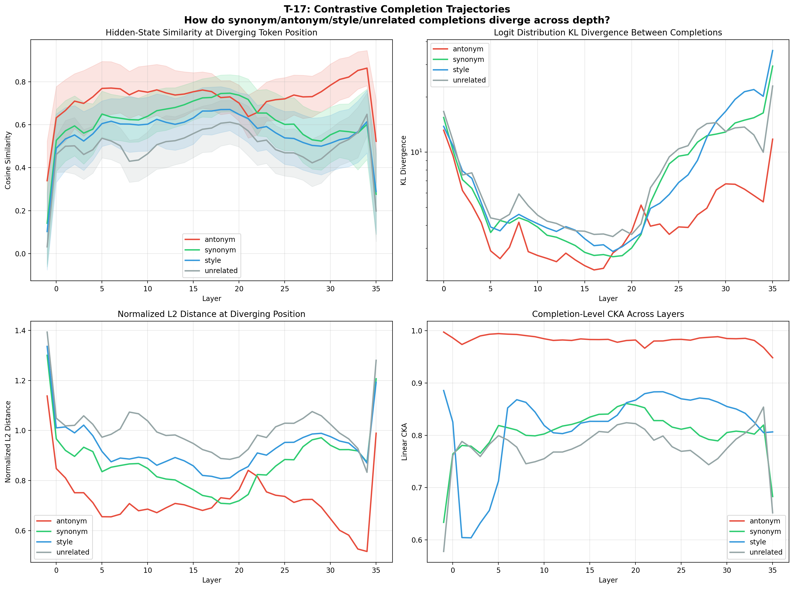
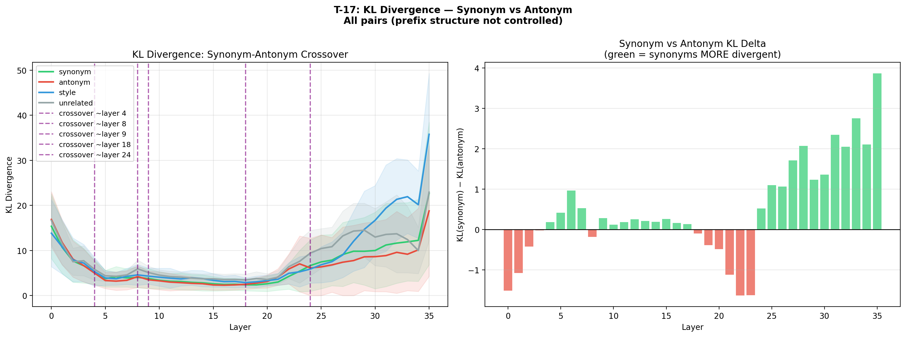
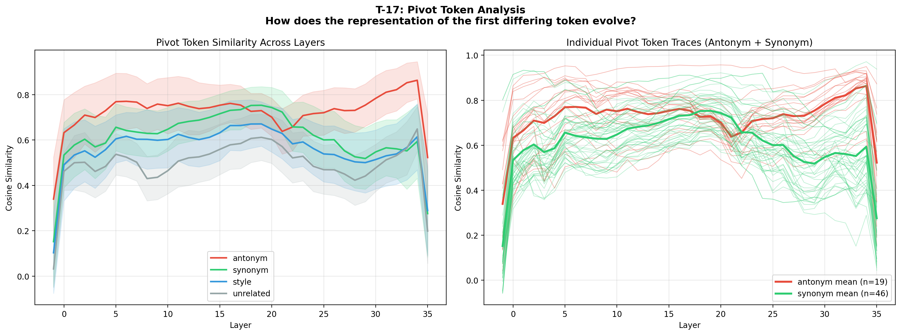
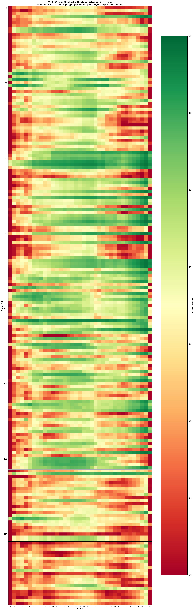

# T-17: Contrastive Completion Trajectories

## Motivation & Research Question

T-1 (logit lens) showed that token predictions evolve through four phases across depth, and T-4 (residual stream geometry) revealed how the hidden-state manifold changes layer-by-layer. But both experiments used a single greedy completion per prompt. A natural follow-up: **how do the model's internal representations differ when processing semantically similar vs. opposite completions?**

Specifically:
1. **At which layer do antonym completions first diverge in hidden-state space?** If the prompt is "Is the Sun a star or a planet?" and we force-decode "star" vs "planet", at what depth does the model's residual stream clearly separate the two?
2. **Do synonym completions maintain similar trajectories despite different surface forms?** "Fast", "swift", and "rapid" mean the same thing — do their hidden states converge at semantic layers even though their token embeddings differ?
3. **Does meaning crystallize before form?** If synonym trajectories stay similar longer than antonym trajectories, it suggests the model builds semantic representations first and only resolves surface-level token choice in later layers.
4. **How does the divergence profile differ across relationship types?** Antonyms, synonyms, style variants, and unrelated completions should each produce distinct divergence signatures.

## Theoretical Framework

### Residual Stream as a Trajectory in Representation Space

A transformer with $L$ layers maps an input token sequence to a sequence of hidden states via the residual stream. For a given token position $t$, the hidden state after layer $\ell$ is:

$$h_t^{(\ell)} = h_t^{(0)} + \sum_{i=1}^{\ell} f_i(h_t^{(i-1)})$$

where $h_t^{(0)}$ is the token embedding and $f_i$ is the residual update from layer $i$ (attention + MLP). Given two completions $A$ and $B$ for the same prompt, the hidden states at the **first diverging token position** $t^\ast$ (the "pivot") follow two trajectories:

$$\text{Trajectory A:} \quad h_{t^\ast}^{(0,A)}, \; h_{t^\ast}^{(1,A)}, \; \ldots, \; h_{t^\ast}^{(L,A)}$$
$$\text{Trajectory B:} \quad h_{t^\ast}^{(0,B)}, \; h_{t^\ast}^{(1,B)}, \; \ldots, \; h_{t^\ast}^{(L,B)}$$

These trajectories start from different embeddings (different token IDs at position $t^\ast$) but are conditioned on the same context (identical prefix). We measure their relationship at each layer $\ell$ via:

**Cosine similarity** (directional alignment):
$$\text{cos}(\ell) = \frac{\langle h_{t^\ast}^{(\ell,A)}, \; h_{t^\ast}^{(\ell,B)} \rangle}{\|h_{t^\ast}^{(\ell,A)}\| \cdot \|h_{t^\ast}^{(\ell,B)}\|}$$

**Normalized L2 distance** (magnitude-sensitive divergence):
$$d(\ell) = \frac{\|h_{t^\ast}^{(\ell,A)} - h_{t^\ast}^{(\ell,B)}\|}{\frac{1}{2}(\|h_{t^\ast}^{(\ell,A)}\| + \|h_{t^\ast}^{(\ell,B)}\|)}$$

### KL Divergence and the Meaning-vs-Form Decomposition

At each layer, we project the hidden state through the final layer norm $\text{RMSNorm}$ and unembedding matrix $W_U$ to get logits:

$$z^{(\ell)} = W_U \cdot \text{RMSNorm}(h_{t^\ast}^{(\ell)})$$

The KL divergence between the resulting distributions for completions $A$ and $B$ decomposes into two components:

$$D_{\text{KL}}(p_A^{(\ell)} \| p_B^{(\ell)}) = \underbrace{D_{\text{KL}}(p_A^{(\ell)} \| p_{\text{sem}}^{(\ell)})}_{\text{form commitment}} + \underbrace{D_{\text{KL}}(p_{\text{sem}}^{(\ell)} \| p_B^{(\ell)})}_{\text{semantic distance}}$$

where $p_{\text{sem}}^{(\ell)}$ is a hypothetical "semantic" distribution that assigns equal probability to all surface forms expressing the same meaning. This decomposition predicts:

- **Antonyms**: semantic distance dominates early (the model distinguishes meanings), form commitment is low (both are valid grammar). KL stays moderate throughout.
- **Synonyms**: semantic distance is ~0 (same meaning), but form commitment grows in late layers as the model selects a specific token. KL rises dramatically in the final layers.

This predicts a **crossover**: synonyms should have lower KL than antonyms in early layers (shared meaning) but higher KL in late layers (divergent surface forms).

### Linear CKA as Representational Similarity

For completions with multiple tokens, pointwise cosine similarity misses structural patterns. We use **Linear Centered Kernel Alignment** (CKA), which compares the Gram matrices of two representations:

$$\text{CKA}(X, Y) = \frac{\| Y^{T} X \|_F^{2}}{\| X^{T} X \|_F \cdot \| Y^{T} Y \|_F}$$

where $X \in \mathbb{R}^{n \times d}$ and $Y \in \mathbb{R}^{n \times d}$ are the hidden-state matrices (tokens × hidden dim) for completions $A$ and $B$ respectively, after centering. CKA = 1 means the representations encode the same structure; CKA = 0 means they are unrelated.

## Setup

- **Model**: Qwen3-4B-Instruct-2507 (36 layers, GQA, SwiGLU, bf16)
- **Data**: `data/text_completions/contrastive_pairs.json` — 50 prompt groups with hand-crafted completion pairs/triples
- **Relationship types**: antonym (19 groups), synonym (16 groups), style (8 groups), unrelated (7 groups)
- **Hardware**: Single B200 GPU (bf16), ~24s total runtime
- **Completion strategy**: Teacher forcing (no generation) — feed each completion's tokens as input, collect hidden states at every layer

### Data Design

Each group contains a prompt and 2–3 short completions (1–8 tokens) with a known semantic relationship:

| Type | Example Prompt | Completions | Design Principle |
|---|---|---|---|
| **Antonym** | "Is the Sun a star or a planet?" | "The Sun is a **star**" / "The Sun is a **planet**" | Shared completion prefix, differ at a single pivot word |
| **Synonym** | "Describe the speed of a cheetah in one word." | "**Fast**" / "**Swift**" / "**Rapid**" | Diverge immediately at first completion token |
| **Style** | "Explain what gravity is." | Formal / Casual / Technical registers | Same information, different verbosity and word choice |
| **Unrelated** | "What is the capital of France?" | "**Paris**" / "**Elephant**" / "**42**" | Correct answer vs semantically nonsensical |

**Important structural note**: antonym pairs share completion prefixes (e.g., "The Sun is a ") before diverging, so the first diverging position has additional shared context. Synonym pairs typically diverge at the very first completion token. This means absolute cosine values are not directly comparable between relationship types — the **trajectory shape** (how similarity evolves across layers) and **KL divergence** (logit-level discrimination) are the primary comparable metrics.

## Methods

### Method 1: Contrastive Logit Lens

Extension of T-1. For each completion in a group, run the full prompt + completion through the model with teacher forcing. At each layer $\ell$, project the residual stream at the pivot position through the final LM head (RMSNorm + unembedding) to get logit distributions $p_A^{(\ell)}$ and $p_B^{(\ell)}$.

**Primary metric**: $D_{\text{KL}}(p_B^{(\ell)} \| p_A^{(\ell)})$ — how distinguishable are the two completions' logit distributions at each layer?

### Method 2: Hidden-State Representational Similarity

Extension of T-4. For each prompt group, collect the residual stream vectors after each layer for all completions.

**Metrics per layer per pair:**
- **Cosine similarity** at the first diverging token position
- **Normalized L2 distance** at the diverging position
- **Linear CKA** over completion tokens

### Method 3: Divergence Curve Analysis

Aggregate per-layer metrics into **divergence curves** — one curve per relationship type, showing how similarity evolves across depth.

### Method 4: Pivot Token Analysis

Track the hidden state specifically at the pivot token position across layers. Measure cosine similarity of the pivot token's representation between the two completions, plus a baseline from a shared-prefix token (which should remain ~1.0 in a causal model).

## Results

### Divergence Curves



The four-panel overview reveals the core dynamics:

**Cosine similarity** (top-left): All relationship types follow an inverted-U trajectory — similarity rises from the embedding layer, plateaus in mid layers, then drops at the final layer. The consistent ordering is antonym > synonym > style > unrelated, which reflects the structural property that antonym pairs share longer completion prefixes.

**KL divergence** (top-right, log scale): The most striking finding. All types start with high KL (~10–17) at layer 0, decrease through mid layers, then **diverge dramatically in late layers** — except antonyms, which stay low. Synonyms and style completions reach KL > 15–20 by layer 34, while antonyms peak at only ~5.4.

**L2 distance** (bottom-left): Mirrors cosine similarity inversely. Antonyms have lowest L2, unrelated highest.

**CKA** (bottom-right): Completion-level representational similarity. Antonyms maintain CKA > 0.97 throughout (the completions encode the same structure). Synonym and style CKA drops below 0.7 in late layers, reflecting divergent surface-form commitments.

### The Meaning-vs-Form Crossover



The central finding of T-17. The left panel shows KL divergence with crossover points marked:

| Layer Range | Synonym KL vs Antonym KL | Interpretation |
|---|---|---|
| **0–17** | Synonym ≤ Antonym | Shared meaning keeps synonym distributions similar; antonyms already semantically distinct |
| **~18** | **Crossover** | Synonym KL surpasses antonym KL |
| **19–35** | Synonym ≫ Antonym | Model commits to specific token forms; synonyms diverge because they target different tokens despite same meaning |

The right panel shows the delta KL(synonym) − KL(antonym) per layer. The transition from red (antonyms more divergent) to green (synonyms more divergent) occurs at layers 18–22, then the green bars grow dramatically — by layer 34, synonyms are 3× more divergent than antonyms in logit space.

**Interpretation**: The model processes meaning and form in two phases:
1. **Layers 0–17 (semantic phase)**: The model builds meaning representations. Antonyms (different meanings) are distinguished more than synonyms (same meaning).
2. **Layers 18–35 (form-commitment phase)**: The model selects specific output tokens. Synonyms (same meaning, different tokens) now diverge more because the model must commit to a single surface form.

This aligns with T-1's finding that the final 4 layers account for 61% → 99.5% accuracy jumps — these are the form-commitment layers.

### Pivot Token Analysis



**Left panel**: Aggregate pivot token similarity by relationship type. Antonym pivots (e.g., "star" vs "planet") maintain higher cosine similarity (0.7–0.85) than synonym pivots (e.g., "Fast" vs "Swift", 0.5–0.75). This is because antonym pivots share the same syntactic role and position in a matched context, differing only in semantic content — the model's residual stream at that position is dominated by context, not token identity.

**Right panel**: Individual traces reveal high variance within both types. Some antonym pairs diverge sharply at specific layers (visible as individual red traces dipping to 0.3), while others stay similar throughout. This suggests certain semantic distinctions are resolved at specific layers rather than gradually.

### Relationship Heatmap



Each row is a group-pair, columns are layers (embedding through layer 35). Groups are sorted by relationship type (synonym | antonym | style | unrelated), separated by horizontal lines.

Key observations:
- **Antonym block** (second section): consistently green (high similarity) through layers 5–34, with a sharp red column at the embedding layer and layer 35
- **Synonym block** (first section): more heterogeneous — some synonym pairs maintain high similarity throughout, others diverge in mid-late layers
- **Style and unrelated blocks**: generally lower similarity (more orange/red), especially in late layers
- **Layer 35 (final)**: universally red across all types — the final layer specializes representations for specific token prediction, destroying inter-completion similarity

### Quantitative Summary

| Metric | Synonym | Antonym | Style | Unrelated |
|---|---|---|---|---|
| Peak cosine similarity | 0.747 (L19) | 0.863 (L34) | 0.671 (L19) | 0.649 (L34) |
| Min cosine similarity | 0.142 (emb) | 0.340 (emb) | 0.103 (emb) | 0.032 (emb) |
| KL at layer 0 | 15.4 | 13.2 | 13.8 | 16.7 |
| KL at layer 16 (min) | 2.7 | 2.3 | 3.1 | 3.6 |
| KL at layer 34 | 16.4 | 5.4 | 20.2 | 10.0 |
| KL crossover layer | — | ~18 | — | — |
| Final-layer cosine (L35) | 0.277 | 0.523 | 0.289 | 0.198 |

## Conclusions & Key Findings

### 1. The Meaning-vs-Form Crossover Is Real

The most striking result: **synonym completions become more divergent than antonyms in logit space after layer ~18**. This directly demonstrates that the model separates semantic processing (early-mid layers) from surface-form commitment (late layers). Antonyms, despite being semantically opposite, stay closer in logit space because the model has already "decided" and the output distributions are both peaked (just at different tokens). Synonyms diverge because the model's form-commitment mechanism treats "Fast", "Swift", and "Rapid" as distinct outputs even though they express the same meaning.

### 2. Context Dominates Token Identity in the Residual Stream

Antonym pairs (e.g., "star" vs "planet" after identical context) maintain cosine similarity > 0.72 across layers 2–34. The residual stream at a given position is overwhelmingly determined by context, not by the specific token embedded there. This confirms the "residual stream as information highway" view — the token embedding is a small perturbation on a context-dominated representation.

### 3. Layer 35 Is a Universal Discriminator

All relationship types show a dramatic cosine similarity drop at the final layer (35): synonyms drop from 0.60 → 0.28, antonyms from 0.86 → 0.52, unrelated from 0.65 → 0.20. This aligns with T-1's finding that layer 35 is where the model makes its final token prediction — it must maximally separate all alternatives.

### 4. The KL "Smile" Pattern

KL divergence follows a U-shape for all relationship types except antonyms: high at layer 0 (embeddings are very different → logits are noisy), decreasing through mid layers (representations converge toward shared meaning), then rising again in late layers (form commitment). Antonyms show a partial U — their KL rises in layers 20–35 but never returns to the initial level, because the model efficiently separates the two meanings without the "form selection" overhead that synonyms face.

### 5. Connections to T-1 Phase Architecture

T-1 identified four phases: representation building (L0–5), early semantics (L6–12), prediction formation (L13–28), refinement (L29–35). The T-17 crossover at layer ~18 falls squarely in the prediction-formation phase, consistent with the interpretation that this phase is where the model transitions from understanding meaning to selecting output tokens.

## Usage

```bash
# No prerequisites — contrastive_pairs.json is hand-crafted, no model inference for data
poetry run python experiments/t17_contrastive_trajectories/run.py
```

Optional flags:
```bash
--device cuda:0          # GPU selection (default: cuda:0)
--output-dir results/    # Output directory (default: experiments/t17_contrastive_trajectories/results/)
```

Runtime: ~24s on a single B200 GPU.

## Connections to Other Experiments

- **T-1 (Logit Lens)**: T-17 extends the logit lens to *contrastive* settings — instead of asking "when does the correct token appear?", we ask "when do alternative tokens separate?" The crossover at layer ~18 aligns with T-1's prediction-formation phase.
- **T-4 (Residual Stream Geometry)**: T-17 uses the same geometric tools (cosine similarity, norms, CKA) but applied to *paired* completions rather than single-sequence statistics. The finding that context dominates token identity complements T-4's anisotropy analysis.
- **T-3 (Layer Swap Cost)**: The form-commitment layers (18–35) where synonym KL rises should correspond to expensive swap regions in T-3's cost matrix — swapping these layers would disrupt the model's surface-form selection.
- **T-7 (Linearization Gap)**: The crossover region (layers 18–22) should correlate with high linearization gap — the transition from semantic to form processing likely requires nonlinear computation.
