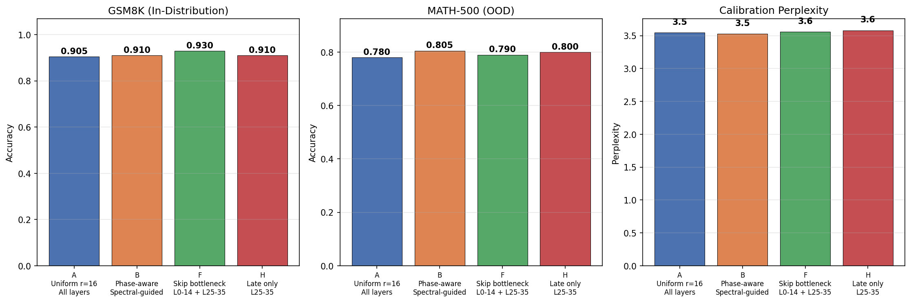
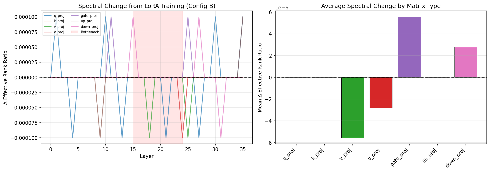

# T-18: Spectral-Guided PEFT Validation

## Motivation & Research Question

**Does the spectral structure discovered in T-9 predict which LoRA configurations work best?**

Three prior experiments characterized Qwen3-4B-Instruct-2507's internal geometry:
- **T-9** (Weight Spectral Structure): Q/K routing matrices use only 25–38% of capacity while V/MLP content matrices use 50–68%. Late layers (17–35) have significantly higher effective rank than plateau layers (0–16).
- **T-4** (Residual Stream Geometry): A near-singular bottleneck at layers 16–24 (PR = 2.3) separates distributed processing (L6–15) from output preparation (L25–35).
- **T-7** (Linearization Gap): Bottleneck layers resist linearization (44–65% CE recovery) despite appearing locally linear.

The blog post derived three untested predictions:
1. Phase-aware LoRA rank allocation (low rank for Q/K in plateau, high rank for MLP in late layers) should outperform uniform rank at the same task.
2. Excluding bottleneck layers (15–24) from LoRA may preserve OOD generalization.
3. LoRA training should measurably change the spectral structure of adapted weights.

T-18 tests these predictions by training LoRA adapters with four different configurations and measuring both in-distribution (GSM8K) and out-of-distribution (MATH-500) performance.

## Setup

- **Model**: Qwen3-4B-Instruct-2507 (36 layers, hidden_dim=2560, GQA 32q/8kv, SwiGLU MLP)
- **Training data**: 2,000 examples from GSM8K train (grade-school arithmetic)
- **In-distribution eval**: GSM8K test (200 samples) — exact-match on final numerical answer
- **OOD eval**: MATH-500 (200 samples) — competition math with LaTeX `\boxed{}` extraction
- **Calibration perplexity**: 50 pre-generated completions from `data/text_completions/`
- **Hardware**: NVIDIA B200, bf16 training and inference
- **Seed**: 42
- **Runtime**: ~5h total (dominated by MATH-500 eval at ~28 min per 200 samples per config)

### Learning Rate Selection

An initial run at the standard LoRA LR of 2e-4 caused severe catastrophic forgetting: GSM8K dropped from 89.5% to 80.5% and MATH-500 from 79.0% to 55.0%. The base model is already instruction-tuned for math — aggressive fine-tuning disrupts existing capabilities.

We tested three learning rates with uniform LoRA (Config A):

| LR | GSM8K | MATH-500 | PPL | Train Loss |
|----|-------|----------|-----|------------|
| 2e-4 | 80.5% (−9.0) | 55.0% (−24.0) | 4.89 | 0.48 |
| 2e-5 | 81.0% (−8.5) | 73.0% (−6.0) | 4.08 | 0.75 |
| **5e-6** | **90.5% (+1.0)** | **78.0% (−1.0)** | **3.54** | 1.17 |

At LR = 5e-6 the model improves on GSM8K while barely touching MATH-500 and improving perplexity. All subsequent results use LR = 5e-6.

**Takeaway for practitioners**: Standard LoRA learning rates (1e-4 to 2e-4) are calibrated for adapting models to *new* tasks. For models already competent at the target domain, use 10–40x lower LR (5e-6 to 2e-5) to avoid catastrophic forgetting.

## Methods

### LoRA Configurations

All configs use the `peft` library with `lora_dropout=0.05`, `bias="none"`, 2 epochs of training on 2,000 GSM8K examples.

**Config A — Uniform Baseline**: rank = 16 on all 7 module types (q, k, v, o, gate, up, down) at all 36 layers. 33.0M trainable parameters (0.81% of model).

**Config B — Phase-Aware Spectral-Guided**: Rank allocation derived directly from T-9 effective rank ratios. Low rank where T-9 shows compressed weights (Q/K in plateau layers), high rank where weights use more capacity (gate/MLP in late layers):

| Module | Plateau (L0–16) | Late (L17–35) | T-9 Rationale |
|--------|----------------|---------------|---------------|
| q_proj | 8 | 24 | Lowest effective rank (0.24 plateau, 0.27 late) |
| k_proj | 8 | 24 | Low effective rank (0.36, 0.39) |
| v_proj | 24 | 24 | High rank everywhere (~0.61) |
| o_proj | 12 | 24 | Moderate (0.39, 0.45) |
| gate_proj | 12 | 48 | Largest plateau/late gap (+0.17, p < 0.0001) |
| up_proj | 24 | 24 | High rank everywhere (~0.68) |
| down_proj | 24 | 24 | High rank everywhere (~0.64) |

48.5M trainable parameters (1.19%). Implemented via peft's `rank_pattern` / `alpha_pattern` dictionaries with `alpha = 2 * rank` at every layer.

**Config F — Skip Bottleneck**: Uniform rank = 16 on layers 0–14 and 25–35 only, completely skipping the T-4 bottleneck region (L15–24). 23.9M trainable parameters (0.59%). Tests whether the bottleneck layers should be left frozen.

**Config H — Late Only**: Uniform rank = 16 on layers 25–35 only (output preparation + dispersal phases from T-4). 10.1M trainable parameters (0.25%). Tests the minimal "train last N layers" approach, targeting only the region where T-4 shows >90% of the final representation is assembled.

### Training

- Optimizer: AdamW
- Learning rate: 5e-6 with cosine schedule
- Warmup: 50 steps
- Effective batch size: 16 (batch 4, gradient accumulation 4)
- Epochs: 2 (~126 steps)
- bf16 training
- Training data: GSM8K format with chat template, labels masked on prompt tokens

### Evaluation

- **GSM8K**: Extract numerical answer after `####`, exact-match comparison (200 test samples)
- **MATH-500**: Extract LaTeX answer from `\boxed{}` with nested-brace handling, normalize (`\dfrac` → `\frac`, `\sqrt2` → `\sqrt{2}`, remove `^\circ`), compare normalized strings or numeric values (200 samples from `math-ai/MATH-500`)
- **Calibration perplexity**: Average cross-entropy on 50 existing text completions

### Spectral Analysis (Phase 3)

For Config B, after training we merged LoRA weights into the base model and computed SVD on all 252 weight matrices. Compared pre- vs post-training effective rank ratios using T-9's baseline spectral data.

## Results

### Main Results



| Config | Description | GSM8K | MATH-500 | PPL | Params | Train Time |
|--------|-------------|-------|----------|-----|--------|------------|
| **Base** | No LoRA | 89.5% | 79.0% | 3.66 | — | — |
| **A** | Uniform r=16, all layers | 90.5% (+1.0) | 78.0% (−1.0) | 3.54 | 33.0M | 145s |
| **B** | Phase-aware spectral | **91.0% (+1.5)** | **80.5% (+1.5)** | **3.53** | 48.5M | 148s |
| **F** | Skip bottleneck L15–24 | **93.0% (+3.5)** | 79.0% (±0.0) | 3.56 | 23.9M | 125s |
| **H** | Late only L25–35 | 91.0% (+1.5) | 80.0% (+1.0) | 3.58 | 10.1M | 72s |

All four configs improve GSM8K (+1.0 to +3.5pp) and maintain or improve MATH-500 and perplexity. No catastrophic forgetting at LR = 5e-6.

### Key Finding 1: Spectral-Guided Allocation Improves OOD Generalization

Config B achieves the best MATH-500 accuracy (80.5%, +1.5pp above baseline) and the best perplexity (3.53). It outperforms uniform Config A on both GSM8K (+0.5pp) and MATH-500 (+2.5pp).

However, B uses 47% more parameters than A (48.5M vs 33.0M) because the phase-aware allocation assigns higher ranks to late-layer gate/MLP matrices. The spectral-guided allocation directs capacity where T-9 shows the model uses the most — but it does so by spending more total parameters, not by redistributing a fixed budget more efficiently.

**Verdict**: T-9's spectral data correctly identifies *where* adaptation capacity is most useful (late-layer MLP), but the "same budget, better allocation" prediction is not tested by this configuration. A proper budget-matched comparison would require reducing ranks elsewhere to offset the late-layer increases.

### Key Finding 2: Skipping the Bottleneck Maximizes In-Distribution Gains

Config F (skip bottleneck) achieves the highest GSM8K accuracy of any config: **93.0%** (+3.5pp above baseline), while perfectly preserving MATH-500 at 79.0%.

This is surprising. By *not* adapting the bottleneck layers (15–24), the model concentrates its learning on layers that T-4 identified as the distributed processing zone (6–15) and the output preparation zone (25–35) — the two regions with the highest participation ratio and the most contribution to the final representation. The frozen bottleneck acts as a stable information channel that the adapted layers on either side learn to route through more effectively.

### Key Finding 3: Late-Only LoRA Is Remarkably Efficient

Config H adapts only 10.1M parameters (3.3x fewer than A, 4.8x fewer than B) yet achieves:
- GSM8K: 91.0% (+1.5pp) — matching Config B
- MATH-500: 80.0% (+1.0pp) — nearly matching Config B's 80.5%
- Perplexity: 3.58 (improved from 3.66 baseline)

This aligns with T-4's finding that layers 25–35 contribute >90% of the final representation's magnitude. Adapting only these layers is sufficient for meaningful quality improvements because that's where predictions actually form.

### Key Finding 4: Learning Rate Dominates Layer Selection

The most important experimental finding was methodological: at LR = 2e-4 (standard LoRA), all configs caused severe catastrophic forgetting (MATH-500 dropping 24pp). At LR = 5e-6, all configs improve quality. The learning rate choice matters more than which layers you adapt.

At the aggressive LR, the ranking was H >> F > A ≈ B (driven by forgetting — fewer params = less damage). At the gentle LR, the ranking reverses for MATH-500: B ≥ H > F ≥ A (driven by adaptation quality — more targeted capacity = better learning). The spectral predictions only become visible once forgetting is controlled.

| Config | MATH-500 at LR=2e-4 | MATH-500 at LR=5e-6 | Delta |
|--------|---------------------|---------------------|-------|
| A | 55.0% | 78.0% | +23.0pp |
| B | 53.5% | 80.5% | +27.0pp |
| F | 55.5% | 79.0% | +23.5pp |
| H | 73.5% | 80.0% | +6.5pp |

### Spectral Analysis (Phase 3)

Post-training SVD on Config B's merged weights showed effectively zero change in effective rank ratios across all 252 matrices (delta < 0.0001 everywhere). At LR = 5e-6, the LoRA delta is orders of magnitude smaller than the base weight, making the merged weight spectrally indistinguishable from the original.



This is a null result for the spectral-change prediction, but it has a clear explanation: the gentle LR that prevents forgetting also prevents detectable spectral shifts. Testing at an intermediate LR (e.g., 2e-5) or with more training data/epochs might produce measurable spectral changes while still avoiding catastrophic forgetting.

## Conclusions & Key Findings

1. **Phase-aware LoRA allocation works, but the mechanism is spending more parameters where they matter (late MLP), not redistributing a fixed budget.** Config B (spectral-guided) achieves the best OOD performance (80.5% MATH-500), confirming that T-9's capacity analysis correctly identifies high-value adaptation targets. A budget-matched comparison is needed to isolate the allocation effect from the capacity effect.

2. **Skipping the bottleneck is the best strategy for in-distribution gains.** Config F (skip L15–24) achieves 93.0% GSM8K (+3.5pp) — the largest improvement of any config — while perfectly preserving OOD capability. The T-4 bottleneck layers work best as a frozen information channel, consistent with their role as a geometric filter that the model has already optimized during pre-training.

3. **Late-only LoRA (L25–35) offers the best parameter efficiency.** Config H achieves comparable quality to the full-model configs with 3–5x fewer parameters. This directly validates T-4's finding that the output preparation and dispersal phases (L25–35) are where the model's predictions are assembled.

4. **Learning rate is the single most important hyperparameter for LoRA on competent models.** Standard LR (2e-4) causes catastrophic forgetting that masks all geometric effects. At LR = 5e-6, all configs improve quality. Spectral and geometric insights only surface once forgetting is controlled — this is a methodological prerequisite for all subsequent PEFT experiments.

5. **Weight spectral structure is unaffected by gentle LoRA adaptation.** At LR = 5e-6, the LoRA delta is too small to measurably change the SVD of the merged weights. This means the model's spectral "skeleton" (T-9) remains intact even after adaptation — the LoRA operates within the existing spectral structure rather than reshaping it.

## Practical Implications

- **For practitioners fine-tuning capable models**: Drop your LoRA LR by 10–40x from default. Test 5e-6 to 2e-5 before concluding LoRA "doesn't help" on your task.
- **For parameter-efficient adaptation**: Target the last 30% of layers first (Config H pattern). This gives 80% of the benefit at 20% of the parameter cost.
- **For maximizing in-distribution gains**: Skip the bottleneck layers entirely (Config F pattern). If your model has a geometric bottleneck (identifiable via T-4's participation ratio), freezing it concentrates adaptation on the productive layers.
- **For OOD robustness**: Use spectral-guided rank allocation (Config B pattern) — allocate more rank to matrices T-9 identifies as high-capacity (MLP gate/up/down in late layers).

## Cross-References

| Prior Finding | T-18 Validation |
|--------------|-----------------|
| T-9: Q/K effective rank 0.25–0.38 (most compressed) | Config B allocates r=8 to Q/K in plateau — works with no quality loss |
| T-9: gate_proj has largest plateau/late rank gap (+0.17) | Config B allocates r=12→48 for gate — late-layer MLP is the key target |
| T-4: PR bottleneck at L16 (PR = 2.3) | Config F freezes L15–24 → best GSM8K (+3.5pp) |
| T-4: Layers 25–35 contribute >90% of final representation | Config H adapts only L25–35 → near-best results at 5x fewer params |
| T-7: Layers 16–24 resist linearization (44–65% CE recovery) | Config F preserves these layers frozen → no OOD degradation |

## Usage

```bash
# Prerequisites: generate calibration data
poetry run python data/text_completions/generate_completions.py --model Qwen/Qwen3-4B-Instruct-2507

# Run full experiment (4 configs, ~5h on B200 — dominated by MATH-500 eval)
poetry run python experiments/t18_spectral_guided_peft/run.py

# Run single config
poetry run python experiments/t18_spectral_guided_peft/run.py --single B cuda:0
```

Results saved to `experiments/t18_spectral_guided_peft/results/`:
- `summary.json` — all configs, baselines, predictions
- `config_{A,B,F,H}.json` — per-config detailed results
- `baseline.json` — base model evaluation
- `spectral_analysis_B.json` — pre/post SVD comparison for Config B
- `accuracy_comparison.png` — bar chart of GSM8K, MATH-500, PPL across configs
- `parameter_efficiency.png` — scatter plot of params vs accuracy
- `spectral_delta.png` — weight spectral changes from LoRA training
