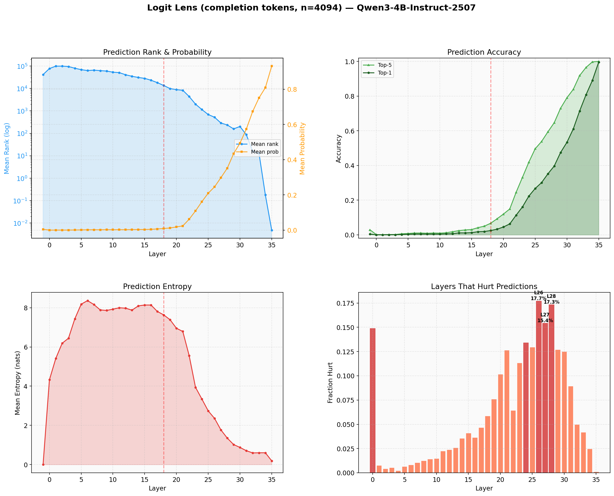
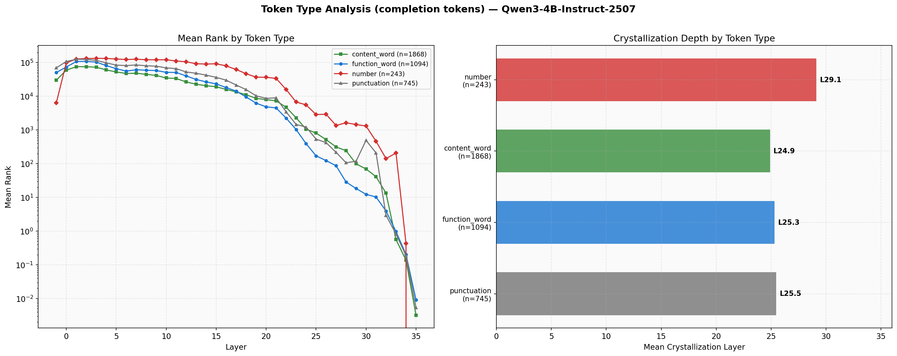
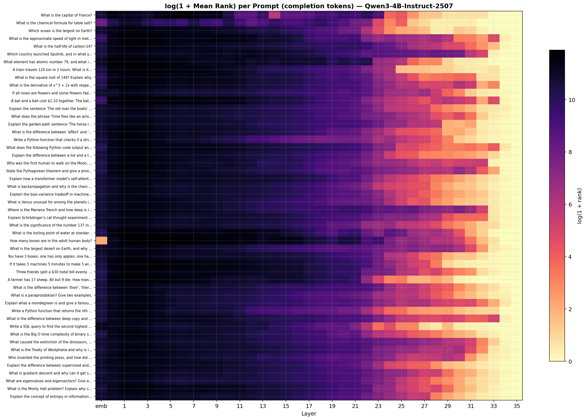
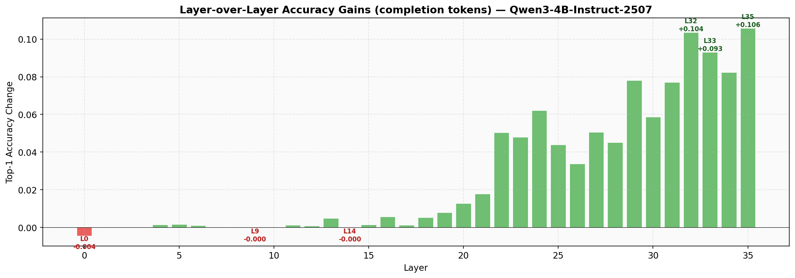

# T-1: Logit Lens / Residual Stream Decoding

## Motivation & Research Question

How do token predictions evolve across the depth of a transformer? By projecting the residual stream after each layer through the final LM head (the "logit lens" technique), we can observe when the model "knows" the answer and whether different token types crystallize at different depths. This has practical implications for early-exit strategies, layer pruning, and understanding computational allocation.

## Setup

- **Model**: Qwen3-4B-Instruct-2507 (36 decoder layers, bf16)
- **Hardware**: NVIDIA B200, cuda:0
- **Evaluation data**: 50 question/instruction-format prompts with greedy completions generated via vLLM (temp=0, max 2048 tokens). A system message ("Answer concisely and directly. Do not restate the question.") prevents echo repetition. Metrics computed **only on completion tokens** (n=4,094), eliminating chat template noise.
- **Prompts**: Diverse mix spanning factual Q&A, multi-step reasoning, linguistic analysis, code tasks, world knowledge, and technical explanations (from `data/text_completions/prompts.json` v3)
- **Token classification**: Tokens classified as function words, content words, numbers, or punctuation

## Methods

For each of the 36 layers (plus the embedding layer), we:

1. **Forward the full prompt+completion** through the model with hooks capturing hidden states at every layer (`use_cache=False`)
2. **Apply the final RMSNorm** to each intermediate hidden state
3. **Project through the LM head** to get a vocabulary distribution at each layer
4. **Track metrics on completion tokens only**: rank of correct next-token, probability, entropy, top-1 prediction
5. **Detect "hurt" layers**: layers where the correct token's rank increases compared to the previous layer
6. **Compute crystallization**: the first layer at which the correct token enters the top-k and stays there for all subsequent layers

## Results

### Overview



### Prediction Quality Across Depth

| Metric | Layers 0–17 | Layers 18–35 |
|--------|-------------|--------------|
| Mean top-1 accuracy | 0.6% (std=0.6%) | 38.9% (std=30.2%) |
| Mean entropy (nats) | 7.5 (std=1.1) | 3.0 (std=2.6) |

Because we measure on the model's own greedy completions, the final layer achieves **99.5% top-1 accuracy** (100% top-5) — the model nearly perfectly predicts tokens it chose to generate. This makes the layer-by-layer progression much more informative: every layer's contribution to reaching ~100% is now visible.

Key layer-by-layer progression:
- **Layers 0–12**: Near-zero accuracy (<1%). Building low-level representations.
- **Layers 13–21**: Slow ramp from 1.1% to 6.3%. Early semantic processing.
- **Layers 22–28**: Rapid climb from 11.3% to 39.7%. The main "prediction formation" zone.
- **Layers 29–35**: Final push from 47.5% to 99.5%. Refinement and commitment.

### The Embedding-to-Layer-0 Disruption

A striking finding: **the raw embedding layer produces better predictions than layers 0–4**. The embedding has a mean rank of 41,659 and median of 3,966 — but layer 0 worsens this to a mean of 77,135 and median of 79,191. Entropy also jumps from near-zero (0.0004 nats at embedding) to 4.3 nats at layer 0, peaking at ~8.2 nats around layers 6–8.

This means the first transformer layer actively *destroys* the token co-occurrence signal present in the raw embeddings, replacing it with a distributed contextual representation. The model trades short-term prediction quality for a richer internal representation that pays off later. Predictions don't recover to embedding-level quality until around layer 12.

### Median Rank Trajectory

The median rank tells a clearer story than the mean (which is skewed by outliers):

| Layer | Median Rank | Interpretation |
|-------|-------------|----------------|
| Embedding | 3,966 | Weak co-occurrence signal |
| Layer 0 | 79,191 | Disrupted — worse than embedding |
| Layer 12 | 19,414 | Recovering |
| Layer 17 | 3,094 | Back to embedding level |
| Layer 22 | 69 | Prediction forming |
| Layer 24 | 9 | Top-10 territory |
| Layer 28 | 1 | Median token is rank 1 |
| Layer 30+ | 0 | Median token is top-1 |

### Crystallization Statistics

| Metric | Value |
|--------|-------|
| Mean crystallization layer (top-10 stable) | 25.4 |
| Median crystallization layer | 25.0 |
| Std deviation | 4.8 layers |
| Mean first top-1 layer | 27.8 |
| Median first top-1 layer | 29.0 |

The 2.4-layer gap between crystallization (entering top-10) and first top-1 (becoming the #1 prediction) shows the model "narrows in" gradually — tokens enter the shortlist ~2–3 layers before being fully committed to.

### Token Type Crystallization



| Token Type | Mean Crystal Layer | Count | Layers Behind Content |
|------------|-------------------|-------|-----------------------|
| Content words | 24.9 | 1,868 | — |
| Function words | 25.3 | 1,094 | +0.4 |
| Punctuation | 25.5 | 745 | +0.6 |
| Numbers | 29.1 | 243 | +4.2 |

Content words crystallize earliest (24.9), followed closely by function words (25.3) and punctuation (25.5). **Numbers are a clear outlier at 29.1** — requiring 4+ additional layers of computation. This is consistent across evaluation methods and dataset sizes.

The number difficulty is also visible in per-layer mean ranks: at layer 32, numbers still have a mean rank of 141, while content words are at 13, function words at 4, and punctuation at 3. Numbers only converge at layers 34–35, suggesting numerical reasoning engages the model's deepest layers.

### Layers That Hurt Predictions

| Layer | Fraction of tokens hurt |
|-------|------------------------|
| Layer 26 | 17.7% |
| Layer 28 | 17.3% |
| Layer 27 | 15.4% |
| Layer 0 | 14.9% |
| Layer 24 | 13.4% |

The hurt pattern is **bimodal**: there's a ramp from layers 11–21 (2–13% hurt) as the model begins restructuring representations, then a spike at layers 24–28 (13–18%) during peak prediction formation, followed by a sharp drop in layers 32+ (<5%). Layer 0 stands alone as an outlier in the early layers (14.9% vs <2% for layers 1–9).

The prediction-formation zone (layers 24–28) is where the model makes the most "risky" updates — aggressively refining predictions in ways that help most tokens but temporarily hurt ~17%.

### Per-Prompt Variation



### Layer-over-Layer Accuracy Gains



The biggest single-layer accuracy gains occur at:
- **Layer 35**: the final layer delivers the largest jump, pushing from ~89% to 99.5%
- **Layer 34**: second largest, jumping from ~81% to 89%
- **Layers 31–32**: each contributing ~8–10 percentage points

This concentration of gains in the final layers suggests the model's last few layers serve as a "commitment" mechanism — converting soft preferences into hard predictions.

## Conclusions & Key Findings

1. **Four-phase architecture**: The model builds predictions through four distinct phases: representation building (0–12), early semantics (13–21), prediction formation (22–28), and refinement (29–35). The transition is visible as a sharp knee around layers 20–22.

2. **Layer 0 actively disrupts embedding predictions**: The first transformer layer destroys raw embedding co-occurrence signals, increasing mean rank from 42K to 77K and entropy from ~0 to 4.3 nats. This restructuring is necessary — representations don't recover until layer 12, but ultimately produce far better predictions.

3. **Numbers require the full network depth**: Number tokens crystallize at layer 29.1 on average — 4+ layers deeper than other token types. At layer 32 (4 layers from the end), numbers still have mean rank 141 while other types are below 13. This suggests numerical reasoning is fundamentally harder and engages the model's deepest layers.

4. **The last 4 layers do most of the work**: Layers 32–35 account for the jump from 61% to 99.5% top-1 accuracy. The final layer alone contributes a 10.5-percentage-point jump. This has implications for early-exit strategies — exiting before layer 32 would lose nearly 40% of accuracy.

5. **Hurt layers are bimodal**: Layer 0 is an isolated hurt layer (14.9%), then hurt rates climb steadily during prediction formation (layers 24–28, peaking at 17.7%). These "hurt" events represent the model taking calculated risks — restructuring representations in ways that improve most tokens at the cost of temporarily degrading others.

6. **Crystallization-to-commitment gap**: Tokens enter the top-10 shortlist (crystallization) at layer 25.4 on average, but don't become the top-1 prediction until layer 27.8 — a 2.4-layer gap where the model "decides" among candidates.

### Practical Implications

- **Layer pruning**: Layers 0–12 contribute <1% accuracy. However, they cannot simply be removed — they build the distributed representations that later layers depend on. The embedding disruption at layer 0 is architecturally necessary.
- **Early exit**: A confidence-based early exit at layer 32 would capture 71% of tokens correctly with 4 fewer layers. However, this would disproportionately fail on numbers (only 14% correct at layer 32 vs 71% overall).
- **Speculative decoding**: Layer 29+ predictions (47.5% accurate) could serve as draft tokens for speculative decoding, but the accuracy cliff for numbers would create systematic failures on mathematical content.
- **Token-type-aware routing**: A routing mechanism that gives numbers extra computation (more layers or wider representations) while fast-tracking punctuation/function words could improve efficiency without sacrificing accuracy.

## Usage

```bash
# Generate completions first (one-time):
poetry run python data/text_completions/generate_completions.py --model Qwen/Qwen3-4B-Instruct-2507

# Run experiment:
poetry run python experiments/t1_logit_lens/run.py
```

Results in `experiments/t1_logit_lens/results/`:
- `summary.json` — aggregate statistics
- `full_results.json` — per-token, per-layer ranks and probabilities
- `logit_lens_overview.png` — 4-panel overview (rank+prob, accuracy, entropy, hurt layers)
- `token_type_crystallization.png` — per-token-type rank evolution and crystallization depths
- `prompt_rank_heatmap.png` — per-prompt rank evolution heatmap
- `accuracy_gains.png` — layer-over-layer top-1 accuracy gains/drops
