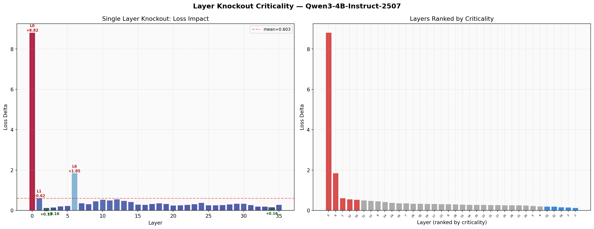
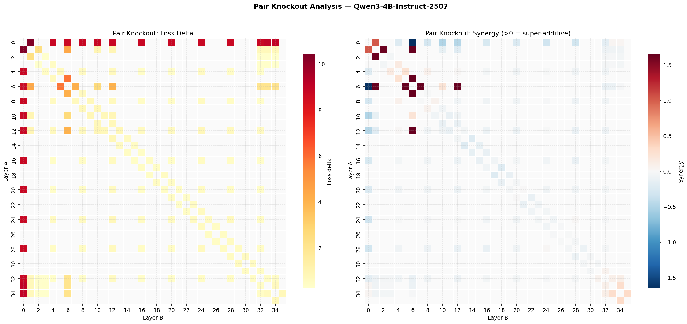

# T-2: Layer Knockout / Criticality Mapping

## Motivation & Research Question

A decoder-only transformer stacks $L$ identical blocks, each adding parameters and compute. But do all layers contribute equally? Are some layers load-bearing pillars while others are decorative — removable without real damage?

This matters for two reasons:

1. **Practical**: Structured pruning (dropping entire layers) is the cheapest form of model compression — no retraining, no quantization error, just fewer matrix multiplies. But it only works if some layers are genuinely redundant. This experiment maps which layers can be removed and how far pruning can go before the model breaks.
2. **Scientific**: A layer's criticality profile reveals the model's internal organization. If certain layers are disproportionately important, they likely perform irreplaceable computational roles (e.g., building initial contextual representations, routing information between attention heads). Pair interactions further reveal *circuits* — groups of layers that depend on each other's outputs.

We answer three questions through systematic ablation:
- **Single knockout**: How much damage does removing each individual layer cause?
- **Pair knockout**: Do layers interact — are there circuits where two layers depend on each other?
- **Greedy pruning**: What is the maximum number of layers you can remove before the model breaks?

## Setup

- **Model**: Qwen3-4B-Instruct-2507 (36 homogeneous decoder layers, bf16, hidden dim = 2560)
- **Hardware**: NVIDIA B200 (183GB), `cuda:1`
- **Evaluation data**: 50 question/instruction-format prompts with greedy completions generated via vLLM (temp = 0, max 512 tokens). System message prevents echo repetition.
- **Baseline loss**: 0.0894 (very low — the model reproduces its own greedy output nearly perfectly)

## Mathematical Framework

### The Residual Stream Model

Each transformer layer operates on a **residual stream**. Let $\mathbf{h}^{(\ell)} \in \mathbb{R}^d$ denote the hidden state at layer $\ell$ for a given token position. The computation is:

$$\mathbf{h}^{(\ell)} = \mathbf{h}^{(\ell-1)} + f_\ell\bigl(\mathbf{h}^{(\ell-1)}\bigr)$$

where $f_\ell$ is the combined attention + MLP transformation of layer $\ell$. Expanding recursively from the embedding $\mathbf{h}^{(0)}$:

$$\mathbf{h}^{(L)} = \mathbf{h}^{(0)} + \sum_{\ell=1}^{L} f_\ell\bigl(\mathbf{h}^{(\ell-1)}\bigr)$$

The final representation is the embedding plus the *sum of all layer updates*. This additive structure is why knockout works as an ablation method: removing layer $k$ means its update $f_k(\cdot)$ is never applied, so the residual stream passes through unchanged — equivalent to replacing $f_k$ with the identity:

$$\mathbf{h}^{(k)}_{\text{knockout}} = \mathbf{h}^{(k-1)} \qquad \text{(skip layer } k\text{)}$$

All downstream layers $\ell > k$ then receive $\mathbf{h}^{(k-1)}$ instead of $\mathbf{h}^{(k)}$, so the ablation propagates forward.

**Why remove rather than zero out?** Zeroing out a layer's parameters would produce $f_k(\mathbf{h}) = \mathbf{0}$ only if the layer had no biases and the activation function mapped zero inputs to zero outputs. In practice, layer norms, biases, and nonlinearities mean zeroing parameters creates an artificial, never-seen-in-training activation pattern — an artifact, not a clean ablation. Removal (identity skip) is the principled choice: it asks "what if this layer simply didn't exist?" with no side effects.

### Why Completion-Token Cross-Entropy?

We need a scalar score that captures how much a knockout damages the model. We use **cross-entropy loss**, but only on **completion tokens** — positions after the prompt, where the model is predicting its own previously-generated greedy output.

Given input token sequence $(x_1, \ldots, x_T)$ with prompt tokens at positions $1 \ldots P$ and completion tokens at positions $P{+}1 \ldots T$, the loss is:

$$\mathcal{L} = -\frac{1}{T - P} \sum_{t=P+1}^{T} \log p_\theta(x_t \mid x_{<t})$$

where $p_\theta(x_t \mid x_{<t})$ is the model's predicted probability for the actual next token.

**Why only completion tokens?** Prompt tokens are the "given" context — predicting them tests the model's language modeling ability on human-written text, which is easy (many valid continuations exist). Completion tokens are the model's *own* greedy output — the single most-likely token at each step. The intact model assigns very high probability to its own greedy choices (baseline loss = 0.0894 nats, corresponding to ~91% average top-1 probability). This creates an extremely sensitive probe: even small perturbations to the model's internals cause the predicted distribution to shift away from its own greedy trajectory, producing measurable loss increases. Prompt-token loss would be a blunter instrument.

### Criticality Metric: Loss Ratio

For layer $i$, define:

$$R_i = \frac{\mathcal{L}_{\text{knockout}_i}}{\mathcal{L}_{\text{baseline}}}$$

where $\mathcal{L}_{\text{knockout}_i}$ is the loss with layer $i$ removed. This ratio is unitless and directly interpretable:

- $R_i = 1$: removing layer $i$ has zero effect (perfectly redundant)
- $R_i = 2$: loss doubles (moderately critical)
- $R_i = 100$: loss increases 100-fold (catastrophically critical)

We use the ratio rather than absolute delta $\Delta L_i = \mathcal{L}_{\text{knockout}_i} - \mathcal{L}_{\text{baseline}}$ because the ratio is scale-invariant — it means the same thing regardless of baseline loss magnitude.

### Synergy: Detecting Inter-Layer Circuits

If layers contributed independently, removing two layers simultaneously would cause damage equal to the sum of their individual damages. Formally, if $\Delta L_i = \mathcal{L}_{\text{knockout}_i} - \mathcal{L}_{\text{baseline}}$ is the damage from removing layer $i$ alone, then under independence:

$$\Delta L_{i,j}^{\text{expected}} = \Delta L_i + \Delta L_j$$

The **synergy** measures departure from this additive null hypothesis:

$$S(i,j) = \Delta L_{i,j}^{\text{observed}} - \bigl(\Delta L_i + \Delta L_j\bigr)$$

**Why this definition?** Consider what the three cases mean in terms of the residual stream:

- **$S > 0$ (super-additive)**: Removing both layers is *worse* than the sum of removing each alone. This means layer $i$'s update $f_i$ and layer $j$'s update $f_j$ form a **circuit** — they are functionally coupled. When only one is removed, the other can partially compensate or at least operates on somewhat-normal inputs. When both are removed, neither can compensate, and the combined damage exceeds the sum. Example: if layer 5 produces an intermediate representation that layer 6 specifically consumes, removing layer 5 alone damages layer 6's input but layer 6 still runs; removing both eliminates the entire computation.

- **$S < 0$ (sub-additive)**: Removing both is *less* damaging than expected. The layers are **redundant with each other** — they perform overlapping functions, so the second removal doesn't add as much damage as it would alone. Example: if layers 30 and 31 both refine output token probabilities in similar ways, losing one is bad but losing both isn't twice as bad.

- **$S \approx 0$ (additive)**: The layers contribute **independently**. Their updates affect non-overlapping aspects of the residual stream, so damages simply stack.

### Pair Selection Strategy

Testing all $\binom{36}{2} = 630$ pairs would be expensive (each requires a full forward pass over 50 prompts). We select 94 pairs that cover the most informative interactions:

| Category | Pairs | Count | Why |
|----------|-------|-------|-----|
| Adjacent | $(i, i{+}1)$ for all $i$ | 35 | Detect local circuits — neighboring layers share the most direct data flow |
| Critical × Critical | $\binom{5}{2}$ of top-5 | 10 | Do the most important layers form circuits with each other? |
| Redundant × Redundant | $\binom{5}{2}$ of bottom-5 | 10 | Are "redundant" layers redundant *with each other* (sub-additive)? |
| Critical × Redundant | top-3 × bottom-3 | 9 | Do critical layers depend on supposedly redundant ones? |
| Evenly spaced | step-4 grid | 30 | Catch long-range coupling that adjacent pairs miss |

### Greedy Pruning: Why Recompute at Each Step?

A naive approach would rank layers by single-knockout criticality and remove them in order of least critical first. This fails because **criticality is context-dependent**: removing one layer changes the criticality of every remaining layer.

Consider: if layers $A$ and $B$ perform redundant functions, removing $A$ alone is low-cost (loss ratio ~1) because $B$ compensates. But after removing $A$, layer $B$ is now the sole provider of that function — its criticality *increases*. Naive ordering would remove both, causing catastrophic damage.

Greedy pruning avoids this by recomputing all remaining layers' criticality after each removal:

1. Compute single-knockout loss for every remaining layer
2. Remove the layer with the lowest knockout loss
3. Repeat from step 1 with the reduced model
4. Stop when loss exceeds $3 \times \mathcal{L}_{\text{baseline}}$

This is $O(L^2)$ forward passes in the worst case (36 layers × 36 steps) but yields a tight upper bound on structured pruning potential.

## Methods

### Part 1: Single Layer Knockout

For each of the 36 layers $i$, we physically remove it from the model's `ModuleList` and run inference on all 50 calibration prompts. The loss ratio $R_i$ and absolute delta $\Delta L_i$ quantify how critical layer $i$ is. The model's `ModuleList` is restored after each knockout, ensuring each measurement is independent.

### Part 2: Pair Layer Knockout

We test the 94 selected pairs, computing loss delta and synergy for each. The pair results are combined with single-knockout data to produce a synergy matrix, revealing which layers form circuits.

### Part 3: Greedy N-Layer Pruning

Iteratively remove the least-critical remaining layer, recomputing criticality at each step. Stop when loss exceeds 3× baseline. This gives the structured pruning ceiling: the maximum number of layers removable while keeping the model functional.

## Results

### Single Layer Knockout — Criticality Profile



| Layer | Loss | Ratio $R_i$ | $\Delta L_i$ | Role |
|-------|------|-------------|---------------|------|
| 0 | 8.905 | **99.6×** | +8.816 | Catastrophically critical |
| 6 | 1.940 | **21.7×** | +1.851 | Computational hub |
| 1 | 0.707 | 7.9× | +0.618 | Early structure |
| 12 | 0.644 | 7.2× | +0.555 | Mid-network critical |
| 10 | 0.633 | 7.1× | +0.544 | Mid-network critical |
| ... | ... | ... | ... | |
| 32 | 0.283 | 3.2× | +0.194 | |
| 34 | 0.254 | 2.8× | +0.165 | |
| 3 | 0.246 | 2.7× | +0.157 | |
| 2 | 0.218 | **2.4×** | +0.129 | Least critical |

#### Why is every layer critical?

With completion-token loss, **every single layer** causes at least a 2.4× loss increase when removed — there are no truly redundant layers. This is a stronger result than it might appear: it means the model has allocated non-overlapping functions to each layer, with no spare capacity for reproducing its own greedy output.

Why no redundancy? The baseline loss (0.0894) is already near the theoretical minimum for greedy self-prediction. The model assigns ~91% probability to its own top-1 token at each position. To maintain this, every layer's update $f_\ell$ must be precisely calibrated — even a small perturbation to the residual stream shifts the logit distribution enough to lose the narrow margin between the top-1 and top-2 tokens.

#### Why is Layer 0 catastrophically critical (~100×)?

Layer 0 receives raw embeddings — the token embedding vectors that come straight from the lookup table. These embeddings encode only *identity* (which token this is) but not *context* (what role this token plays in the sequence). Layer 0's job is to perform the initial transformation from "what token" to "what token in what context" — establishing the residual stream's distributional structure that all 35 downstream layers expect.

Concretely, removing layer 0 means layers 1–35 receive raw embeddings as input. These have a completely different distribution (norm, direction, variance structure) from what those layers saw during training. The result is catastrophic: loss goes from 0.09 to 8.91 (~100×), meaning the model's average predicted probability for the correct next token drops from ~91% to near-uniform over the vocabulary.

#### Why is Layer 6 a computational hub (22×)?

Layer 6's outsized criticality (22× — far above layers 2–5 at 2.4–4.5×) suggests it performs a *qualitatively different* computation from its neighbors, not just "more of the same." Possible explanations from the transformer literature:

- **Syntactic structure formation**: In many transformer models, layers 4–8 are where syntactic dependencies (subject-verb agreement, clause boundaries) crystallize. Layer 6 may be the critical layer for building these structures.
- **Attention pattern specialization**: Layer 6 may contain attention heads with highly specialized patterns (e.g., induction heads for in-context learning) that no other layer replicates.
- **Information bottleneck**: Layer 6 may serve as a compression point where redundant early features are consolidated into a more efficient representation required by deeper layers.

The pair analysis below confirms that layer 6 is not just individually critical but structurally central — it forms circuits with multiple other layers.

### Pair Knockout — Synergy



Most super-additive pairs:

| Pair | $\Delta L_{i,j}$ | $\Delta L_i + \Delta L_j$ | Synergy $S$ | Interpretation |
|------|-------------------|---------------------------|-------------|----------------|
| (5, 6) | +7.17 | +3.64 | **+3.53** | Tightly coupled circuit |
| (6, 7) | +4.41 | +2.37 | **+2.04** | Layer 6 hub extends to 7 |
| (1, 6) | +4.17 | +2.47 | **+1.70** | Cross-phase coupling |
| (1, 2) | +2.35 | +0.75 | **+1.60** | Early layers interdependent |
| (6, 12) | +3.45 | +2.00 | **+1.45** | Long-range circuit via residual |

#### What the synergy pattern reveals

**Layer 6 is a circuit hub.** It appears in 4 of the top 5 synergistic pairs. This means layer 6 doesn't just perform an important *standalone* computation — it is the *nexus* of inter-layer dependencies. Its update $f_6(\cdot)$ both consumes features produced by earlier layers (5, 1) and produces features consumed by later layers (7, 12).

**The (5, 6) circuit is the strongest dependency.** Synergy of +3.53 means removing both layers causes 3.53 nats of *extra* damage beyond what their individual knockouts predict. Why? The additive null hypothesis $\Delta L_{5,6} = \Delta L_5 + \Delta L_6$ assumes independence — that layer 5's contribution doesn't affect what layer 6 computes, and vice versa. The large positive synergy rejects this: layer 5 produces intermediate representations that layer 6 specifically consumes. When only layer 5 is removed, layer 6 receives slightly wrong inputs but still runs and partially compensates. When only layer 6 is removed, its input from layer 5 is wasted but doesn't hurt. When *both* are removed, the entire two-layer computation is gone with no compensation — hence the super-additive damage.

**The (6, 12) long-range coupling.** These layers are 6 apart, yet synergy is +1.45 — significant. In the residual stream model, this is possible because layer 6's update $f_6(\mathbf{h}^{(5)})$ is added to the residual and can be read by any later layer, not just layer 7. Layer 12 apparently reads features written by layer 6, bypassing layers 7–11 via the residual stream. This is a concrete example of the "residual stream as communication bus" hypothesis.

**The (1, 2) early-layer circuit.** Synergy of +1.60 between layers 1 and 2 is notable because layer 2 is the *least* critical layer individually ($R_2 = 2.4\times$). Yet it forms a strong circuit with layer 1. This means layer 2's low individual criticality is partly because layer 1 can compensate for its absence — but remove both and neither can compensate. Redundancy is relational, not absolute.

### Greedy Pruning

| Step | Layer Removed | Loss | Ratio | Remaining Layers |
|------|---------------|------|-------|------------------|
| 0 | — | 0.0894 | 1.0× | 36 |
| 1 | 2 | 0.218 | 2.4× | 35 |
| 2 | 34 | 0.329 | 3.7× → **stopped** | 34 |

**Only 1 layer can be removed** before loss exceeds the 3× threshold. The model's structured pruning ceiling is 1/36 layers (~2.8%).

#### Why is the pruning ceiling so low?

This is strikingly different from results in the literature where 20–30% of layers can often be removed. The difference is the evaluation metric:

- **Perplexity on general text** (common in pruning papers): measures average language modeling quality, which degrades gracefully. Many layers contribute small, redundant improvements to perplexity.
- **Self-completion cross-entropy** (our metric): measures the model's ability to reproduce its *exact* greedy trajectory. This is a much harder target — like the difference between "write a reasonable essay" and "reproduce this specific essay word-for-word." Every layer's contribution matters for maintaining the exact argmax at each position.

The pruning ceiling tells us something real about the model's architecture: **there is essentially zero computational slack** in the layer stack when evaluated on the task of self-consistent generation. Each layer's update nudges the residual stream in a direction that is necessary for downstream layers to produce the correct next-token prediction.

## Conclusions & Key Findings

1. **Every layer is essential for self-completion**: Even the "least critical" (layer 2) causes 2.4× loss increase. The model has allocated non-redundant functions to all 36 layers. This is because the baseline loss is already near-minimal — maintaining ~91% top-1 probability requires every layer's precise contribution.

2. **Layer 0 is catastrophically critical (~100×)**: It transforms raw token embeddings into contextualized representations with the distributional properties all downstream layers expect. Without it, layers 1–35 receive inputs from a completely wrong distribution.

3. **Layer 6 is the model's circuit hub**: Not just individually critical (22×) but structurally central — it appears in 4/5 top synergistic pairs. It both consumes features from early layers (1, 5) and produces features for later layers (7, 12). The (5, 6) circuit ($S = +3.53$) is the strongest inter-layer dependency found.

4. **Synergy reveals functional organization**: Super-additive pairs indicate circuits (tightly coupled layers), sub-additive pairs indicate redundancy. The synergy pattern shows that the model's critical circuitry is *concentrated around layer 6*, with a secondary cluster in early layers (1, 2).

5. **Near-zero structured pruning ceiling**: Only 1 layer can be removed before loss triples. This is specific to the self-completion metric — general perplexity would likely allow more pruning. The result means that every layer's residual-stream update is load-bearing for maintaining the model's exact greedy decoding trajectory.

6. **Redundancy is relational**: Layer 2 is the "least critical" individually but forms a strong circuit with layer 1 ($S = +1.60$). A layer's criticality depends on what other layers are present — you cannot assess redundancy from single-knockout data alone.

For layer replacement and linearization analysis building on these knockout results, see T-7.

## Usage

```bash
# Generate completions first (one-time):
poetry run python data/text_completions/generate_completions.py --model Qwen/Qwen3-4B-Instruct-2507

# Run experiment (Parts 1-3):
poetry run python experiments/t2_layer_knockout/run.py
```

Results in `experiments/t2_layer_knockout/results/`:
- `results.json` — all data (knockouts, pairs, pruning)
- `single_knockout_overview.png` — criticality profile
- `pair_knockout_heatmap.png` — pair loss delta and synergy heatmaps
- `greedy_pruning_curve.png` — loss trajectory
