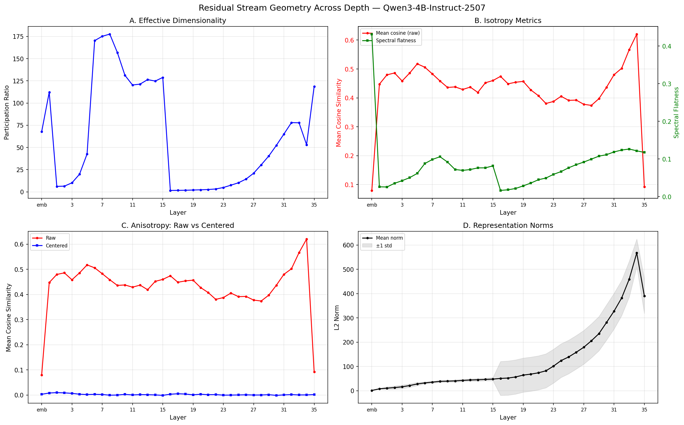
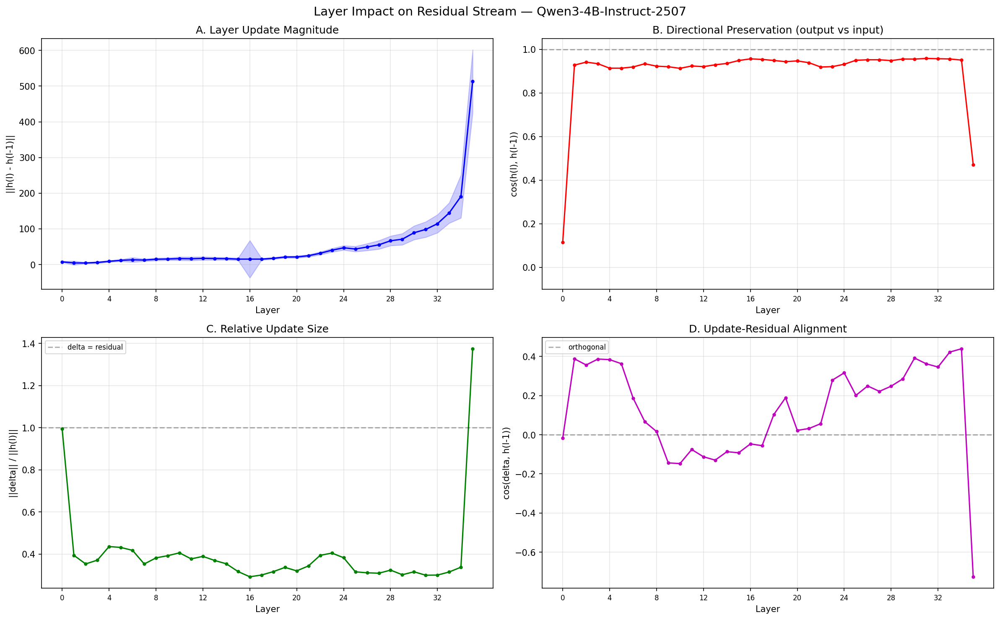
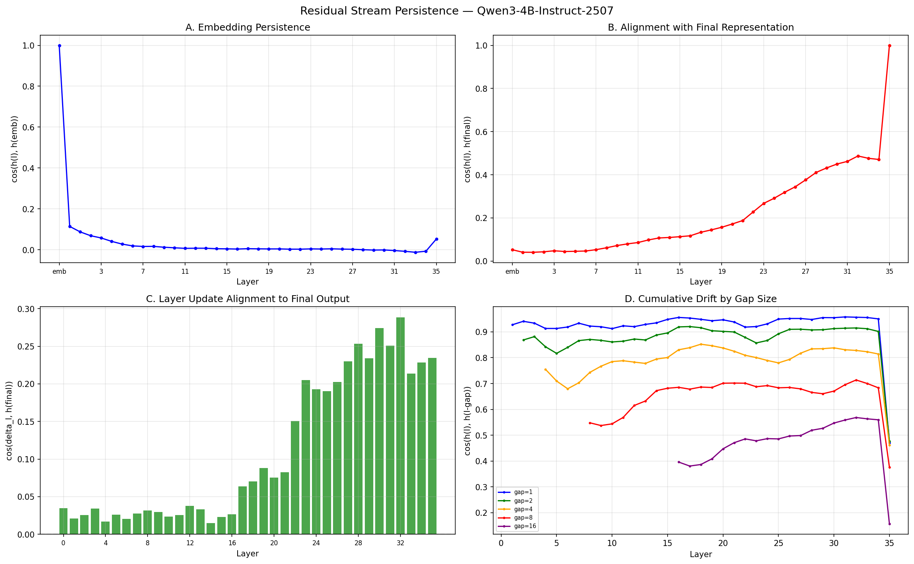
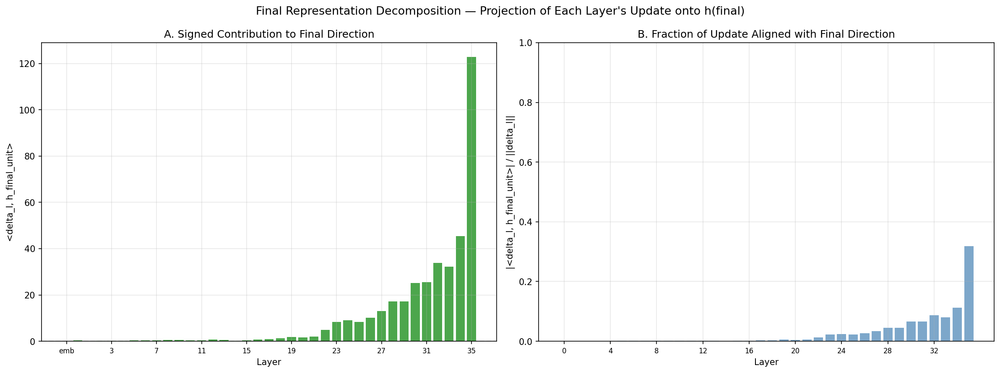
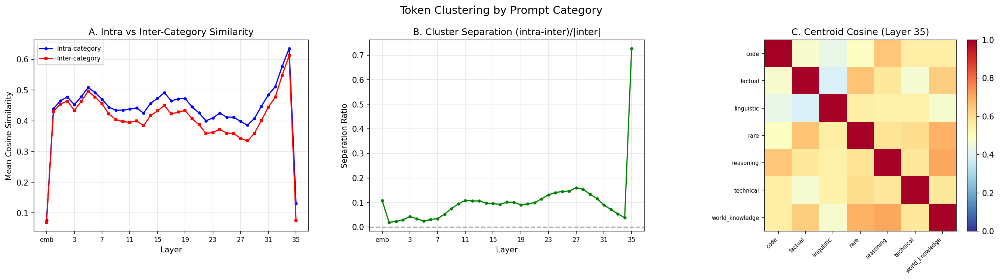
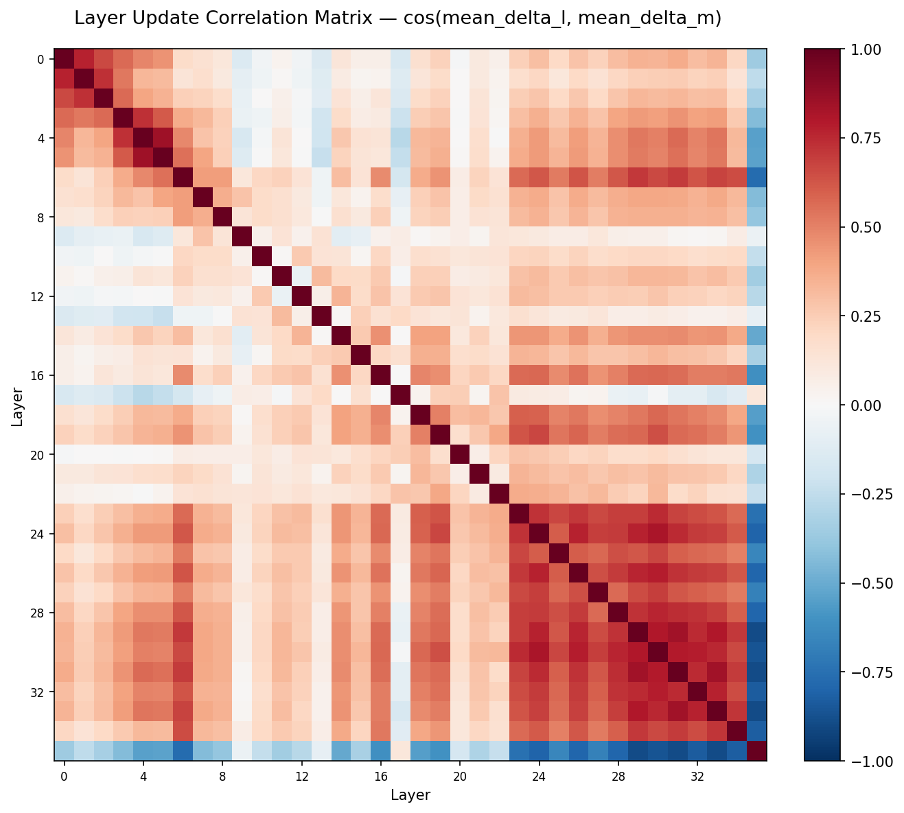
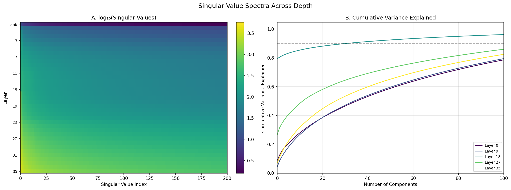
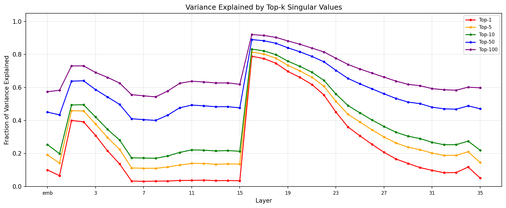

# T-4: Residual Stream Geometry Across Depth

## Motivation & Research Question

How does the geometry of the hidden-state manifold change as representations flow through transformer layers? Specifically:

1. **Effective dimensionality**: How many dimensions do representations actually use at each layer?
2. **Isotropy and anisotropy structure**: Are representations uniformly distributed in the space, or clustered in a low-dimensional cone? If anisotropic, is it intrinsic or removable?
3. **Token clustering**: Do tokens from semantically similar prompts converge as depth increases?
4. **Layer impact**: How much does each layer change the residual stream — in magnitude, direction, and relative contribution?
5. **Residual persistence**: How strongly do signals from earlier layers survive through later processing? Which layers' contributions persist to the final output?

This connects to the Layer Shuffle Recovery experiment (on Qwen3-1.7B) — if activation flow fingerprints work well for ordering layers, there must be a predictable geometric transformation at each layer. Understanding the geometry explains *why* those fingerprints are so discriminative.

## Setup

- **Model**: Qwen3-4B-Instruct-2507 (36 homogeneous decoder layers, hidden\_dim=2560)
- **Data**: 50 pre-generated completions from `data/text_completions/`, covering 7 categories (factual, reasoning, linguistic, code, world\_knowledge, technical, rare)
- **Tokens analyzed**: 4,094 completion tokens (prompt/template tokens excluded)
- **Layers**: 37 measurement points — embedding output + 36 transformer layer outputs
- **Hardware**: NVIDIA B200, bf16 inference, float32 metric computation
- **Runtime**: ~143 seconds total

## Mathematical Framework

This section develops the metrics we use to characterize the geometry of the residual stream. Each metric answers a specific question about what happens to representations as they flow through layers. We build up from basic linear algebra, explaining *why* each metric is needed and *how* it captures the phenomenon we care about.

### 1. Participation Ratio as Effective Dimensionality

#### The problem: what does "dimensionality" mean for representations?

Every hidden state lives in $\mathbb{R}^{2560}$, so technically they're all 2560-dimensional. But that tells us nothing — the representations might use only a tiny subspace. The question is: **how many directions actually matter?**

A naive answer is "count the nonzero singular values" (i.e., the matrix rank). But in practice all singular values are nonzero due to floating-point noise — the rank is always $\min(N, d)$. We need a *soft* measure that distinguishes "10 important directions + 2550 negligible ones" from "200 equally important directions."

#### Setup and SVD

Start with $N$ token representations $\lbrace \mathbf{h}_1, \ldots, \mathbf{h}_N \rbrace \subset \mathbb{R}^d$. In our experiment, $N = 4{,}094$ (completion tokens) and $d = 2{,}560$ (hidden dimension).

**Step 1: Mean-center.** Compute the centroid $\bar{\mathbf{h}} = \frac{1}{N}\sum_i \mathbf{h}_i$ and subtract it. This removes the shared offset so we measure the *spread* of representations, not their location. Form the centered data matrix:

$$\mathbf{H} \in \mathbb{R}^{N \times d}, \quad \text{row } i = \mathbf{h}_i - \bar{\mathbf{h}}$$

**Step 2: Compute SVD.** The SVD factorizes $\mathbf{H} = \mathbf{U} \boldsymbol{\Sigma} \mathbf{V}^\top$, where $\boldsymbol{\Sigma}$ contains singular values $\sigma_1 \ge \sigma_2 \ge \cdots \ge \sigma_r \ge 0$ with $r = \min(N, d)$. Each singular value tells us how much variance the data has along the corresponding direction $\mathbf{v}_i$ (column of $\mathbf{V}$). Specifically, $\sigma_i^2$ is proportional to the variance explained by direction $i$.

**Step 3: Normalize to a probability distribution.** The total variance is $\sum_i \sigma_i^2$. Define the fraction of variance in each direction:

$$p_i = \frac{\sigma_i^2}{\sum_{j=1}^{r} \sigma_j^2}$$

Now $p_i \ge 0$ and $\sum_i p_i = 1$ — this is a probability distribution over directions, weighted by how much variance each captures.

#### The participation ratio formula

We want a single number that counts "how many directions participate." The **participation ratio** (PR) is the inverse of the sum of squared probabilities:

$$\text{PR} = \frac{1}{\sum_i p_i^2}$$

Equivalently, substituting the definition of $p_i$:

$$\text{PR} = \frac{\left(\sum_i \sigma_i^2\right)^2}{\sum_i \sigma_i^4}$$

#### Why this formula works — building intuition

The key insight is that $\sum_i p_i^2$ measures *concentration*. Consider two extremes:

**All variance in one direction:** $p_1 = 1$, all others zero. Then $\sum p_i^2 = 1$, so $\text{PR} = 1/1 = 1$. The representations are effectively one-dimensional.

**Variance spread equally across $k$ directions:** $p_1 = \cdots = p_k = 1/k$, rest zero. Then $\sum p_i^2 = k \cdot (1/k)^2 = 1/k$, so $\text{PR} = k$. This directly counts the number of active dimensions.

**Smoothly decaying spectrum:** If $p_i$ decays gradually (say, exponentially), PR gives a number between 1 and $r$ that reflects the "effective" number of directions — directions with tiny $p_i$ contribute $p_i^2 \approx 0$ and don't inflate the count.

This is exactly the **inverse Simpson index** from ecology (where it counts effective species). In information theory, it equals $\exp(H_2)$ where $H_2 = -\ln \sum_i p_i^2$ is the Rényi entropy of order 2.

#### Why PR over alternatives

| Metric | Problem |
|--------|---------|
| **Rank** (count of nonzero $\sigma_i$) | Always equals $\min(N, d)$ due to floating-point noise. Need an arbitrary threshold to make it useful. |
| **Shannon entropy** $-\sum p_i \ln p_i$ | Unbounded (grows as $\ln r$), hard to interpret as "number of dimensions." Also more sensitive to the tail of tiny eigenvalues. |
| **Top-$k$ variance explained** | Requires choosing $k$; different $k$ values tell different stories. |
| **PR** | Bounded in $[1, r]$, directly interpretable as an effective count, insensitive to near-zero eigenvalues ($p_i^2 \approx 0$). |

PR directly answers: "if I approximated this spectrum by a uniform distribution over $k$ directions, what $k$ would match?"

### 2. Isotropy via Cosine Similarity

#### The problem: are representations spread out or clustered?

Dimensionality (PR) tells us how many directions the representations *span*, but not how they're *distributed* within that span. A cloud of points could have high PR (many active dimensions) yet still cluster in one corner of the space. We need a complementary measure of whether representations fill the space uniformly (**isotropic**) or clump together (**anisotropic**).

#### Cosine similarity as a geometric probe

The simplest test: pick two random representations and measure the angle between them. If vectors are spread uniformly over all directions, random pairs should be roughly orthogonal (cosine $\approx 0$ in high dimensions). If they cluster in a cone, random pairs will have high positive cosine.

For a set of vectors $\lbrace \mathbf{h}_i \rbrace$, the **mean pairwise cosine similarity** is:

$$\bar{c} = \frac{1}{|\mathcal{P}|} \sum_{(i,j) \in \mathcal{P}} \frac{\langle \mathbf{h}_i, \mathbf{h}_j \rangle}{\lVert \mathbf{h}_i \rVert \cdot \lVert \mathbf{h}_j \rVert}$$

where $\mathcal{P}$ is the set of sampled distinct pairs (we sample 5,000 pairs rather than computing all $\binom{N}{2}$).

**Baseline for random vectors:** For vectors drawn uniformly on the unit sphere $S^{d-1}$ in $\mathbb{R}^d$, the expected cosine between any two is exactly 0, with variance $\mathcal{O}(1/d)$. In $d = 2{,}560$, random vectors have cosine $\approx 0 \pm 0.02$. So $\bar{c} \gg 0$ is a clear signal of anisotropy.

#### Decomposing anisotropy: is it "real" or just a shared mean?

A high $\bar{c}$ could arise from two very different situations:

1. **Mean-direction anisotropy:** All vectors have a large shared component (like a DC offset). They point in roughly the same direction not because of interesting structure, but because they all contain the same bias term.
2. **Intrinsic anisotropy:** Even after removing the shared component, vectors cluster in a low-dimensional subspace — there's genuine geometric structure.

To disentangle these, decompose each vector into its shared and unique parts:

$$\mathbf{h}_i = \underbrace{\bar{\mathbf{h}}}_{\text{shared mean}} + \underbrace{\tilde{\mathbf{h}}_i}_{\text{deviation from mean}}$$

where $\bar{\mathbf{h}} = \frac{1}{N}\sum_i \mathbf{h}_i$. By construction, $\sum_i \tilde{\mathbf{h}}_i = \mathbf{0}$.

Now expand the inner product between any two vectors:

$$\langle \mathbf{h}_i, \mathbf{h}_j \rangle = \langle \bar{\mathbf{h}} + \tilde{\mathbf{h}}_i,\ \bar{\mathbf{h}} + \tilde{\mathbf{h}}_j \rangle$$

$$= \underbrace{\lVert \bar{\mathbf{h}} \rVert^2}_{\text{(A) shared component}} + \underbrace{\langle \bar{\mathbf{h}},\, \tilde{\mathbf{h}}_i \rangle + \langle \bar{\mathbf{h}},\, \tilde{\mathbf{h}}_j \rangle}_{\text{(B) cross terms}} + \underbrace{\langle \tilde{\mathbf{h}}_i,\, \tilde{\mathbf{h}}_j \rangle}_{\text{(C) intrinsic similarity}}$$

**When the mean dominates** ($\lVert \bar{\mathbf{h}} \rVert \gg \lVert \tilde{\mathbf{h}}_i \rVert$ for typical $i$): Term (A) dominates. The norms are $\lVert \mathbf{h}_i \rVert \approx \lVert \bar{\mathbf{h}} \rVert$. So:

$$\frac{\langle \mathbf{h}_i, \mathbf{h}_j \rangle}{\lVert \mathbf{h}_i \rVert \lVert \mathbf{h}_j \rVert} \approx \frac{\lVert \bar{\mathbf{h}} \rVert^2}{\lVert \bar{\mathbf{h}} \rVert^2} = 1$$

All vectors look similar — but only because they share the same large mean direction, not because of intrinsic clustering.

**The diagnostic:** Compute $\bar{c}$ on the centered vectors $\tilde{\mathbf{h}}_i = \mathbf{h}_i - \bar{\mathbf{h}}$. This removes term (A) entirely, isolating the intrinsic anisotropy (C). If centered cosine $\approx 0$, all observed anisotropy was due to the shared mean. If centered cosine $\gg 0$, there's genuine geometric clustering beyond the mean direction.

### 3. Spectral Flatness

#### The problem: PR counts dimensions, but what about the *shape* of the spectrum?

PR tells us "about 50 directions matter," but not *how* the variance is distributed among those 50. Two very different spectra can yield the same PR:

- **Flat-then-zero:** 50 equal eigenvalues, then zeros. PR = 50.
- **Smooth decay:** Eigenvalues decay as $1/i$, with enough of them that PR happens to equal 50. But the first few directions carry much more variance than the last.

We want a metric that distinguishes "flat spectrum" from "peaked spectrum" — i.e., how *uniform* is the variance distribution?

#### Definition

Given the covariance eigenvalues $\lbrace \lambda_i \rbrace_{i=1}^{m}$ (where $m$ is the count of positive eigenvalues, and $\lambda_i = \sigma_i^2 / (N-1)$ converts singular values to covariance eigenvalues), the **spectral flatness** is:

$$\text{SF} = \frac{\text{geometric mean of } \lambda_i}{\text{arithmetic mean of } \lambda_i} = \frac{\left(\prod_{i=1}^{m} \lambda_i\right)^{1/m}}{\frac{1}{m}\sum_{i=1}^{m} \lambda_i}$$

The geometric mean can be computed in log-space to avoid numerical overflow:

$$\text{geometric mean} = \exp\left(\frac{1}{m}\sum_{i=1}^{m} \ln \lambda_i\right)$$

#### Why geometric-mean / arithmetic-mean works

The AM-GM inequality guarantees that the arithmetic mean is always $\ge$ the geometric mean, with equality only when all values are identical. Therefore $\text{SF} \in (0, 1]$:

- **SF = 1:** All eigenvalues equal — the spectrum is perfectly flat, variance is uniform across all directions (maximally isotropic).
- **SF → 0:** One eigenvalue dominates — the spectrum is "spiked," almost all variance sits on a single axis.

The geometric mean is highly sensitive to small values (one tiny eigenvalue drags it down), while the arithmetic mean is dominated by large values. So their ratio captures how "spread out" vs "peaked" the spectrum is.

#### Why both PR and SF?

| Metric | What it measures | Analogy |
|--------|-----------------|---------|
| **PR** | Effective *count* of active dimensions | "How many people are at the party?" |
| **SF** | How *evenly* variance is distributed among active dimensions | "Is the conversation spread evenly, or do 2 people dominate?" |

They give complementary views. In our experiment, both track the same gross trends (collapse regions have low PR *and* low SF), but they can diverge in interesting ways — e.g., a smoothly decaying spectrum where many small eigenvalues contribute to PR but SF stays low because the top eigenvalues are much larger.

### 4. Cluster Separation

#### The problem: do representations organize by semantic category?

The metrics above treat all tokens as one undifferentiated cloud. But our tokens come from 7 semantic categories (factual, reasoning, code, etc.). We want to know: **does the geometry reflect this semantic structure?** Do "code tokens" cluster together and separate from "reasoning tokens"?

#### Intra- vs inter-category similarity

Partition tokens into $C$ categories. For each, measure how similar tokens are *within* and *between* categories:

$$\bar{c}_{\text{intra}} = \frac{1}{C} \sum_{c=1}^{C} \left(\text{mean cosine between pairs within category } c\right)$$

$$\bar{c}_{\text{inter}} = \text{mean cosine between pairs from different categories}$$

If $\bar{c}_{\text{intra}} > \bar{c}_{\text{inter}}$, tokens within a category are more similar to each other than to outsiders — the category has geometric coherence.

#### The separation ratio

The raw difference $\bar{c}_{\text{intra}} - \bar{c}_{\text{inter}}$ is hard to interpret in isolation (is 0.05 a lot?). We normalize by the inter-category baseline:

$$S = \frac{\bar{c}_{\text{intra}} - \bar{c}_{\text{inter}}}{|\bar{c}_{\text{inter}}| + \epsilon}$$

where $\epsilon = 10^{-10}$ prevents division by zero. $S > 0$ means categories are distinguishable; larger $S$ means stronger separation.

#### Important caveat: anisotropy masks separation

In highly anisotropic layers, *all* cosine similarities are large (e.g., intra = 0.64, inter = 0.61). The absolute difference is 0.03 and $S$ is small, even though the categories might be geometrically organized. The problem is that the shared mean direction inflates both intra and inter equally. This is why our results show separation *dropping* in late layers (29–34) where anisotropy peaks, then *jumping* at layer 35 where the dispersal breaks the anisotropy and lets category structure become visible.

### 5. Layer Impact Metrics

#### The core model: residual stream as accumulated sum

The transformer's key architectural feature is the **residual connection**: each layer adds its output to its input rather than replacing it. Concretely, layer $\ell$ computes:

$$\mathbf{h}^{(\ell)} = \mathbf{h}^{(\ell-1)} + f_\ell\left(\mathbf{h}^{(\ell-1)}\right)$$

where $f_\ell$ is the layer's transformation (attention + MLP + normalizations) and $\boldsymbol{\delta}_\ell = f_\ell(\mathbf{h}^{(\ell-1)})$ is its **update vector**. The residual stream at layer $\ell$ is the sum of the embedding plus all updates so far:

$$\mathbf{h}^{(\ell)} = \mathbf{h}^{(\text{emb})} + \sum_{i=0}^{\ell} \boldsymbol{\delta}_i$$

This means each layer's contribution is *additive* — it doesn't overwrite what came before, it adds to it. Understanding the geometry of the residual stream requires understanding how each update $\boldsymbol{\delta}_\ell$ interacts with the accumulated sum.

#### Why we need four metrics

A single number (like $\lVert \boldsymbol{\delta}_\ell \rVert$) can't capture the full picture. An update can be large but aligned with the residual (just making it longer), large but orthogonal (adding a new direction), or large but opposing (partially canceling what's there). We need to measure both *magnitude* and *direction* of the update relative to the existing stream:

**Metric 1 — Update magnitude:** $\lVert \boldsymbol{\delta}_\ell \rVert$

The absolute size of the layer's contribution. Answers: "how much does this layer change the residual stream in raw terms?"

**Metric 2 — Directional preservation:** $\cos(\mathbf{h}^{(\ell)},\, \mathbf{h}^{(\ell-1)})$

The cosine between the layer's output and input. Answers: "does the representation still point in roughly the same direction after this layer?" Values near 1 mean a small angular perturbation (the update is a minor correction). Values near 0 mean a major redirect.

To see why this differs from update magnitude: a tiny update on a huge residual gives high preservation (cos $\approx$ 1) even though some change occurred. A moderate update that's orthogonal to a small residual gives low preservation (cos $\ll$ 1) even though the update isn't especially large.

**Metric 3 — Relative update size:** $\lVert \boldsymbol{\delta}_\ell \rVert / \lVert \mathbf{h}^{(\ell)} \rVert$

The update magnitude normalized by the output magnitude. Answers: "does the residual dominate, or does this layer's update overwhelm what was already there?"

- Ratio $< 1$: the accumulated residual is larger than this layer's single contribution (typical — most layers add incrementally)
- Ratio $> 1$: this layer's update is *larger* than the result, which is possible only if the update partially cancels the residual (output = residual + update, and if update opposes residual, the output can be smaller than the update)

**Metric 4 — Update-residual alignment:** $\cos(\boldsymbol{\delta}_\ell,\, \mathbf{h}^{(\ell-1)})$

The cosine between the update and the *existing* residual (before the update is added). This is the most revealing metric — it tells us the *geometric role* of the update:

- **Positive** ($\cos > 0$): the update reinforces the current direction. The residual gets longer in the direction it was already pointing. This grows norms and increases anisotropy.
- **Zero** ($\cos \approx 0$): the update is orthogonal — it adds a new direction without affecting the existing signal. This increases dimensionality.
- **Negative** ($\cos < 0$): the update *opposes* the residual. It partially cancels the dominant direction, dispersing the representation. This can *shrink* norms and reduce anisotropy.

Together, these four metrics let us characterize each layer's geometric role: "layer 34 makes a moderate, well-aligned update that reinforces the residual" vs "layer 35 makes a massive, opposing update that disperses it."

### 6. Residual Persistence and Decomposition

#### The problem: where does the final representation come from?

The residual stream is a running sum. By the last layer, the representation $\mathbf{h}^{(L)}$ contains contributions from all 36 layers plus the embedding. But which layers actually matter? Maybe the early layers build intermediate structure that gets overwritten. Maybe one layer dominates the final output. We need to trace contributions through depth.

#### Persistence metrics

**Embedding persistence:** $\cos(\mathbf{h}^{(\ell)},\, \mathbf{h}^{(\text{emb})})$

How much of the original embedding direction survives at layer $\ell$. If this drops to zero quickly, the embedding's directional content is erased — later layers build entirely new directions.

**Final alignment:** $\cos(\mathbf{h}^{(\ell)},\, \mathbf{h}^{(L)})$

How aligned each intermediate layer's output is with the final representation. A monotonic increase means the network gradually converges toward its output direction. A sudden jump would mean one layer is responsible for most of the final direction.

**Update survival:** $\cos(\boldsymbol{\delta}_\ell,\, \mathbf{h}^{(L)})$

Does layer $\ell$'s update point *toward* the eventual output? If $\cos \approx 0$, that layer's update is orthogonal to the final direction — it built intermediate structure that doesn't directly appear in the output. If $\cos > 0$, the update contributed constructively to the final direction.

**Cumulative drift:** $\cos(\mathbf{h}^{(\ell)},\, \mathbf{h}^{(\ell-k)})$ for gap sizes $k \in \lbrace 1, 2, 4, 8, 16 \rbrace$

How rapidly the representation rotates over spans of $k$ layers. Drift over 1 layer is captured by directional preservation; drift over 16 layers reveals whether the network slowly drifts or makes abrupt turns.

#### Residual decomposition: quantifying each layer's contribution

Since the residual stream is a literal sum:

$$\mathbf{h}^{(L)} = \mathbf{h}^{(\text{emb})} + \boldsymbol{\delta}_0 + \boldsymbol{\delta}_1 + \cdots + \boldsymbol{\delta}_{L-1}$$

we can ask: **how much of the final representation's magnitude comes from each term?** Project each update onto the final direction $\hat{\mathbf{h}}^{(L)} = \mathbf{h}^{(L)} / \lVert \mathbf{h}^{(L)} \rVert$:

$$\text{signed projection of layer } \ell = \langle \boldsymbol{\delta}_\ell,\, \hat{\mathbf{h}}^{(L)} \rangle$$

This is the scalar length of $\boldsymbol{\delta}_\ell$ projected onto the final direction. Positive means the update contributes constructively; negative means it opposes. By the linearity of inner products, these projections sum to the total:

$$\lVert \mathbf{h}^{(L)} \rVert = \langle \mathbf{h}^{(L)},\, \hat{\mathbf{h}}^{(L)} \rangle = \langle \mathbf{h}^{(\text{emb})},\, \hat{\mathbf{h}}^{(L)} \rangle + \sum_{\ell=0}^{L-1} \langle \boldsymbol{\delta}_\ell,\, \hat{\mathbf{h}}^{(L)} \rangle$$

So the projections form a complete **decomposition of the final norm into per-layer contributions**. Each layer's percentage is:

$$\text{contribution of layer } \ell = \frac{\langle \boldsymbol{\delta}_\ell,\, \hat{\mathbf{h}}^{(L)} \rangle}{\lVert \mathbf{h}^{(L)} \rVert} \times 100\%$$

This tells us, for example, that layers 30–35 contribute ~80% of the final norm while layers 0–15 contribute less than 5% — meaning early layers build structure orthogonal to the final output direction

## Methods

### 1. Hidden State Extraction
Forward-hook-based extraction at every layer, identical to T-1. For each of 50 prompts, we register hooks on all 36 `model.model.layers[i]` modules plus capture the embedding output. Only completion-token positions are retained (positions $\ge$ `prompt_token_count`), yielding 4,094 token vectors of dimension 2,560 per layer.

### 2. Effective Dimensionality (Participation Ratio)
For each layer's pooled matrix $\mathbf{H} \in \mathbb{R}^{4094 \times 2560}$, we mean-center and compute SVD. The participation ratio is computed from the squared singular values as defined above.

### 3. Isotropy and Anisotropy Decomposition
Three complementary measures, computed on both raw and mean-centered representations:

- **Mean pairwise cosine similarity**: Sample 5,000 random token pairs and compute their cosine similarity. For isotropic representations this should be ~0; for anisotropic (cone-shaped) distributions, it will be high. Computing on **centered** representations (mean-subtracted) isolates intrinsic geometry from the shared-direction component.
- **Spectral flatness**: Computed on the eigenvalues of the sample covariance matrix ($\sigma_i^2 / (N-1)$), ranging from 0 (one dominant direction) to 1 (perfectly isotropic).
- **Norm statistics**: Track how representation magnitudes (L2 norms) evolve across depth.

### 4. Token Clustering by Category
Tokens are grouped by their prompt's category. We compute:

- **Intra-category similarity**: Mean cosine similarity between random token pairs *within* the same category
- **Inter-category similarity**: Mean cosine similarity between tokens from *different* categories
- **Cluster separation ratio**: $(c_{\text{intra}} - c_{\text{inter}}) / (|c_{\text{inter}}| + \epsilon)$ — higher means categories are more distinguishable
- **Centroid analysis**: Cosine similarity between category centroids at each layer

### 5. Layer Impact Analysis
For each transformer layer, compute the update vector $\boldsymbol{\delta}_\ell = \mathbf{h}^{(\ell)} - \mathbf{h}^{(\ell-1)}$ and measure its magnitude, directional preservation, relative size, and alignment with the existing residual (see mathematical framework above).

### 6. Residual Persistence Analysis
Track embedding persistence, final-output alignment, update survival, cumulative drift across gap sizes (1, 2, 4, 8, 16 layers), and decompose the final representation into per-layer contributions via projection.

### 7. Update Correlation Matrix
Compute mean update vectors per layer (averaged across tokens), then measure the pairwise cosine similarity between all layer pairs — revealing which layers push the residual stream in similar or opposing directions.

## Results

### Effective Dimensionality



| Region | Layers | PR Range | Interpretation |
|--------|--------|----------|----------------|
| Embedding | emb | 73.4 | Moderate — token embeddings span ~73 effective dimensions |
| Early spike | 0 | 124.9 | First layer *increases* dimensionality |
| Early collapse | 1–5 | 6.0–43.0 | Dramatic collapse — layers 1–2 reduce to just ~6 effective dims |
| Mid recovery | 6–15 | 146.9–204.7 | Recovery to high-dimensional plateau, peaking at layer 8 |
| Deep collapse | 16–24 | 2.3–16.8 | Second major collapse — PR drops to **2.3** at layer 16 |
| Late recovery | 25–34 | 23.9–127.4 | Gradual recovery through final layers |
| Final layer | 35 | 160.1 | Sharp dimensionality expansion at the output |

The **bimodal collapse pattern** (layers 1–5 and 16–24) is striking. The deep collapse at layer 16 (PR=2.3) means representations are nearly one-dimensional — almost all variance sits on a single axis. This suggests two critical "bottleneck" regions where the model compresses information maximally before expanding it again.

### Isotropy / Anisotropy

The raw mean cosine similarity hovers around **0.37–0.51** throughout most layers (moderately anisotropic), peaking at **0.63** at layer 34 before dramatically dropping to **0.09** at the final layer 35.

The **centered** cosine similarity is essentially **zero** (~−0.002 to +0.008) at every layer. This is a key finding: **all observed anisotropy is due to a shared mean direction, not intrinsic geometric clustering**. After removing the mean, token representations are nearly perfectly isotropic at every layer.

Spectral flatness follows a non-monotonic trajectory: the embedding starts high (0.35), drops sharply at layer 0 (0.08), then generally increases through the network — reaching 0.13–0.19 in layers 6–15, dipping to 0.04 during the deep collapse (layers 16–17), and steadily climbing to 0.20–0.22 by layers 30–35. The pattern tracks the PR trajectory: collapse regions have low SF (spiked spectra), recovery regions have higher SF (more distributed spectra).

### Representation Norms

Norms grow **superlinearly** across depth:
- Embedding: 1.00
- Layer 10: 40.5
- Layer 20: 67.7
- Layer 30: 282.0
- Layer 34: 570.7

Combined with high raw cosine similarity, this confirms the **anisotropic cone** pattern: representations extend along an increasingly narrow cone with growing norms. The final layer (35) breaks this pattern — norms drop to 387.6 and cosine drops to 0.09 (see Layer Impact below for the mechanism).

### Layer Impact on Residual Stream



#### Update Magnitude

| Layer | ‖delta‖ | Interpretation |
|-------|---------|----------------|
| 0 | 7.7 | Moderate — transforms embedding |
| 1–5 | 4.5–11.9 | Small — incremental refinement |
| 6–15 | 12.6–17.3 | Medium-sized, relatively consistent updates |
| 16–24 | 15.2–46.9 | Growing — accelerating norm contribution |
| 25–34 | 43.6–190.9 | Large and escalating — dominant norm builders |
| 35 | **513.9** | Massive — the largest single-layer update by far |

Layer 35's update (‖delta‖=513.9) is **2.7x the size of the residual it receives** (‖h(34)‖=570.7), making it the only layer whose update exceeds its input in magnitude.

#### Directional Preservation

Most layers preserve the direction of their input remarkably well: cos(h(l), h(l-1)) is **0.91–0.96** for layers 1–34. This means each layer makes a relatively small angular perturbation while growing the norm. Two layers stand out:

- **Layer 0**: cos = 0.11 — nearly orthogonal to the embedding. This layer completely redirects the representation into a new subspace, consistent with its role as a geometric expansion (PR: 73→125).
- **Layer 35**: cos = 0.47 — substantial redirection. The only layer besides L0 that significantly changes the direction of the residual stream.

#### Relative Update Size

The ratio ‖delta‖ / ‖h(l)‖ is remarkably stable at **0.29–0.44** for layers 1–34 — each layer's update is about 30–40% the size of the resulting representation. This means the residual stream always dominates over any single layer's contribution, providing stability.

Two exceptions:
- **Layer 0**: ratio = 0.99 — the update is essentially the entire representation (the embedding contributes very little to the output norm)
- **Layer 35**: ratio = **1.38** — the update is *larger* than the resulting representation, which is only possible because the update partially opposes the residual (see below)

#### Update-Residual Alignment

This metric reveals the most nuanced picture of what each layer does to the residual stream:

| Region | Layers | cos(delta, h(l-1)) | Interpretation |
|--------|--------|-------------------|----------------|
| Initial redirect | 0 | −0.02 | Orthogonal — embedding is irrelevant to update direction |
| Early reinforcement | 1–5 | +0.36 to +0.39 | **Positive** — updates reinforce the residual direction, growing norms |
| Mid transition | 6–8 | +0.19 → +0.02 | Shifting from reinforcement to orthogonal |
| Mid orthogonal/opposing | 9–15 | −0.14 to −0.09 | **Weakly opposing** — updates push slightly against the residual |
| Deep collapse transition | 16–17 | −0.05 | Nearly orthogonal |
| Late reinforcement | 18–34 | +0.02 to +0.44 | Increasingly **positive** — strong reinforcement drives superlinear norm growth |
| Final dispersal | 35 | **−0.73** | Strongly **opposing** — the update actively pushes against the residual |

This reveals layer 35's mechanism: its update actively opposes the residual direction (cos = −0.73), which is why norms drop from 571 to 388 despite the update being the largest of any layer. The layer doesn't just add variance in new directions — it actively *subtracts* from the dominant direction that accumulated over layers 18–34.

The transition from opposing (L9–15) to reinforcing (L18–34) coincides with the onset of the deep collapse, suggesting the bottleneck is where the model switches from exploring diverse directions to committing to a dominant direction that will be refined through the late layers.

### Residual Persistence



#### Embedding Persistence

Cosine similarity between each layer's output and the original embedding drops rapidly:
- Layer 0: 0.11 (already mostly destroyed)
- Layer 5: 0.03
- Layers 6–35: 0.00–0.05

**The embedding direction is essentially erased by layer 5.** The original token identity encoded by the embedding table does not persist as a directional signal — it is completely overwritten by the transformer layers. This means all directional information in the later residual stream comes from the transformer layers' accumulated updates, not from the embedding.

#### Alignment with Final Output

Cosine similarity between each layer's output and the final representation (h(35)) grows monotonically:
- Layer 0: 0.04
- Layer 10: 0.08
- Layer 20: 0.17
- Layer 25: 0.32
- Layer 30: 0.45
- Layer 34: 0.47
- Layer 35: 1.00 (by definition)

This shows a **gradual convergence**: the representation slowly rotates toward the final output direction throughout the network, with the most rapid alignment happening in layers 22–35 (from 0.23 to 1.00). There is no sudden jump — the final direction is built incrementally.

#### Which Layers' Updates Survive to the Final Output?



The signed projection of each layer's update onto the final direction ($\langle \boldsymbol{\delta}_\ell, \hat{\mathbf{h}}^{(L)} \rangle$) reveals which layers actually contribute to the final representation:

| Layer | Signed Projection | % of Final Norm | Interpretation |
|-------|-------------------|-----------------|----------------|
| emb | 0.5 | 0.1% | Negligible — embedding barely contributes to final direction |
| 0–15 | 0.3–2.3 | 0.1–0.6% | Minimal — early/mid layers contribute almost nothing to the final direction |
| 16–21 | 2.7–6.5 | 0.7–1.7% | Small but growing contributions |
| 22–24 | 12.2–17.4 | 3.1–4.5% | Significant contributions begin |
| 25–29 | 16.5–26.3 | 4.3–6.8% | Substantial — each layer adds meaningfully |
| 30–34 | 31.4–55.7 | 8.1–14.4% | Dominant — these 5 layers account for ~50% of the final norm |
| 35 | **123.4** | **31.8%** | Single largest contributor |

**Layers 30–35 collectively account for ~80% of the final representation's magnitude along its own direction.** Layers 0–15 together contribute less than 5%. This means the "early processing" done by the first half of the network is almost entirely orthogonal to the final output direction — it builds intermediate structure that is later transformed into the final direction by late layers.

The fraction of each layer's update that aligns with the final direction also grows monotonically: early layers project only 3–6% of their update onto the final direction, while layer 35 projects 24%. This means early layers' updates are almost entirely orthogonal to the eventual output — they build structure in directions that are later consumed and redirected.

### Token Clustering



| Layer | Intra-cat | Inter-cat | Separation |
|-------|-----------|-----------|------------|
| emb   | 0.077     | 0.069     | 0.11       |
| 0     | 0.439     | 0.431     | 0.02       |
| 11    | 0.438     | 0.395     | 0.11       |
| 22    | 0.400     | 0.359     | 0.11       |
| 27    | 0.398     | 0.343     | **0.16**   |
| 34    | 0.635     | 0.612     | 0.04       |
| 35    | 0.131     | 0.076     | **0.73**   |

Category separation generally increases through the middle layers, from near-zero at layer 0 to a peak of 0.16 at layer 27. However, **separation reverses in layers 29–34**: as norms grow superlinearly and raw cosine similarity climbs to 0.63, both intra- and inter-category similarity rise together, compressing the gap and dropping separation back to 0.04 at layer 34. The final layer 35 then produces a jump to **0.73** — the dispersal of representations lets category structure become the dominant organizing principle, with intra-category similarity dropping to 0.13 while inter-category drops further to 0.08.

### Update Correlation Matrix



The correlation matrix between mean layer updates reveals clear **block structure**:

1. **Early block (L0–5)**: Updates are mutually correlated (cos 0.3–0.8), forming a coherent group. These layers work together to build the initial representation.
2. **Mid block (L6–15)**: Updates are correlated among themselves but only weakly with the early block. The boundary at layer 6 (where PR jumps from 43 to 197) marks a transition to a different processing mode.
3. **Late block (L17–34)**: A large, strongly correlated block — these layers push in similar directions, driving the superlinear norm growth. The deep collapse layers (16–19) form a transition zone.
4. **Layer 35 is anti-correlated with all other layers** — the entire column/row shows blue (negative) values. This confirms quantitatively that layer 35's update opposes the direction established by all previous layers.

The block boundaries align with the geometric phase transitions: early collapse → mid recovery → deep collapse → late recovery → dispersal. Layers within the same geometric phase push in similar directions; layers in different phases push in different or opposing directions.

### Singular Value Spectra





The cumulative variance plots reveal:
- At layers 1–2 (early collapse), the top-1 SV explains **~40%** of variance; at layers 3–5 the dominance decreases (31%→22%→14%) as PR recovers
- At layers 16–24 (deep collapse), the top-1 SV explains **36–79%** of variance, peaking at layer 16 (79%) and decreasing monotonically as PR slowly recovers through this region
- At mid layers (6–15), variance is more distributed — top-1 explains only 3–4%, and top-10 explains ~25–30%
- The final layer 35 has one of the most distributed spectra — top-1 explains only 4%, with top-50 needed for ~68% variance

The SV heatmap shows a clear "bright band" at singular value index 0 during collapse layers, confirming the single-dominant-direction interpretation.

## Conclusions & Key Findings

1. **Bimodal dimensionality collapse**: Two distinct bottleneck regions (layers 1–5, PR 6–43; layers 16–24, PR 2.3–16.8) bookend a high-dimensional processing plateau (layers 6–15, PR 147–205). These are sharp phase transitions, not gradual.

2. **All anisotropy is mean-direction anisotropy**: Centered cosine similarity is ~0 everywhere — mean-centering produces near-isotropic representations at every layer.

3. **Layer 0 and layer 35 are geometric singularities**: Layer 0 completely redirects the embedding (cos(io) = 0.11, update ratio = 1.0). Layer 35 actively opposes the accumulated residual (cos(delta, prev) = −0.73, update ratio = 1.38). All other layers preserve direction with cos > 0.91 and updates at 30–40% of the residual.

4. **The embedding is erased by layer 5**: All directional information in the later residual stream comes from transformer updates, not from the embedding.

5. **Late layers dominate the final representation**: Layers 30–35 contribute ~80% of the final representation's magnitude along its own direction. Layers 0–15 contribute <5% — the early network builds intermediate structure orthogonal to the final output.

6. **Layer updates form three correlated blocks** (early/mid/late) with a strongly anti-correlated layer 35, aligning with the geometric phase boundaries. This explains why activation fingerprints (Layer Shuffle Recovery) are discriminative for layer ordering.

## Cross-Experiment Connections

Throughout this section, T-4 geometric data (PR, norms, SV spectra, impact metrics) are as reported in the Results tables above. Only cross-experiment findings and their geometric interpretations are stated here.

### T-2 (Layer Knockout) + T-7 (Linearization Gap): Geometry Explains Criticality and Linearizability

T-2 found that layer 0 is catastrophically critical (99.6x loss ratio). T-7 showed it is also linearizable (99.1% recovery with a full-rank linear map). T-4 explains why both are true: layer 0 is the only layer that *increases* dimensionality (PR: 73→125) and completely redirects the representation (cos(io) = 0.11). This geometric expansion is a specific, learnable linear transformation — which is why linear replacement works but removal is catastrophic.

T-7's "bimodal linearity" finding maps onto T-4's geometry:

| T-4 Geometry Region | Layers | PR | T-7 Linear Replacement |
|---|---|---|---|
| Early collapse (low PR) | 1–5 | 6–43 | 91–99% recovery |
| Mid recovery (high PR) | 6–15 | 147–205 | Mixed: L6 recovers (87%), L8–L12 fail |
| Deep collapse (low PR) | 16–24 | 2.3–16.8 | Fails: −1796% to −101% |
| Late recovery | 25–34 | 24–127 | L32–L33 recover (87–88%), **L34 fails (−45%)** |

The general trend: **low-PR regions tend to be linearizable, high-PR regions tend to resist linear replacement**. When representations are squeezed into 2–6 effective dimensions, the layer's transformation is constrained enough to be captured by a fixed linear map. When representations span 150–200 dimensions, the transformation is input-dependent and globally nonlinear.

T-2 also found layer 6 is a computational hub (2nd most critical at 21.7x, appears in 4/5 top synergistic pairs). In T-4, layer 6 sits at the onset of the mid-recovery plateau (PR jumps from 43 at layer 5 to 197 at layer 6) — it marks the transition from compressed to distributed representation. The update correlation matrix shows layer 6 at the boundary between the early and mid correlation blocks.

### T-7 (Linearization Gap): Local Smoothness vs Global Geometry

T-7 found a U-shaped nonlinearity profile with middle layers (6–18) being most locally linear (gap ~0.13–0.15) but globally nonlinear (catastrophic replacement failure). T-7's Jacobian consistency data resolves this paradox when combined with T-4's geometry:

- **Layers 6–8**: Low Jacobian consistency (0.55–0.66) despite low linearization gap. The Jacobian is smooth at each operating point but *varies strongly across inputs*. These layers have high PR (197–205) — the many active dimensions create room for input-dependent behavior.
- **Layers 29–35**: High consistency (0.76–0.88), meaning the Jacobian is nearly the same regardless of input. Norms are largest here (236–571), and the late-layer norm growth dominates over input-dependent variation. The update-residual alignment is strongly positive (cos = 0.29–0.44), confirming these layers perform a consistent, reinforcing transformation.

T-7 also found that MLP nonlinearity drives the late-layer spike (MLP gap 0.24 at layer 35). The final-layer dispersal requires nonlinear transformation that SwiGLU provides — the strongly negative update-residual alignment (cos = −0.73) shows this is an active reversal, not just noise.

### T-9 (Weight Spectral Structure): Weight Rank vs Representation Dimensionality

T-9 found no significant correlation between weight effective rank and representation geometry (r = 0.157, p = 0.36). T-4 explains why: the residual stream is an **accumulated sum** of all upstream layer contributions:

$$\mathbf{h}^{(\ell)} = \mathbf{h}^{(0)} + \sum_{i=1}^{\ell} f_i\left(\mathbf{h}^{(i-1)}\right)$$

A single layer's weight rank constrains only its *incremental update* $f_i$, not the total dimensionality of $\mathbf{h}^{(\ell)}$. The bimodal collapse is driven by dominant singular values in the *accumulated representations* (top-1 SV explains up to 79% of variance at layer 16), which emerge from accumulation dynamics regardless of individual weight ranks.

### T-17 (Contrastive Trajectories): Geometry of Divergence

T-17 found that **shared-prefix** antonym pairs maintain high cosine similarity (>0.63) across layers 2–34, with a dip at layer 21. During the deep collapse (PR 2.3–16.8), two sequences processing different tokens are squeezed onto a near-one-dimensional manifold — their cosine similarity remains high because there is essentially only one direction available. The update-residual alignment data adds nuance: during the collapse (L16–24), layers are reinforcing a shared dominant direction (cos(delta, prev) > 0), which further compresses both sequences toward the same axis.

T-17's finding that layer 35 is a "universal discriminator" (all cosine similarities drop sharply) aligns directly with T-4's final-layer dispersal mechanism.

### T-1 (Logit Lens): Prediction Quality vs Geometric Phase

T-1 found a four-phase architecture in prediction quality: representation building (L0–12, <1% accuracy), early semantics (L13–21), prediction formation (L22–28), and refinement (L29–35, reaching 99.5%). T-4's geometric phases provide a structural explanation:

- **L0–12 (<1% accuracy)**: Spans the early collapse and mid recovery. Updates are nearly orthogonal to the final output (update-to-final cos < 0.04). The representation is being restructured in directions that won't contribute to the final prediction.
- **L22–28 (rapid accuracy climb)**: Coincides with the end of the deep collapse and beginning of late recovery. Update alignment to final jumps from 0.08 to 0.25 — these layers start building toward the output. The signed projection onto final also accelerates here (12→26 per layer).
- **L35 (99.5% accuracy)**: The dispersal creates a well-separated landscape via opposing update (cos = −0.73), letting the LM head cleanly select the correct token.

### T-3 (Layer Swap Cost): Geometry Predicts Swap Tolerance

T-3 found that the cheapest swaps are exclusively adjacent late-middle pairs (layers 25–33, delta-loss 0.06–0.10), while early layers (0–2) and layer 35 produce the costliest swaps (delta-loss 10–23). T-4's geometry and impact metrics explain this:

- **Cheapest swaps (L25–L33)**: The update correlation matrix shows these layers are strongly mutually correlated — they push in similar directions with similar magnitudes. Directional preservation is consistently high (cos > 0.95). Swapping adjacent layers within this correlated block is minimally disruptive because both layers do approximately the same thing.
- **Costliest swaps (L0–L2, L35)**: Layer 0 is a geometric singularity (cos(io) = 0.11, complete redirect). Layer 35 is anti-correlated with all other layers. These are geometrically unique transformations with no substitute.
- **T-3's 3-zone clustering** (early [0–6], middle [7–30], late [31–35]) aligns with T-4's update correlation blocks and geometric regimes.

### Synthesis: The Geometric Processing Pipeline

Combining T-4 with other experiments reveals a coherent six-phase pipeline:

| Phase | Layers | PR | Key Geometry | Impact Signature | Cross-Experiment Role |
|---|---|---|---|---|---|
| **Geometric expansion** | 0 | 73→125 | Norm 1→7.7 | cos(io)=0.11, ratio=1.0 | Critical (99.6x, T-2), linearizable (99.1%, T-7) |
| **First compression** | 1–5 | 6–43 | Top-1 SV 14–40% | Reinforcing (cos(d,h)=+0.37) | Linearizable (91–99%, T-7) |
| **Distributed processing** | 6–15 | 147–205 | Top-1 SV 3–4% | Weakly opposing (cos(d,h)=−0.10) | Hub at L6 (21.7x, T-2), low Jacobian consistency |
| **Second compression** | 16–24 | 2.3–16.8 | Top-1 SV 36–79% | Transitioning to reinforcing | Prediction accuracy begins climb (T-1) |
| **Output preparation** | 25–34 | 24–127 | Norm 139→571 | Strongly reinforcing (cos(d,h)=+0.35) | Cheapest swap region (T-3), ~50% of final norm |
| **Dispersal** | 35 | 160 | Cosine 0.63→0.09 | Opposing (cos(d,h)=−0.73), ratio=1.38 | Universal discriminator (T-17), 99.5% accuracy (T-1) |

## Practical & Architectural Implications

The following implications are **hypotheses grounded in T-4 observations and cross-experiment patterns**, not experimentally validated optimizations. They identify specific, testable predictions for future work.

### 1. Layer Pruning & Structured Distillation

The two compression bottlenecks pass information through as few as 2–3 effective dimensions, making intermediate layers within each bottleneck candidates for pruning or merging:

- **Layers 17–23**: PR stays below 10, top-1 SV explains 36–79% of variance, and their updates are highly correlated (update correlation >0.5). *Hypothesis*: these 7 layers could be replaced with 2–3 layers or a single linear projection capturing the dominant singular direction.
- **Layers 1–4**: Similarly low-dimensional (PR 6–20) and confirmed linearizable by T-7 (91–99% recovery). *Hypothesis*: these could be collapsed into a single learned linear map.
- **Do not prune layer 0, layer 6, or layer 35.** T-2 knockout ratios (99.6x, 21.7x) and T-4's unique geometric signatures at these layers indicate they perform irreplaceable transformations.

### 2. Quantization Strategy by Geometric Phase

Different geometric regimes have different precision profiles:

- **Bottleneck layers (1–5, 16–24)**: Variance concentrates on 2–6 axes, so signal-to-noise ratio is inherently high. *Hypothesis*: INT4 or lower should preserve the dominant singular direction with minimal degradation.
- **Distributed processing layers (6–15)**: PR 147–205 with weakly opposing updates means computation is input-dependent across many dimensions. *Hypothesis*: these layers are most sensitive to quantization noise and should receive higher precision (INT8/FP8).
- **Late recovery layers (25–34)**: Strongly reinforcing updates (cos = +0.35) with high directional preservation (cos(io) > 0.95) suggest consistent, well-conditioned transformations tolerant of moderate quantization, though large norms (139–571) require careful scaling.
- **Layer 35**: The dispersal involves precise norm reduction, direction reversal, and cosine collapse. *Hypothesis*: this benefits from higher precision (FP8/INT8 minimum).

### 3. KV-Cache Compression

Low effective dimensionality in bottleneck regions implies key/value vector redundancy. Combined with T-9's finding that Q/K matrices are lower-rank (0.31) than V/O matrices (0.52):

- *Hypothesis*: **Layers 16–24** KV-cache entries could be compressed via low-rank projection or aggressive quantization, since representations at these layers project onto essentially one direction (PR 2.3–16.8).
- **Layers 6–15** require fuller KV-cache fidelity — high-dimensional representations (PR 147–205) carry input-dependent routing information.

### 4. Feature Extraction & Embedding Selection

For downstream tasks requiring sentence/token embeddings:

- **Always mean-center** representations. Since all anisotropy is mean-direction anisotropy (centered cosine ~0), mean-centering produces near-isotropic embeddings better suited for cosine-similarity-based retrieval.
- **Layer 27** has peak category separation (0.16) before the late-layer anisotropic collapse, with moderate dimensionality (PR ~49) and norms — a natural choice for semantic embeddings.
- **Layer 35** has maximum category separation (0.73) and near-isotropic geometry, but is optimized for next-token prediction.
- **Avoid layers 16–24** — PR 2.3–16.8 means representations are too compressed to preserve fine-grained distinctions.

### 5. Early Exit & Adaptive Computation

The geometric pipeline suggests natural exit points:

- **After layer 24** (end of deep collapse): The bottleneck has constrained representations — prediction accuracy climbs steeply through this region (T-1). An exit head here could capture tokens that resolved during compression.
- **The cost of skipping layer 35 is high**: any early-exit head at earlier layers must compensate for the anisotropic cone geometry (high cosine, large norms) — requiring a learned dispersal pre-projection rather than a simple linear head. The opposing update mechanism of layer 35 (cos(delta, prev) = −0.73) is essential for separating tokens for the LM head.

### 6. Architecture Design Observations

- **The bimodal bottleneck pattern may be functional**: the two compression phases mirror the information bottleneck principle — compress to discard irrelevant features, then expand to build task-relevant representations. Architectures with *explicit* bottleneck layers (reduced hidden dims or low-rank constraints) might achieve similar compression more parameter-efficiently.
- **Final-layer dispersal appears necessary for the LM head**: applying the LM head to layer 34 representations (cosine 0.63) instead of layer 35 (cosine 0.09) would face high inter-token similarity, degrading discrimination. Architectures that share or skip the final layer would need an alternative dispersal mechanism.

## Usage

```bash
# Prerequisites: completions must exist at data/text_completions/qwen3-4b-instruct-2507/
poetry run python experiments/t4_residual_stream_geometry/run.py
```

Output in `experiments/t4_residual_stream_geometry/results/`:
- `summary.json` — All per-layer metrics, impact data, persistence data, update correlations, and singular value spectra
- `geometry_overview.png` — 4-panel plot: dimensionality, isotropy, anisotropy decomposition, norms
- `token_clustering.png` — Intra/inter-category similarity, separation ratio, centroid heatmap
- `singular_value_spectra.png` — SV heatmap and cumulative variance curves
- `variance_explained.png` — Top-k variance explained across layers
- `layer_impact.png` — 4-panel plot: update magnitude, directional preservation, relative update size, update-residual alignment
- `residual_persistence.png` — 4-panel plot: embedding persistence, final alignment, update survival, cumulative drift
- `update_correlation.png` — Layer update correlation heatmap
- `residual_decomposition.png` — Per-layer signed contribution and alignment fraction to final output
