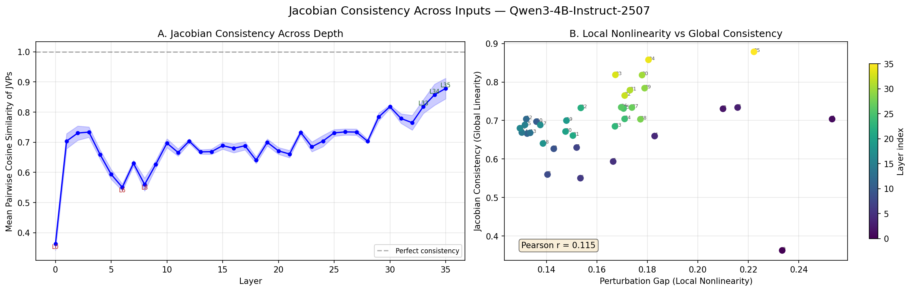
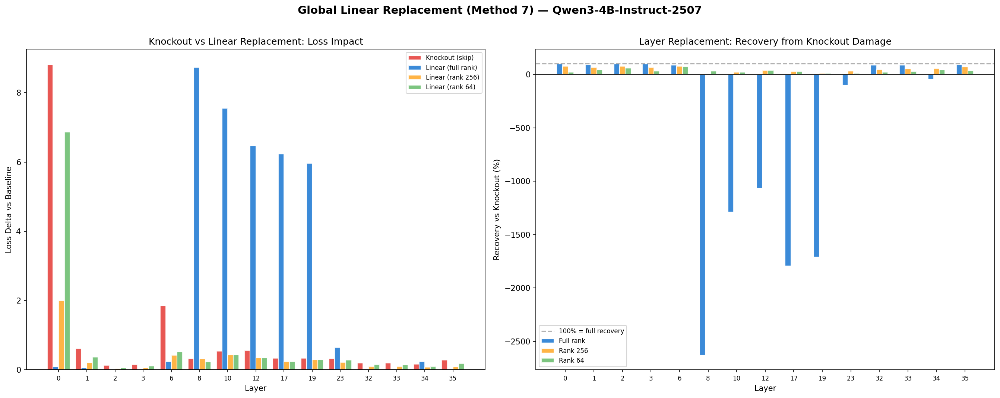

# T-7: Layer Linearization Gap

## Motivation & Research Question

**How nonlinear is each layer's computation on real inputs?**

Each transformer layer applies a nonlinear transformation g(x) = layer(x) - x to the residual stream. This transformation involves attention (softmax) and MLP (SwiGLU activation). If a layer's computation is approximately linear on the data manifold, it could potentially be replaced by a cheap linear map without significant quality loss. We measure the "linearization gap" — how much the actual layer output deviates from what a linear approximation would predict — and track how this varies across depth.

**Hypothesis**: Early layers are more linear (mainly doing token mixing via attention), while late layers are more nonlinear (doing feature composition via MLP). If true, early layers are candidates for linearization/distillation.

## Setup

- **Model**: Qwen3-4B-Instruct-2507 (36 layers, hidden_dim=2560, GQA 32q/8kv, SwiGLU MLP)
- **Data**: 50 pre-generated calibration completions (vLLM, temp=0), completion tokens only
- **Hardware**: NVIDIA B200, bf16 inference
- **Seed**: 42
- **Max sequence length**: 128 tokens
- **Runtime**: ~237 seconds total (~142s analysis, ~2s Jacobian consistency, ~86s layer replacement)

## Mathematical Framework

### The Core Question

A transformer layer takes a vector $\mathbf{x}$ (the "residual stream" at that depth) and returns a modified vector. If that transformation is *approximately linear*, the layer could be replaced by a simple matrix multiply — which is dramatically cheaper than running full attention + MLP. The goal of this experiment is to measure exactly how nonlinear each layer actually is on real data.

The challenge: "nonlinear" is not a single number. A layer can be smooth locally but vary wildly across inputs. It can be linear in some directions but not others. It can look linear at small scales but reveal nonlinearity at large scales. We need multiple complementary measurements, each capturing a different aspect. This framework defines those measurements and explains why each one matters.

### Notation

Each transformer layer computes:

$$\mathbf{x}_{\text{out}} = \mathbf{x} + g(\mathbf{x})$$

where:
- $\mathbf{x} \in \mathbb{R}^d$ is the input hidden state for a single token ($d = 2560$)
- $g(\mathbf{x})$ is what the layer *adds* to the residual stream (the attention + MLP computation)
- The $+ \mathbf{x}$ is the residual (skip) connection — the layer's output is the input plus a correction

We isolate $g$ because the residual connection is already perfectly linear. All the nonlinearity lives in $g$.

The function $g$ decomposes into two stages applied sequentially:

$$g(\mathbf{x}) = f_{\text{attn}}(\mathbf{x}) + f_{\text{mlp}}\big(\mathbf{x} + f_{\text{attn}}(\mathbf{x})\big)$$

The attention sublayer:

$$f_{\text{attn}}(\mathbf{x}) = W_o \cdot \text{Attn}\big(W_q \cdot \text{RMSNorm}(\mathbf{x}), W_k \cdot \text{RMSNorm}(\mathbf{x}), W_v \cdot \text{RMSNorm}(\mathbf{x})\big)$$

The MLP sublayer (SwiGLU):

$$f_{\text{mlp}}(\mathbf{h}) = W_{\text{down}} \cdot \Big[\text{SiLU}\big(W_{\text{gate}} \cdot \text{RMSNorm}(\mathbf{h})\big) \odot \big(W_{\text{up}} \cdot \text{RMSNorm}(\mathbf{h})\big)\Big]$$

There are three sources of nonlinearity inside $g$:

1. **Softmax** in attention: $\text{softmax}(QK^\top / \sqrt{d_k})$ — the $QK^\top$ product is bilinear (quadratic in the input), then $\exp$ makes it fully nonlinear
2. **SiLU** (the function $x \cdot \sigma(x)$) in SwiGLU: a smooth gating function — approximately linear near 0, approximately identity for large positive $x$
3. **RMSNorm**: $\mathbf{x} \mapsto \mathbf{x} \cdot \sqrt{d} / \|\mathbf{x}\|_2$ — normalizes the magnitude, making the output depend only on the *direction* of $\mathbf{x}$

### Linearization: The Best Linear Approximation

**The idea.** Any smooth function, no matter how complex, looks linear when you zoom in far enough. Think of a curve on a map — at city-block scale it curves, but at centimeter scale it's a straight line. The same applies to $g$: near any specific input $\mathbf{x}$, we can approximate $g$ by a linear function. The question is: *how far can we zoom out before this approximation breaks down?*

**The Jacobian matrix.** The linear approximation of $g$ at point $\mathbf{x}$ is given by its Jacobian, the $d \times d$ matrix of partial derivatives:

$$\mathbf{J}_g(\mathbf{x}) \in \mathbb{R}^{d \times d}, \qquad [\mathbf{J}_g]_{ij} = \frac{\partial g_i}{\partial x_j}$$

Each row $i$ tells you: "if I wiggle the input, how does output dimension $i$ respond?" Each column $j$ tells you: "if I wiggle input dimension $j$, how do all outputs respond?"

**The linear approximation.** For a small perturbation $\mathbf{h}$:

$$g(\mathbf{x} + \mathbf{h}) \approx g(\mathbf{x}) + \mathbf{J}_g(\mathbf{x}) \cdot \mathbf{h}$$

This says: "the change in output equals the Jacobian times the change in input." It is the best possible linear prediction. The **linearization gap** measures how badly this approximation fails — i.e., how much nonlinear behavior is left over.

### The Gap: Quantifying the Approximation Error

**Taylor expansion.** To understand the error, we expand $g$ to second order. Perturb the input by $\varepsilon \mathbf{d}$, where $\mathbf{d}$ is a unit direction and $\varepsilon$ controls the perturbation size:

$$g(\mathbf{x} + \varepsilon \mathbf{d}) = \underbrace{g(\mathbf{x})}_{\text{value at base point}} + \underbrace{\varepsilon \mathbf{J} \mathbf{d}}_{\text{1st order (linear)}} + \underbrace{\frac{\varepsilon^2}{2} \mathbf{H}[\mathbf{d}, \mathbf{d}]}_{\text{2nd order (quadratic)}} + \underbrace{\mathcal{O}(\varepsilon^3)}_{\text{higher order}}$$

Here $\mathbf{H}$ is the Hessian tensor (second derivatives of $g$), and $\mathbf{H}[\mathbf{d}, \mathbf{d}]$ is the second-order correction in direction $\mathbf{d}$. We write $\mathbf{J}$ as shorthand for $\mathbf{J}_g(\mathbf{x})$.

Now define three quantities:

**Actual displacement** — what really happens when we perturb the input:

$$\Delta = g(\mathbf{x} + \varepsilon \mathbf{d}) - g(\mathbf{x}) = \varepsilon \mathbf{J} \mathbf{d} + \frac{\varepsilon^2}{2} \mathbf{H}[\mathbf{d}, \mathbf{d}] + \mathcal{O}(\varepsilon^3)$$

**Linear prediction** — what the Jacobian predicts should happen:

$$\hat{\Delta} = \varepsilon \mathbf{J} \mathbf{d}$$

**Residual** — the part the linear approximation misses:

$$\mathbf{r} = \Delta - \hat{\Delta} = \frac{\varepsilon^2}{2} \mathbf{H}[\mathbf{d}, \mathbf{d}] + \mathcal{O}(\varepsilon^3)$$

The **perturbation gap** is the relative size of this residual:

$$\text{gap} = \frac{\|\mathbf{r}\|}{\|\Delta\|} = \frac{\|\text{actual} - \text{linear prediction}\|}{\|\text{actual}\|}$$

A gap of 0.13 means: "87% of what the layer does is captured by the linear approximation; 13% is genuinely nonlinear."

**How the gap scales with perturbation size.** For small $\varepsilon$:

- The residual grows as $\|\mathbf{r}\| \sim \varepsilon^2$ (dominated by the Hessian term)
- The actual displacement grows as $\|\Delta\| \sim \varepsilon$ (dominated by the Jacobian term)
- Their ratio: $\text{gap} \sim \varepsilon^2 / \varepsilon = \varepsilon$

So for a function with quadratic nonlinearity (like softmax or SiLU), doubling the perturbation size doubles the gap. More generally, if the leading nonlinearity is degree $k$ (quadratic: $k=2$, cubic: $k=3$), the gap scales as $\varepsilon^{k-1}$. The multi-scale analysis (Method 5) measures this exponent.

### Central Differences: Computing Jacobian-Vector Products Efficiently

**The problem.** The Jacobian $\mathbf{J}$ is a $2560 \times 2560$ matrix (~26 million entries). We cannot store it or compute it fully. But we don't need the full matrix — we only need its product with specific direction vectors, $\mathbf{J} \mathbf{d}$.

**The trick.** By definition, $\mathbf{J} \mathbf{d}$ is the derivative of $g$ in direction $\mathbf{d}$. We can approximate this with finite differences — evaluate $g$ at two nearby points and take the slope.

**Forward difference** (the naive approach):

$$\mathbf{J} \mathbf{d} \approx \frac{g(\mathbf{x} + \varepsilon \mathbf{d}) - g(\mathbf{x})}{\varepsilon}$$

**Central difference** (what we actually use):

$$\mathbf{J} \mathbf{d} \approx \frac{g(\mathbf{x} + \varepsilon \mathbf{d}) - g(\mathbf{x} - \varepsilon \mathbf{d})}{2\varepsilon}$$

**Why central is better.** Expand both evaluations via Taylor series:

$$g(\mathbf{x} + \varepsilon \mathbf{d}) = g(\mathbf{x}) + \varepsilon \mathbf{J} \mathbf{d} + \frac{\varepsilon^2}{2} \mathbf{H}[\mathbf{d}, \mathbf{d}] + \frac{\varepsilon^3}{6} \mathbf{T}[\mathbf{d}, \mathbf{d}, \mathbf{d}] + \cdots$$

$$g(\mathbf{x} - \varepsilon \mathbf{d}) = g(\mathbf{x}) - \varepsilon \mathbf{J} \mathbf{d} + \frac{\varepsilon^2}{2} \mathbf{H}[\mathbf{d}, \mathbf{d}] - \frac{\varepsilon^3}{6} \mathbf{T}[\mathbf{d}, \mathbf{d}, \mathbf{d}] + \cdots$$

Note: even powers of $\varepsilon$ have the same sign in both; odd powers flip sign. Subtracting cancels all even-order terms:

$$\frac{g(\mathbf{x} + \varepsilon \mathbf{d}) - g(\mathbf{x} - \varepsilon \mathbf{d})}{2\varepsilon} = \mathbf{J} \mathbf{d} + \frac{\varepsilon^2}{6} \mathbf{T}[\mathbf{d}, \mathbf{d}, \mathbf{d}] + \mathcal{O}(\varepsilon^4)$$

The error is $\mathcal{O}(\varepsilon^2)$ instead of $\mathcal{O}(\varepsilon)$ for forward differences — the Hessian term vanishes. This matters in practice:
- bf16 has ~7.8e-3 relative precision, forcing $\varepsilon \geq 0.01$ (smaller perturbations drown in rounding noise)
- At $\varepsilon = 0.05$: forward difference error is ~5%, central difference error is ~0.25% — 20x better

### bf16 Perturbation Scaling

**The problem.** In bf16 (bfloat16), numbers have only ~3 decimal digits of precision. If $\mathbf{x}$ has magnitude 100 and we add a perturbation of magnitude 0.001, bf16 rounds $100 + 0.001 = 100$ — the perturbation vanishes entirely.

**The fix.** Scale perturbations to be proportional to the input magnitude:

$$\boldsymbol{\delta} = \varepsilon \cdot \|\mathbf{x}\| \cdot \hat{\mathbf{d}}$$

where $\hat{\mathbf{d}} = \mathbf{d} / \|\mathbf{d}\|$ is a unit direction vector. Now $\|\boldsymbol{\delta}\| = \varepsilon \cdot \|\mathbf{x}\|$, so the perturbation is always a fixed *fraction* $\varepsilon$ of the input magnitude, regardless of the absolute scale:

$$\frac{\|\boldsymbol{\delta}\|}{\|\mathbf{x}\|} = \varepsilon$$

This keeps $\mathbf{x} + \boldsymbol{\delta}$ representable in bf16 without losing the perturbation to rounding.

### Homogeneity Gap: Does Scaling the Input Scale the Output?

**What it tests.** A truly linear function satisfies $g(\alpha \mathbf{x}) = \alpha g(\mathbf{x})$ for any scalar $\alpha$. Equivalently, $g(\mathbf{x}) = \mathbf{J} \mathbf{x}$ (the Jacobian applied to the input itself). The homogeneity gap measures how badly this fails:

$$\text{homogeneity gap} = \frac{\|g(\mathbf{x}) - \mathbf{J} \mathbf{x}\|}{\|g(\mathbf{x})\|}$$

where $\mathbf{J} \mathbf{x}$ is estimated via central differences using perturbation direction $\mathbf{x}$ itself:

$$\mathbf{J} \mathbf{x} \approx \frac{g((1+\varepsilon)\mathbf{x}) - g((1-\varepsilon)\mathbf{x})}{2\varepsilon}$$

**Why it saturates at ~1.0 for every layer.** RMSNorm normalizes by input magnitude:

$$\text{RMSNorm}(\alpha \mathbf{x}) = \frac{\alpha \mathbf{x} \cdot \sqrt{d}}{\|\alpha \mathbf{x}\|} = \frac{\mathbf{x} \cdot \sqrt{d}}{\|\mathbf{x}\|} = \text{RMSNorm}(\mathbf{x})$$

The scalar $\alpha$ cancels out. Since every layer passes through RMSNorm before computing attention and MLP, the entire function $g$ becomes approximately **scale-invariant**: $g(\alpha \mathbf{x}) \approx g(\mathbf{x})$ for any $\alpha > 0$. This means the output doesn't change when we scale the input, so the derivative with respect to scale is zero:

$$\mathbf{J} \mathbf{x} = \lim_{\varepsilon \to 0} \frac{g((1+\varepsilon)\mathbf{x}) - g(\mathbf{x})}{\varepsilon} \approx 0$$

The homogeneity gap becomes $\|g(\mathbf{x}) - 0\| / \|g(\mathbf{x})\| = 1$.

**What this means.** This is not a failure of the metric — it reveals a fundamental geometric fact. RMSNorm projects the residual stream onto a sphere of radius $\sqrt{d}$. Every layer operates on the *direction* of $\mathbf{x}$, not its magnitude. The Jacobian has a null space containing the radial direction $\mathbf{x}/\|\mathbf{x}\|$, so its effective rank is at most $d-1$. The homogeneity gap is uninformative about actual nonlinearity — it is dominated entirely by this geometric constraint.

### Multi-Scale Analysis: Identifying the Type of Nonlinearity

**The idea.** The perturbation gap at a single scale $\varepsilon$ tells us *how much* nonlinearity there is. By measuring the gap at multiple scales, we can determine *what kind* of nonlinearity dominates.

If the leading nonlinearity is degree $k$, the gap scales as:

$$\text{gap}(\varepsilon) \sim C \cdot \varepsilon^{k-1}$$

Taking logarithms of both sides:

$$\log(\text{gap}) = (k-1) \cdot \log(\varepsilon) + \log(C)$$

This is a straight line in log-log space with slope $\beta = k - 1$. Linear regression of $\log(\text{gap})$ vs $\log(\varepsilon)$ gives the slope, and the nonlinearity order is:

$$k = \beta + 1$$

**Expected values:** Purely quadratic nonlinearity (softmax, SiLU) gives $k = 2$, so slope $= 1$. Purely cubic gives $k = 3$, slope $= 2$.

**Why we observe sub-quadratic orders ($k \approx 0.6\text{--}0.8$).** The gap is a *ratio* $\|\mathbf{r}\| / \|\Delta\|$. At larger $\varepsilon$, RMSNorm re-normalization dampens both the numerator and denominator — it pulls both the "actual" and "linear" responses toward the same normalized manifold. This compression bends the log-log curve downward at large $\varepsilon$, giving an apparent slope $< 1$ (order $< 2$).

Additionally, R² of the log-log fit varies across layers: early/middle layers have R² ~ 0.34-0.77, while late layers can be much worse (layer 33: R² = 0.19, layer 35: R² = 0.26). Low R² means the single-power-law model is inadequate — the gap-vs-$\varepsilon$ curve has curvature in log-log space, likely from transitioning between nonlinearity regimes at different scales. **The nonlinearity order for layers 33-35 (0.78-0.84) should be treated with caution** given these poor fits.

### Spectral Norm: Worst-Case Amplification

**Why we need it.** The perturbation gap tells us how nonlinear a layer is. The spectral norm tells us something different: how much a layer can *amplify* perturbations. A layer with spectral norm 2 can take a small input change and double it — this matters for stability (will errors accumulate and explode through 36 layers?).

**Definition.** The spectral norm of $\mathbf{J}$ is its largest singular value:

$$\|\mathbf{J}\|_2 = \sigma_{\max}(\mathbf{J}) = \max_{\|\mathbf{d}\|=1} \|\mathbf{J} \mathbf{d}\|$$

It is the maximum factor by which $\mathbf{J}$ can stretch any unit vector.

**Computation via power iteration.** We can't compute $\sigma_{\max}$ directly (that would require the full $2560 \times 2560$ Jacobian). Instead, we use power iteration — start with a random vector and repeatedly multiply by $\mathbf{J}$, normalizing each time:

$$\mathbf{v}_0 = \text{random unit vector}$$

$$\mathbf{v}_{k+1} = \frac{\mathbf{J} \mathbf{v}_k}{\|\mathbf{J} \mathbf{v}_k\|}$$

After $K$ iterations, the approximation

$$\|\mathbf{J} \mathbf{v}_K\| \approx \sigma_{\max}$$

holds. Each $\mathbf{J} \mathbf{v}$ product is computed via central differences (no need to store $\mathbf{J}$):

$$\mathbf{J} \mathbf{v} \approx \frac{g(\mathbf{x} + \varepsilon \|\mathbf{x}\| \mathbf{v}) - g(\mathbf{x} - \varepsilon \|\mathbf{x}\| \mathbf{v})}{2\varepsilon \|\mathbf{x}\|}$$

**Convergence.** After $K$ iterations, the error is

$$\mathcal{O}\big((\sigma_2/\sigma_1)^K\big)$$

where $\sigma_1$ and
$\sigma_2$ are the two largest singular values.
With $K=5$ and typical ratio

$$\sigma_2/\sigma_1 \sim 0.5\text{--}0.8$$

the error is ~3-33%.

**Interpretation for stability.** The full layer (with residual connection) has Jacobian $\mathbf{I} + \mathbf{J}_g$. The layer is contractive or expansive depending on the spectral norm:

$$\|\mathbf{J}_g\|_2 < 1 \quad \text{(contractive)} \qquad \|\mathbf{J}_g\|_2 > 1 \quad \text{(expansive)}$$

If contractive, every perturbation shrinks through the layer. If expansive, some perturbation directions get amplified. For stable propagation through 36 layers, we need most layers to be contractive (or at least not strongly expansive).

### Mean Amplification: Typical Behavior

**Why we need it.** The spectral norm captures the *worst case* — the single direction that gets amplified most. But most input perturbations won't align with that direction. Mean amplification measures the *average* amplification across random directions:

$$\text{mean amplification} = \frac{1}{N} \sum_{i=1}^{N} \|\mathbf{J} \mathbf{d}_i\|$$

where $\mathbf{d}_i$ are random unit vectors.

**Connection to singular values.** For random unit vectors in $\mathbb{R}^d$, the expected squared norm of $\mathbf{J} \mathbf{d}$ equals the average squared singular value:

$$\mathbb{E}\big[\|\mathbf{J} \mathbf{d}\|^2\big] = \frac{\|\mathbf{J}\|_F^2}{d} = \frac{\sigma_1^2 + \sigma_2^2 + \cdots + \sigma_d^2}{d}$$

So mean amplification $\approx \|\mathbf{J}\|_F / \sqrt{d}$, the RMS (root-mean-square) singular value. If this is $< 1$, the layer is *typically* contractive even if a few singular values exceed 1.

### Jacobian Consistency: Local vs Global Linearity

**The key distinction.** Everything above measures nonlinearity *at a single input* $\mathbf{x}$. But the practical question is: can we replace a layer with one fixed linear map $W$ that works for *all* inputs?

- **Locally linear**: at each input $\mathbf{x}$, the function is well-approximated by its Jacobian $\mathbf{J}(\mathbf{x})$ — the perturbation gap is small
- **Globally linear**: the Jacobian is approximately the *same matrix* at all inputs — one $W$ works everywhere

A layer can be locally linear but globally nonlinear. Think of a function like $g(x) = x^2$: at any point, the tangent line is a good local fit, but different points have different slopes. Similarly, a transformer layer might apply smooth, nearly-linear attention routing at each input, but the *routing pattern itself* changes with input content — so the Jacobian at input $\mathbf{x}_1$ is a different matrix than at input
$\mathbf{x}_2$.

**Measuring consistency.** Pick a random direction $\hat{\mathbf{d}}$, and compute $\mathbf{J}(\mathbf{x}_i) \hat{\mathbf{d}}$ at multiple data points

$$\mathbf{x}_1, \ldots, \mathbf{x}_K$$

If the Jacobian is the same everywhere, all these vectors should point in the same direction. We measure this via pairwise cosine similarity:

$$C_g = \mathbb{E}_{\hat{\mathbf{d}}} \left[ \underset{i \neq j}{\text{mean}} \cos\Big(\mathbf{J}(\mathbf{x}_i)\hat{\mathbf{d}}, \mathbf{J}(\mathbf{x}_j)\hat{\mathbf{d}}\Big) \right]$$

- $C_g = 1$: the Jacobian maps every direction identically at all inputs — the layer is globally linear
- $C_g \to 0$: the Jacobian rotates outputs inconsistently across inputs — only locally linear

**Why consistency can be low even when the perturbation gap is low:** Consider a layer that performs context-dependent attention routing. At each input $\mathbf{x}$, the softmax attention weights are locally smooth (small perturbations produce smooth responses → low gap). But different inputs produce *different* attention patterns, so the Jacobian at $\mathbf{x}_1$ is a different matrix than at
$\mathbf{x}_2$. The layer is a smooth function everywhere, but it's a *different* smooth function at each point.

**Connection to global linear replacement (Method 7):** When fitting the least-squares problem

$$\mathbf{W} = \arg\min \sum_k \|g(\mathbf{x}_k) - \mathbf{W}\mathbf{x}_k\|^2$$

the solution is

$$\mathbf{W} = \Big(\sum_k g(\mathbf{x}_k)\mathbf{x}_k^\top\Big)\Big(\sum_k \mathbf{x}_k \mathbf{x}_k^\top\Big)^{-1}$$

which is a data-weighted average of the per-point Jacobians. If Jacobians are consistent
($C_g \to 1$), this average is close to any individual Jacobian and the replacement works. If Jacobians vary
($C_g \ll 1$), the average washes out the input-specific structure and produces a poor approximation that may be worse than the identity.

## Methods

### Method 1: Perturbation Gap (Primary Metric)

For each layer with input $\mathbf{x}$ and transform $g(\mathbf{x})$:
1. Generate 16 random unit perturbation directions $\mathbf{d}_i$
2. Scale perturbation to bf16-safe magnitude ($\varepsilon = 0.05$):
$$\boldsymbol{\delta}_i = \varepsilon \|\mathbf{x}\| \hat{\mathbf{d}}_i$$
3. Estimate Jacobian-vector product via central differences: $\mathbf{J}\boldsymbol{\delta} \approx (g(\mathbf{x}+\boldsymbol{\delta}) - g(\mathbf{x}-\boldsymbol{\delta})) / 2$
4. Compare actual displacement $g(\mathbf{x}+\boldsymbol{\delta}) - g(\mathbf{x})$ to linear prediction $\mathbf{J}\boldsymbol{\delta}$
5. Gap $= \|\text{actual} - \text{linear}\| / \|\text{actual}\|$, averaged over directions and tokens

### Method 2: Homogeneity Gap

Tests scale-invariance by comparing $g(\mathbf{x})$ to $\mathbf{J}\mathbf{x}$ (the Jacobian applied to the input itself). See mathematical framework above for why this saturates at ~1.0 for RMSNorm-based architectures.

### Method 3: Attention vs MLP Decomposition

Applies the perturbation gap separately to:
- **Attention sublayer** (nonlinearity from softmax + RMSNorm):
$$f_{\text{attn}}(\mathbf{x}) = \mathbf{W}_o \cdot \text{Attn}(\text{LN}_1(\mathbf{x}))$$
- **MLP sublayer** (nonlinearity from SiLU gating + RMSNorm):
$$f_{\text{mlp}}(\mathbf{x}) = \mathbf{W}_{\text{down}} \cdot \text{SwiGLU}(\text{LN}_2(\mathbf{x} + f_{\text{attn}}(\mathbf{x})))$$

Note: the MLP sublayer function includes the attention computation (since its input depends on it), measuring the *marginal* nonlinearity of adding MLP to the attention output.

### Method 4: Jacobian Spectral Properties

- **Spectral norm** $\|\mathbf{J}\|_2$: Estimated via power iteration with finite-difference JVPs (5 iterations). Measures worst-case amplification of perturbations.
- **Mean amplification** $\mathbb{E}[\|\mathbf{J}\hat{\mathbf{d}}\|]$: Average Jacobian action on random unit vectors (16 samples). Measures typical amplification, proportional to $\|\mathbf{J}\|_F / \sqrt{d}$.

### Method 5: Multi-Scale Nonlinearity Order

Perturbation gap computed at $\varepsilon \in \lbrace 0.01, 0.02, 0.05, 0.1, 0.2 \rbrace$ with 8 random directions each. Log-log linear regression of gap vs $\varepsilon$ gives the nonlinearity order per layer. $R^2$ of the fit indicates how well a single power law describes the nonlinearity.

**Caveat:** At large $\varepsilon$ (0.1--0.2), the Taylor expansion may not converge well, and higher-order terms can cause non-monotonic gap behavior (we observe this in layers 0 and 35 where the gap at $\varepsilon=0.2$ exceeds $\varepsilon=0.1$). The fitted "order" should be interpreted as an effective scaling exponent over the tested range, not a true mathematical order of the dominant nonlinearity.

### Method 6: Jacobian Consistency Across Inputs

Methods 1-5 measure properties of the Jacobian at a single operating point. Method 6 asks a different question: **how much does the Jacobian change across different inputs?** This directly predicts whether a single global linear map $W$ can approximate the layer across all inputs (Method 7).

For each layer, we:
1. Pick $D=8$ shared random unit directions in $\mathbb{R}^{2560}$:
$$\hat{d}_1, \ldots, \hat{d}_D$$
2. For each of $K=10$ calibration prompts, compute the JVP (Jacobian-vector product) at the last completion token — the normalized output direction when perturbing in direction $\hat{d}$:
$$v_k^{(d)} = J(x_k) \hat{d} / \|J(x_k) \hat{d}\|$$
3. For each direction $d$, compute the mean pairwise cosine similarity across all prompts of:
$$\lbrace v_1^{(d)}, \ldots, v_K^{(d)} \rbrace$$
4. Average across directions → **Jacobian consistency score**.

If the Jacobian is the same matrix at all inputs (globally linear), all $v_k^{(d)}$ are identical → consistency $= 1.0$. If the Jacobian varies strongly (globally nonlinear), they point in different directions → consistency $\to 0$.

### Method 7: Global Linear Replacement

Methods 1-6 measure local properties (how the Jacobian behaves at or near a single input). Method 7 tests **global linearity** directly: can a layer be replaced by a single learned linear map across all inputs?

For each target layer, we:
1. **Collect activation pairs**: Run all calibration data through the model, recording each layer's input $X \in \mathbb{R}^{N \times d}$ and output $Y \in \mathbb{R}^{N \times d}$ (where $N$ is total tokens across all sequences).
2. **Fit a linear map** via least-squares (computed in float32 for numerical stability):
$$W = \arg\min_W \|Y - WX\|_F^2$$
3. **Low-rank variants**: Fit the residual
$R = Y - X$ with $W_r X$,
then truncate $W_r$'s SVD to rank 64 or 256. This preserves the skip connection (identity) — architecturally appropriate since transformer layers compute:
$$h_{i+1} = h_i + f(h_i)$$
4. **Evaluate**: Hook the replacement into the model (output = $Wx$ instead of the full attention+MLP computation) and measure loss.

The **recovery metric** tells us what fraction of the knockout damage (from T-2) is recovered by the linear surrogate:

$$\text{Recovery} = 1 - \frac{\Delta L_{\text{replacement}}}{\Delta L_{\text{knockout}}}$$ Values near 100% mean the layer is essentially linear; negative values mean the linear map is actively worse than skipping the layer entirely.

This directly tests the prediction from Method 6: layers with high Jacobian consistency should be globally replaceable, while layers with low consistency should resist global linear approximation.

## Results

### Perturbation Gap Across Depth


| Layer Range | Perturb Gap | Attn Gap | MLP Gap | NL Order | Interpretation |
|------------|-------------|----------|---------|----------|----------------|
| 0-1        | 0.23-0.25   | 0.15     | 0.19-0.21 | 0.61-0.70 | **Most nonlinear** — embedding projection |
| 2-5        | 0.17-0.21   | 0.12-0.16| 0.12-0.18 | 0.69-0.74 | Decreasing nonlinearity |
| 6-18       | 0.13-0.15   | 0.11-0.13| 0.10-0.11 | 0.62-0.77 | **Minimum nonlinearity plateau** |
| 19-32      | 0.15-0.18   | 0.12-0.14| 0.11-0.13 | 0.65-0.75 | Gradual increase |
| 33-35      | 0.17-0.22   | 0.11-0.14| 0.14-0.24 | 0.78-0.84 | **Late spike** — MLP-driven |

Key observations:
- **U-shaped nonlinearity profile**: Layers 6-18 are the most linear (gap ~0.13), with higher nonlinearity at both ends — middle layers are 35% less nonlinear than early layers (0.137 vs 0.211) and 20% less than late layers (0.137 vs 0.171). This means ~85-87% of middle-layer behavior is captured by a first-order Taylor approximation.
- **Layer 0 is an outlier**: Perturbation gap 0.23, and its transform norm $\|g(\mathbf{x})\|/\|\mathbf{x}\| = 8.37$ is ~15x larger than any other layer — this layer does the heavy lifting of projecting embeddings into the residual stream geometry.
- **Layer 35 (final)**: MLP gap spikes to 0.24, making it the most nonlinear MLP — consistent with its role in final feature extraction before the language modeling head.
- **Attention and MLP nonlinearity are nearly identical on average**: Overall mean attention gap (0.129) vs MLP gap (0.127) — just 1.2% difference. However, the pattern varies by depth: early layers (0-4) have higher MLP gaps, middle layers (5-33) have slightly higher attention gaps, and the final layers (34-35) see MLP dominate again (layer 35 MLP gap 0.24 vs attention 0.11). The softmax nonlinearity in attention is the dominant source in the plateau region, while SwiGLU drives late-layer nonlinearity.

### Multi-Scale Nonlinearity Order


The fitted nonlinearity order across all layers is **0.61--0.84**, consistently below the expected value of 2.0 for purely quadratic nonlinearity. This sub-linear scaling (gap grows slower than $\varepsilon$) has three explanations:

1. **RMSNorm dampening**: At larger $\varepsilon$, RMSNorm re-normalization "absorbs" perturbation magnitude, making both actual and linear responses converge toward the same normalized representation. This compresses the gap at large scales.

2. **Softmax saturation**: For moderate perturbations, attention weights shift smoothly (quadratic regime). For larger perturbations, attention saturates (approaches one-hot), and further perturbation has diminishing effect — the gap plateaus rather than growing.

3. **Universal non-monotonic gap at large** $\varepsilon$: All 36/36 layers show gap *increasing* from $\varepsilon=0.1$ to $\varepsilon=0.2$, beyond the power-law prediction. Examples: layer 0 goes from 0.17 to 0.24 (+41%), layer 35 from 0.24 to 0.42 (+78%). This is universal — even the most linear plateau layers exhibit it (e.g., layer 16: 0.14 to 0.25). This means the linear approximation has a narrow validity domain ($\varepsilon \leq 0.1$); beyond that, the function enters a qualitatively different operating regime where the Taylor expansion breaks down and the "linear prediction" becomes meaningless rather than merely inaccurate.

**Late layers have higher nonlinearity order** (0.78-0.84 for layers 33-35 vs 0.61-0.74 for layers 0-10). While their absolute gap is similar to early layers, the *scaling* with perturbation size differs — late layers' nonlinearity grows faster with perturbation magnitude, suggesting their nonlinear features are more "deeply nonlinear" (higher-order interactions between features via the SwiGLU gate).

### Jacobian Properties


| Layer Range | Spectral Norm | Mean Amplification | $\|g(\mathbf{x})\|/\|\mathbf{x}\|$ |
|------------|---------------|-------------------|----------------|
| 0          | 5.5           | 3.6               | 8.37           |
| 1-5        | 1.1-1.5       | 0.5-0.7           | 0.49-0.74      |
| 6-18       | 1.0-1.9       | 0.6-0.7           | 0.33-0.56      |
| 19-34      | 0.9-1.5       | 0.6-0.8           | 0.38-0.63      |
| 35         | 1.6           | 0.6               | 1.11           |

**Layer 0 spectral analysis:** Spectral norm ~5.5, meaning worst-case perturbations are amplified 5.5x. Mean amplification 3.6 means even *typical* perturbations are amplified 3.6x. This is consistent with layer 0's massive transform magnitude ($\|g(\mathbf{x})\|/\|\mathbf{x}\| = 8.37$) — it's an expansive map that projects the $d$-dimensional embedding into a richer representation.

**Spectral norm clustering:** Beyond layer 0, elevated spectral norms cluster at layers 9 (1.85) and 10 (1.75) in the early-middle range, and layers 34 (1.53) and 35 (1.58) at the end. These are the layers where worst-case perturbation amplification is highest, suggesting more complex transformations at these specific depths.

**Mean amplification $< 1$ for layers 1-35 (remarkably uniform):** All 35 non-embedding layers are contractive on average, with mean amplification ranging from 0.534 to 0.806 (mean 0.652, std = 0.058 — very tight). This uniformity across 35 layers is striking and suggests a strong training-time constraint on Jacobian norms. The mean amplification relates to the Frobenius norm of the Jacobian:
$\mathbb{E}[\|\mathbf{J}\mathbf{d}\|] \sim \|\mathbf{J}\|_F / \sqrt{d}$.
With $\|\mathbf{J}\|_F / \sqrt{d} < 1$, the Jacobian has Frobenius norm less than $\sqrt{d}$, meaning its squared singular values sum to less than $d$. Since most of the $d$ singular values must be $< 1$, the Jacobian is "mostly contractive" with possibly a few expanding directions (captured by the spectral norm being near or above 1).

**Dynamical systems interpretation:** The residual connection makes the full layer map $F(\mathbf{x}) = \mathbf{x} + g(\mathbf{x})$ with Jacobian

$$\mathbf{J}_F = \mathbf{I} + \mathbf{J}_g$$

For stability:
- We need the spectral radius $\rho(\mathbf{I} + \mathbf{J}_g) < 1$ for convergence (in an iterative sense)
- Since $\mathbf{J}_g$ is contractive on average (i.e.,
$$\|\mathbf{J}_g\|_F / \sqrt{d} < 1$$
), most eigenvalues of $\mathbf{J}_g$ are small, making
$\mathbf{J}_F \approx \mathbf{I}$ — the layer makes small, stable corrections to the residual stream
- The product of all 36 layer Jacobians determines the end-to-end sensitivity: since most have spectral norm near 1, the network avoids both vanishing and exploding gradients
- **Jacobian consistency adds a second stability dimension:** Layers with consistent Jacobians
($C_g \to 1$) behave like fixed linear operators regardless of input — the dynamical system is essentially autonomous. Layers with low consistency
($C_g \ll 1$) behave like time-varying (input-varying) linear operators — the dynamics are non-autonomous and harder to approximate with fixed-point analysis. The general increase of consistency with depth (0.36 → 0.88) suggests the model transitions from adaptive, context-sensitive processing to fixed, context-invariant output formatting

### Per-Prompt Gap Variability


The heatmap reveals that most of the gap variation is **structural** (across layers) rather than **data-dependent** (across prompts). For any given layer, the gap is remarkably stable across the 50 calibration prompts — standard deviations are typically 10-20% of the mean. This means our per-layer conclusions are robust and not driven by specific prompt content.

Notable exceptions: layer 0 shows slightly more cross-prompt variation than other layers, consistent with its role as the input-dependent embedding projector. Late layers (33-35) also show elevated variation, particularly on prompts with unusual token patterns.

### Cross-Reference with T-2 Layer Criticality


Pearson correlation between perturbation gap and knockout loss delta: **r = 0.35** (moderate positive). The most critical layer (layer 0, T-2 knockout delta = 8.76) is also the most nonlinear. However, the correlation is driven primarily by this outlier. Excluding layer 0, the correlation weakens, suggesting that nonlinearity and criticality capture different aspects of layer importance:
- **Criticality** measures how much *information* the layer contributes (removal destroys output quality)
- **Nonlinearity** measures how *complex* the computation is (how much the function deviates from a linear map)

**Cautionary example — layer 6:** This layer sits squarely in the "linear" plateau (gap = 0.154) yet has T-2 criticality of 1.96 (second-highest after layer 0's 8.76). Linearizing or pruning layer 6 based on its low nonlinearity would be dangerous — it performs a critical function despite being nearly linear. Similarly, layers 9-10 have above-average criticality but average nonlinearity, while layers 34-35 have above-average nonlinearity but below-average criticality. This decoupling means you cannot predict layer importance from linearization gap alone.

**Method 7 contrast — local vs global linearity:** The global linear replacement results (below) reveal a striking contrast. Middle layers (8-19), which have the *lowest* perturbation gap (most locally linear), are the *worst* candidates for global linear replacement — a full-rank fitted linear map performs catastrophically worse than simply skipping these layers (recovery -1067% to -2630%). Conversely, early layers (0-3) and most late layers (32-33, 35), which have *higher* perturbation gaps (more locally nonlinear), are 87-99% replaceable by a single global linear map — though layer 34 is a notable exception (-45% recovery). This establishes a fundamental distinction: **local linearity (smooth Jacobian at each operating point) ≠ global linearity (capturable by one linear map across all inputs)**.

### Jacobian Consistency Across Inputs



While the perturbation gap measures how nonlinear a layer is *at a given input*, Jacobian consistency measures how much the Jacobian *varies across different inputs*. This is the missing piece that explains Method 7's paradoxical results.

| Layer Range | Consistency | Perturbation Gap | Method 7 Recovery | Interpretation |
|------------|-------------|------------------|--------------------:|----------------|
| 0 | **0.363** | 0.233 (high) | 99.1% | Low consistency, high nonlinearity, yet globally linearizable |
| 1-3 | 0.70-0.73 | 0.21-0.25 | 91-98% | Moderate consistency, globally linearizable |
| 4-8 | 0.55-0.66 | 0.14-0.18 | -2631% to 87% | **Low consistency** despite local linearity |
| 9-19 | 0.63-0.70 | 0.13-0.15 | -1796% to -1067% | Moderate consistency, globally nonlinear |
| 20-28 | 0.66-0.73 | 0.15-0.18 | (not tested) | Rising consistency |
| 29-35 | **0.76-0.88** | 0.17-0.22 | 87-92% (excl. L34: -45%) | **High consistency**, mostly globally linearizable |

**The consistency profile is generally increasing** — from 0.36 at layer 0 to 0.88 at layer 35, though with a notable dip in layers 4-8 (0.55-0.66) before resuming the upward trend. This is fundamentally different from the U-shaped perturbation gap. It means:

- **Late layers apply approximately the same transformation regardless of input content.** Their Jacobian is stable across prompts — the attention patterns and MLP activations don't change much. A single linear map captures their behavior well.
- **Early layers (especially layer 0) have highly input-dependent Jacobians** — the transformation varies strongly with content. Yet layer 0 achieves 99% recovery because its dominant transformation is a large-scale embedding projection (8.37× magnification) that overwhelms the input-dependent component in a least-squares fit.
- **Middle layers (5-8) sit in the trough** — low consistency (0.55-0.63) combined with moderate magnitude transformations (0.3-0.5×). Unlike layer 0, their input-dependent component isn't overwhelmed by a dominant fixed transformation, so least-squares fitting fails.

**Layer 0 anomaly explained:** Layer 0 has the lowest consistency (0.363) yet the highest global linear recovery (99.1%). This apparent contradiction resolves once we consider *magnitude*: layer 0's transform-to-input ratio is 8.37× (15× larger than any other layer). The 63.7% of Jacobian variation across inputs is small relative to the massive fixed linear component. Least-squares fitting is magnitude-weighted — it captures the dominant fixed transformation and tolerates the smaller varying component. For middle layers with transform ratios of only 0.3-0.5×, the varying component is comparable in magnitude to the fixed one, and least-squares cannot separate them.

### Global Linear Replacement (Method 7)



**Full-rank replacement**: $Y = WX$ fitted via least-squares across all calibration tokens.

**Low-rank replacement** (residual-preserving): Fits the residual
$R = Y - X$ with $W_r X$,
truncates $W_r$ to the target rank via SVD, then applies
$Y \approx X + W_r^{(\text{lr})} X$. This preserves the skip connection (identity) — architecturally appropriate since transformer layers compute:

$$h_{i+1} = h_i + f(h_i)$$

| Layer | Knockout Δ | Full-Rank Δ | FR Recovery | Rank-256 Δ | R256 Recovery | Rank-64 Δ | R64 Recovery |
|-------|-----------|-------------|-------------|-----------|--------------|----------|-------------|
| 0 | 8.816 | 0.083 | **99.1%** | 1.996 | 77.4% | 6.866 | 22.1% |
| 1 | 0.617 | 0.057 | **90.7%** | 0.207 | 66.5% | 0.363 | 41.3% |
| 2 | 0.129 | 0.002 | **98.7%** | 0.031 | 76.1% | 0.051 | 60.8% |
| 3 | 0.156 | 0.003 | **98.4%** | 0.055 | 64.9% | 0.106 | 31.9% |
| 6 | 1.851 | 0.241 | **87.0%** | 0.420 | 77.3% | 0.519 | 71.9% |
| 32 | 0.194 | 0.025 | **87.0%** | 0.102 | 47.2% | 0.155 | 19.9% |
| 33 | 0.196 | 0.023 | **88.3%** | 0.095 | 51.7% | 0.144 | 26.5% |
| 35 | 0.282 | 0.023 | **91.8%** | 0.089 | 68.3% | 0.182 | 35.4% |
| 8 | 0.320 | 8.737 | **-2630%** | 0.316 | 1.3% | 0.222 | 30.7% |
| 10 | 0.543 | 7.556 | **-1291%** | 0.433 | 20.3% | 0.432 | 20.5% |
| 12 | 0.555 | 6.472 | **-1067%** | 0.343 | 38.3% | 0.347 | 37.5% |
| 17 | 0.329 | 6.237 | **-1796%** | 0.241 | 26.7% | 0.242 | 26.5% |
| 19 | 0.329 | 5.966 | **-1711%** | 0.294 | 10.8% | 0.292 | 11.3% |
| 23 | 0.321 | 0.646 | **-101%** | 0.218 | 32.2% | 0.285 | 11.1% |
| 34 | 0.165 | 0.239 | **-45.3%** | 0.071 | 56.7% | 0.095 | 42.4% |

#### Bimodal linearity

**Linearizable layers (87-99% recovery)**: Layers 0-3, 6, 32-33, 35 — predominantly the earliest and latest layers (though not uniformly — layer 34 is a notable exception). Even the catastrophically critical layer 0 (99× knockout) is 99% linearizable — its massive importance comes from a specific *linear* transformation of raw embeddings, not from nonlinear attention patterns.

**Fundamentally nonlinear layers (negative recovery)**: Layers 8, 10, 12, 17, 19 — the middle layers. Here, the full-rank linear map is catastrophically *worse* than simply skipping the layer (up to -2631% recovery). The fitted linear map actively poisons the residual stream. These layers perform input-dependent computations (context-sensitive attention routing) that no single linear map can capture.

#### The skip connection dominates middle layers

For middle layers, constrained low-rank replacement dramatically outperforms full-rank replacement:

- Layer 8: full-rank → -2630% recovery, but rank-64 → **30.7%** recovery
- Layer 12: full-rank → -1067%, but rank-64 → **37.5%**
- Layer 17: full-rank → -1796%, but rank-64 → **26.5%**

The full-rank solution overfits to the training activations and introduces systematic biases that cascade through subsequent layers. The low-rank solution, by being more constrained, acts like a regularized identity with a small correction — preserving the skip connection that carries most of the signal through middle layers.

#### Depth-dependent compressibility

- **Early layers (0-3)**: Rank-256 recovers 65-79%. The layer's linear component requires high rank.
- **Layer 6**: Rank-64 already recovers 72% — this hub layer's computation is surprisingly low-rank despite being T-2's 2nd most critical layer.
- **Middle layers (8-19)**: Rank-256 recovers 1-38% — the layer's residual contribution is genuinely hard to approximate.
- **Late layers (32-35)**: Rank-256 recovers 47-68%, rank-64 drops to 20-43%.

### Cross-Reference with T-9 Weight Spectral Structure

T-9 found a significant negative correlation between weight effective rank and linearization gap: **r = -0.43, p = 0.009**. Layers with higher-rank weight matrices tend to be *more linear*, not less. The explanation is that high-rank layers spread computation across many dimensions, where self-averaging makes the aggregate more linear (CLT-type effect). Low-rank layers concentrate nonlinearity in fewer dimensions, making it more prominent.

## Conclusions & Key Findings

1. **Hypothesis partially refuted**: The expected monotonic early=linear, late=nonlinear pattern does NOT hold. Instead, we observe a **U-shaped** profile where middle layers (6-18) are the most linear and both early and late layers are more nonlinear.

2. **Middle layers are locally linear but globally nonlinear**: Layers 6-18 have perturbation gaps of only 0.13-0.15, meaning ~85-87% of their behavior is captured by a first-order (local) approximation. However, Method 7 shows that fitting a *global* linear map across all inputs fails catastrophically for these layers (recovery -1067% to -2630%). The Jacobian is smooth at each point but varies strongly with input — these layers perform input-dependent attention routing that no single linear map can capture. Practical linearization must use *per-input* Jacobians (affine surrogates), not a fixed replacement matrix.

3. **Sub-quadratic nonlinearity everywhere**: The multi-scale analysis shows effective nonlinearity orders of 0.61--0.84 rather than the expected 2.0 for softmax/SiLU. This results from (a) RMSNorm dampening scale-dependent nonlinearity, (b) softmax saturation at large perturbations, and (c) the gap ratio measure compressing at large $\varepsilon$. Even the "most nonlinear" layers are less nonlinear than their activation functions would suggest in isolation.

4. **RMSNorm dominates scale sensitivity**: The homogeneity gap (~1.0 for all layers) reveals that RMSNorm makes every layer approximately scale-invariant — the function $g(\mathbf{x})$ depends on the *direction* of $\mathbf{x}$, not its magnitude. Geometrically, each layer operates on the unit sphere $S^{d-1}$ where $d = 2560$. The Jacobian has a null space containing the radial direction $\mathbf{x}/\|\mathbf{x}\|$.

5. **Layer 0 is qualitatively different**: The only expansive layer (mean amplification 3.6 vs < 1 for all others), with transform magnitude 15x larger, spectral norm 5.5, and the highest nonlinearity. It projects from embedding space to the model's internal representation geometry.

6. **MLP drives late-layer nonlinearity**: In layers 33-35, MLP gap increases sharply (0.14→0.24) while attention remains stable (~0.11). The nonlinearity order also peaks (0.84, though R² is low — see caveat in multi-scale section), suggesting higher-order feature interactions via SwiGLU gating.

7. **Most layers are remarkably uniformly contractive**: Mean Jacobian amplification $< 1$ for layers 1-35, with very tight spread (mean 0.652, std 0.058). This uniformity suggests a training-time constraint on Jacobian norms. Combined with the residual connection ($\mathbf{x} \to \mathbf{x} + g(\mathbf{x})$ where $\|g(\mathbf{x})\| \sim 0.5\|\mathbf{x}\|$), this creates a stable dynamical system. The Jacobian

$$\mathbf{J}_F = \mathbf{I} + \mathbf{J}_g$$

has spectral radius near 1, ensuring neither vanishing nor exploding gradients.

8. **Linear approximation has a narrow validity domain**: The universal non-monotonicity at $\varepsilon=0.2$ (all 36/36 layers show gap increasing after decreasing at $\varepsilon=0.1$) means perturbation-based linearization is fundamentally limited. Linear surrogates are valid only for small perturbations ($\varepsilon \leq 0.1$); beyond that, the function enters a qualitatively different regime. This constrains practical applications of linear surrogates to scenarios where inputs stay close to the calibration manifold.

9. **Jacobian consistency generally increases with depth**: From 0.36 (layer 0) to 0.88 (layer 35), the Jacobian becomes broadly more stable across inputs, though with a notable dip in layers 4-8 (0.55-0.66) before resuming the upward trend. Late layers apply nearly the same linear transformation regardless of content (consistency 0.76-0.88), explaining why Method 7's global linear replacement generally succeeds there (layers 32-33, 35 at 87-92% recovery, though layer 34 is a notable exception at -45%). Middle layers (5-8) have the lowest consistency in the plateau (0.55-0.63), explaining their catastrophic global replacement failure. Layer 0 is an outlier — lowest consistency (0.36) yet 99% global recovery — because its 8.37× magnitude transformation overwhelms the varying component in least-squares fitting.

## Practical Implications

*Note: The following are hypotheses suggested by the data. None have been validated end-to-end.*

### Linearization Opportunities

**1. Per-input linear surrogates for plateau layers (6-18).** With perturbation gaps of ~0.13 (local linear approximation error ~13%), these layers are candidates for per-input affine approximation $\mathbf{x} + \mathbf{J}\mathbf{x} + \mathbf{b}$. **Important caveat from Method 7:** A *fixed* global linear map (same W for all inputs) fails catastrophically for middle layers. Any surrogate *must* be input-dependent (e.g., cached Jacobians from calibration data or learned per-token routing), since attention patterns vary strongly with content even though each local computation is smooth. Whether the overhead of computing per-input Jacobians offsets the savings from skipping attention+MLP is untested.

**2. Plateau layer pruning.** Layers 6-18 have the lowest nonlinearity (gap ~0.13), are contractive (mean amplification < 1), and T-2 confirms low knockout criticality for most of them. Removing 3-5 layers (e.g., 10-14) would cut ~14% of compute. However, the impact on downstream quality has not been measured beyond single-layer knockout.

**3. Depth-heterogeneous attention.** The U-shaped nonlinearity profile suggests a hybrid architecture:
- **Plateau (6-18)**: Perturbation gap is lowest (~0.13), suggesting softmax attention could potentially be replaced with linear attention variants (GLA, cosine-similarity).
- **Edges (0-5, 28-35)**: Higher perturbation gaps suggest more complex attention routing.
- This is consistent with hybrid approaches like Qwen3.5 (DeltaNet + attention) and Jamba (Mamba + attention), though whether nonlinearity gap is the right criterion for layer assignment is unproven.

**4. Activation function simplification.** MLP gap in plateau layers is only 0.10-0.11, suggesting SwiGLU contributes relatively little nonlinearity in these layers compared to layers 33-35 where MLP gap reaches 0.24. Whether replacing SwiGLU with simpler activations in plateau layers preserves output quality is untested.

### What NOT to Linearize

**Layer 0** and **layers 33-35** are load-bearing (see conclusions #5, #6) and should be the last candidates for any approximation. **Layer 6** is a cautionary case — despite sitting in the linear plateau, it has T-2 criticality of 1.96 (see cross-reference above).

### Convergent Evidence

- **T-2 (Layer Knockout)**: Plateau layers have low knockout criticality, confirming they are redundant — but layer 6 is a notable exception. Method 7 further shows that *global* linear replacement fails for plateau layers despite their local linearity — practical surrogates must be per-input
- **T-9 (Spectral Structure)**: Weight effective rank correlates negatively with linearization gap (r = -0.43, p = 0.009 per T-9 analysis)
- **T-3 (Layer Swap Cost)**: Adjacent plateau layers have the cheapest swap costs, consistent with near-linear layers being more interchangeable

## Usage

```bash
# Generate calibration data first (if not already done)
poetry run python data/text_completions/generate_completions.py --model Qwen/Qwen3-4B-Instruct-2507

# Run full experiment (Methods 1-6)
poetry run python experiments/t7_layer_linearization_gap/run.py

# Run only Method 6 (Jacobian consistency) using existing results
poetry run python experiments/t7_layer_linearization_gap/run_part6.py

# Run only Method 7 (global linear replacement) using T-2 knockout results
poetry run python experiments/t7_layer_linearization_gap/run_part7.py
```

Results are saved to `experiments/t7_layer_linearization_gap/results/`:
- `summary.json` — all per-layer metrics including multi-scale analysis, Jacobian consistency, and layer replacements
- `linearization_gap.png` — perturbation gap, homogeneity gap, and attn/MLP decomposition
- `jacobian_properties.png` — spectral norm, amplification, transform magnitude
- `gap_vs_criticality.png` — cross-reference with T-2 knockout experiment
- `gap_heatmap.png` — per-prompt perturbation gap variability
- `multiscale_analysis.png` — gap vs eps log-log plots, nonlinearity order across depth
- `jacobian_consistency.png` — Jacobian consistency across depth and local vs global linearity scatter
- `layer_replacement.png` — knockout vs linear replacement comparison

Runtime: ~237s on NVIDIA B200 (~142s for Parts 1-5, ~2s for Part 6, ~86s for Part 7).
