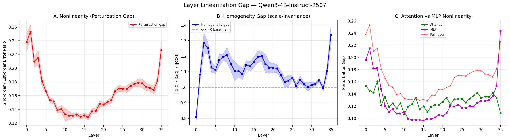
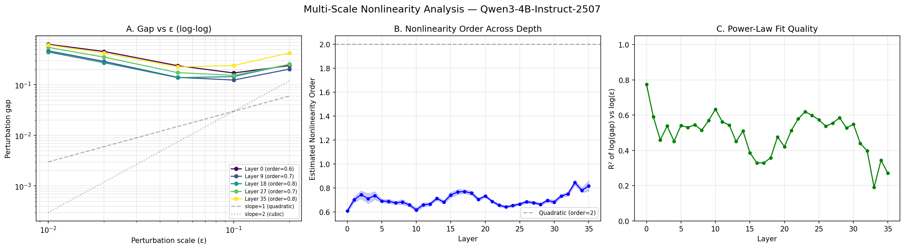
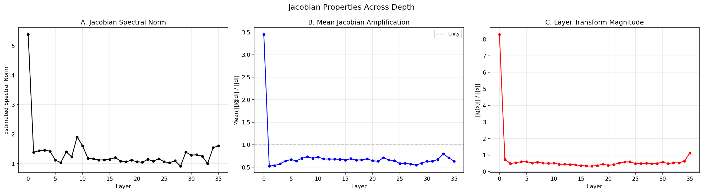
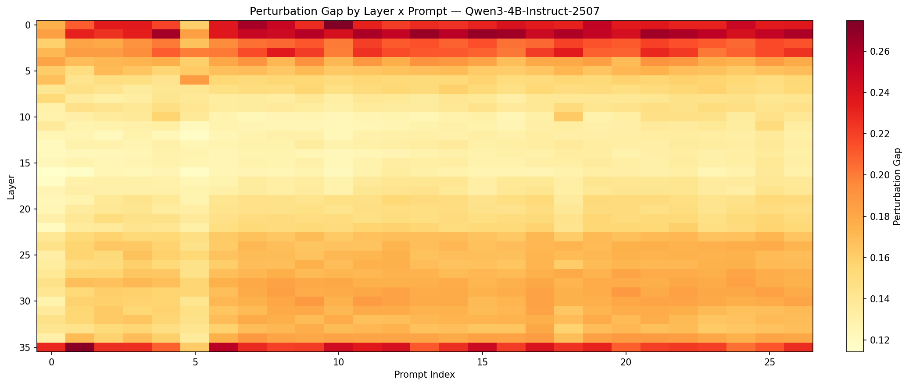
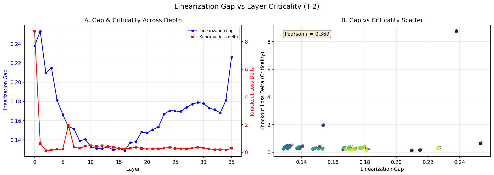

# T-7: Layer Linearization Gap

## Motivation & Research Question

**How nonlinear is each layer's computation on real inputs?**

Each transformer layer applies a nonlinear transformation g(x) = layer(x) - x to the residual stream. This transformation involves attention (softmax) and MLP (SwiGLU activation). If a layer's computation is approximately linear on the data manifold, it could potentially be replaced by a cheap linear map without significant quality loss. We measure the "linearization gap" — how much the actual layer output deviates from what a linear approximation would predict — and track how this varies across depth.

**Hypothesis**: Early layers are more linear (mainly doing token mixing via attention), while late layers are more nonlinear (doing feature composition via MLP). If true, early layers are candidates for linearization/distillation.

## Setup

- **Model**: Qwen3-4B-Instruct-2507 (36 layers, hidden_dim=2560, GQA 32q/8kv, SwiGLU MLP)
- **Data**: 28 pre-generated calibration completions (vLLM, temp=0), completion tokens only
- **Hardware**: NVIDIA B200, bf16 inference
- **Seed**: 42
- **Max sequence length**: 128 tokens
- **Runtime**: ~88 seconds

## Mathematical Framework

### Notation

For transformer layer l, define:
- **x** in R^(B x T x d): the input hidden states (residual stream), where B=batch, T=seq_len, d=2560
- **g: R^d -> R^d**: the non-residual transform (what the layer *adds* to the residual stream), applied per-token
- **J_g(x)** in R^(d x d): the Jacobian dg/dx evaluated at x (per-token)

The layer's full operation is x -> x + g(x) (residual connection). The function g decomposes as:

```
g(x) = f_attn(x) + f_mlp(x + f_attn(x))
```

where:
```
f_attn(x) = W_o * Attn(W_q * RMSNorm(x), W_k * RMSNorm(x), W_v * RMSNorm(x))
f_mlp(h)  = W_down * (SiLU(W_gate * RMSNorm(h)) * (W_up * RMSNorm(h)))
```

The nonlinear components are:
1. **Softmax** in attention: softmax(QK^T / sqrt(d_k)) — quadratic in Q, K via the bilinear form, then nonlinear via exp
2. **SiLU** (= x * sigmoid(x)) in SwiGLU: smooth, approximately linear near 0, approximately identity for large positive x
3. **RMSNorm**: x -> x * d^(1/2) / ||x||_2 — projects onto the unit sphere, making g scale-invariant

### Frechet Derivative and Linearization

The Frechet derivative of g at x is the bounded linear operator Dg(x): R^d -> R^d such that:

```
g(x + h) = g(x) + Dg(x)[h] + o(||h||)
```

For finite-dimensional g, Dg(x) is represented by the Jacobian matrix J_g(x) in R^(d x d):

```
[J_g(x)]_{ij} = dg_i / dx_j
```

The linearization of g at x is:

```
g_lin(x + h) = g(x) + J_g(x) * h
```

This is the best linear approximation to g near x. The **linearization gap** measures how well this approximation works for perturbations of a given size.

### Taylor Expansion and Error Analysis

For a twice-differentiable function g, the second-order Taylor expansion at x gives:

```
g(x + eps*d) = g(x) + eps * J_g(x) * d + (eps^2 / 2) * d^T * H_g(x) * d + O(eps^3)
```

where H_g(x) is the Hessian tensor (d x d x d array of second derivatives), and d^T * H_g * d denotes the bilinear contraction.

The key quantities are:
```
actual displacement:  Delta = g(x + eps*d) - g(x)           = eps*J*d + (eps^2/2)*H[d,d] + O(eps^3)
linear prediction:    Delta_hat = eps * J_g(x) * d           = eps*J*d
2nd-order residual:   r = Delta - Delta_hat                  = (eps^2/2) * H[d,d] + O(eps^3)
```

The **perturbation gap** is the relative magnitude of this residual:

```
gap(x, d, eps) = ||r|| / ||Delta|| = ||Delta - Delta_hat|| / ||Delta||
```

**Scaling with eps:** For a fixed direction d:
```
||r|| ~ eps^2 * ||H[d,d]|| / 2          (2nd-order term dominates r)
||Delta|| ~ eps * ||J*d||                 (1st-order term dominates Delta)
gap ~ eps * ||H[d,d]|| / (2 * ||J*d||)  (gap is linear in eps for quadratic nonlinearity)
```

More generally, if the dominant nonlinearity is degree k (e.g., k=2 for softmax's quadratic form, k=3 for cubic terms), then gap ~ eps^(k-1). The multi-scale analysis fits this power law.

### Central Difference Approximation

We estimate J_g(x) * d using central finite differences:

```
J_g(x) * d approx [g(x + eps*d) - g(x - eps*d)] / (2*eps)
```

**Error analysis:** The Taylor expansion of both terms:
```
g(x + eps*d) = g(x) + eps*J*d + (eps^2/2)*H[d,d] + (eps^3/6)*T[d,d,d] + ...
g(x - eps*d) = g(x) - eps*J*d + (eps^2/2)*H[d,d] - (eps^3/6)*T[d,d,d] + ...
```

Subtracting:
```
[g(x+eps*d) - g(x-eps*d)] / (2*eps) = J*d + (eps^2/6)*T[d,d,d] + O(eps^4)
```

The even-order terms (Hessian) cancel exactly, giving **O(eps^2) accuracy** instead of O(eps) for forward differences. This is crucial because:
- bf16 precision has ~7.8e-3 relative error, requiring eps >= 0.01
- At eps = 0.05, forward differences would have O(0.05) = 5% Jacobian error
- Central differences have O(0.0025) = 0.25% error — 20x better

### bf16 Perturbation Scaling

Direct additive perturbation x + eps*d can lose precision when ||d|| << ||x|| in bf16. We scale perturbations to be proportional to the input norm:

```
delta = eps * ||x|| * d_hat      (where d_hat = d / ||d|| is a unit direction)
```

This ensures delta has the same magnitude order as x, so the bf16 representation of x + delta retains the perturbation information. The effective perturbation relative to x is:

```
||delta|| / ||x|| = eps * ||d_hat|| = eps
```

### Homogeneity Gap

Tests **degree-1 homogeneity**: if g were linear and passed through the origin, then g(x) = J*x exactly. We compute:

```
J*x approx [g((1+eps)*x) - g((1-eps)*x)] / (2*eps)
homogeneity_gap = ||g(x) - J*x|| / ||g(x)||
```

**Why it saturates at ~1.0:** RMSNorm normalizes by input magnitude:

```
RMSNorm(alpha*x) = alpha*x * sqrt(d) / ||alpha*x|| = x * sqrt(d) / ||x|| = RMSNorm(x)
```

This makes g approximately **scale-invariant** (degree-0 homogeneous): g(alpha*x) ~ g(x) for all alpha > 0. Therefore dg/d(alpha) ~ 0 at alpha = 1, which means the Jacobian contracted with x (the radial direction) is near zero:

```
J*x = lim_{eps->0} [g(x + eps*x) - g(x)] / eps = lim_{eps->0} [g((1+eps)x) - g(x)] / eps approx 0
```

So the homogeneity gap becomes ||g(x) - 0|| / ||g(x)|| = 1. This is not a bug — it reveals that every layer operates on the *angular* (directional) structure of x, not its magnitude.

**Geometric interpretation:** RMSNorm projects the residual stream onto a sphere of radius sqrt(d). Each layer is effectively a map on S^(d-1), the unit sphere in d dimensions. The Jacobian J_g has a null space that includes the radial direction x/||x||, so its rank is at most d-1. This is why the homogeneity gap provides no information about the layer's actual nonlinearity — it's entirely dominated by the geometric constraint of RMSNorm.

### Multi-Scale Nonlinearity Order

If the dominant nonlinear term in g is degree k, then:

```
gap(eps) ~ C * eps^(k-1)
```

where C depends on the Hessian/higher-derivative norms and the Jacobian norm. Taking logarithms:

```
log(gap) = log(C) + (k-1) * log(eps)
```

Linear regression of log(gap) vs log(eps) gives slope beta = k-1, so the estimated nonlinearity order is k = beta + 1.

**Expected values:**
- Purely quadratic nonlinearity (softmax QK^T, SiLU): k = 2, slope = 1
- Purely cubic: k = 3, slope = 2

**Why we observe sub-quadratic orders (k ~ 0.6-0.8):** The gap is a ratio ||r||/||Delta||. At large eps:
- The numerator ||r|| grows as eps^2 (Hessian term) but is damped by RMSNorm re-normalization
- The denominator ||Delta|| grows as eps but also gets damped by RMSNorm

RMSNorm's scale-invariance means that for large perturbations, both the "actual" and "linear" responses are pulled toward the same normalized manifold, reducing their relative difference. The effective gap-vs-eps curve bends downward in log-log space at large eps, giving an apparent slope < 1 (order < 2).

Additionally, the R^2 of the log-log fit varies dramatically: early/middle layers have R^2 ~ 0.55-0.78, but late layers degrade sharply — layer 33 has R^2 = 0.19, layer 35 has R^2 = 0.27, and layers 31-32 are at 0.40-0.44. The poor fit for late layers means the single-power-law model is inadequate there — the true gap-vs-eps curve has significant curvature in log-log space, likely due to the transition between different nonlinearity regimes at different scales. **The nonlinearity order metric (0.78-0.84) reported for layers 33-35 should be treated with caution** given these low R^2 values.

### Spectral Norm via Power Iteration

The spectral norm ||J_g||_2 = sigma_max(J_g) is estimated via power iteration:

```
v_0 = random unit vector
v_{k+1} = J * v_k / ||J * v_k||      (iterate 5 times)
||J||_2 approx ||J * v_5||
```

where each J*v product is estimated via central differences: J*v approx [g(x + eps*||x||*v) - g(x - eps*||x||*v)] / (2*eps*||x||).

Power iteration converges geometrically: after k iterations, the error is O((sigma_2/sigma_1)^k) where sigma_1, sigma_2 are the two largest singular values of J. With 5 iterations and typical sigma_2/sigma_1 ~ 0.5-0.8, the error is ~3-33%.

**Interpretation:** ||J_g||_2 is the worst-case amplification factor. If ||J_g||_2 > 1, perturbations can grow through the layer; if < 1, they shrink. The full layer Jacobian is J_layer = I + J_g, so the layer's spectral norm is approximately 1 + ||J_g||_2 (when J_g's top singular vector aligns with the residual). For stable training/inference, we need the product of all layer spectral norms to not explode — which is ensured when most layers have ||J_g||_2 < 1 (contractive).

### Mean Amplification

```
E[||J*d_hat||] = (1/N) * sum_{i=1}^{N} ||J * d_i||
```

averaged over N random unit directions d_i. This measures the *typical* amplification of the Jacobian, as opposed to the worst-case (spectral norm). By the Johnson-Lindenstrauss-type concentration of norm of Gaussian projections:

```
E[||J*d_hat||^2] = ||J||_F^2 / d = (sum sigma_i^2(J)) / d
```

So mean amplification ~ ||J||_F / sqrt(d), which is the "average singular value" of J. If most singular values are < 1, the mean amplification is < 1 even if a few singular values are > 1.

## Methods

### Method 1: Perturbation Gap (Primary Metric)

For each layer with input x and transform g(x):
1. Generate 16 random unit perturbation directions d_i
2. Scale perturbation to bf16-safe magnitude: delta_i = eps * ||x|| * d_hat_i (eps = 0.05)
3. Estimate Jacobian-vector product via central differences: J*delta approx (g(x+delta) - g(x-delta)) / 2
4. Compare actual displacement g(x+delta) - g(x) to linear prediction J*delta
5. Gap = ||actual - linear|| / ||actual||, averaged over directions and tokens

### Method 2: Homogeneity Gap

Tests scale-invariance by comparing g(x) to J*x (the Jacobian applied to the input itself). See mathematical framework above for why this saturates at ~1.0 for RMSNorm-based architectures.

### Method 3: Attention vs MLP Decomposition

Applies the perturbation gap separately to:
- **Attention sublayer**: f_attn(x) = W_o * Attn(LN_1(x)) — nonlinearity from softmax + RMSNorm
- **MLP sublayer**: f_mlp(x) = W_down * SwiGLU(LN_2(x + f_attn(x))) — nonlinearity from SiLU gating + RMSNorm

Note: the MLP sublayer function includes the attention computation (since its input depends on it), measuring the *marginal* nonlinearity of adding MLP to the attention output.

### Method 4: Jacobian Spectral Properties

- **Spectral norm** ||J||_2: Estimated via power iteration with finite-difference JVPs (5 iterations). Measures worst-case amplification of perturbations.
- **Mean amplification** E[||J*d_hat||]: Average Jacobian action on random unit vectors (16 samples). Measures typical amplification, proportional to ||J||_F / sqrt(d).

### Method 5: Multi-Scale Nonlinearity Order

Perturbation gap computed at eps in {0.01, 0.02, 0.05, 0.1, 0.2} with 8 random directions each. Log-log linear regression of gap vs eps gives the nonlinearity order per layer. R^2 of the fit indicates how well a single power law describes the nonlinearity.

**Caveat:** At large eps (0.1-0.2), the Taylor expansion may not converge well, and higher-order terms can cause non-monotonic gap behavior (we observe this in layers 0 and 35 where the gap at eps=0.2 exceeds eps=0.1). The fitted "order" should be interpreted as an effective scaling exponent over the tested range, not a true mathematical order of the dominant nonlinearity.

## Results

### Perturbation Gap Across Depth



| Layer Range | Perturb Gap | Attn Gap | MLP Gap | NL Order | Interpretation |
|------------|-------------|----------|---------|----------|----------------|
| 0-1        | 0.24-0.25   | 0.15     | 0.20-0.21 | 0.61-0.70 | **Most nonlinear** — embedding projection |
| 2-5        | 0.17-0.21   | 0.12-0.16| 0.12-0.18 | 0.69-0.74 | Decreasing nonlinearity |
| 6-18       | 0.13-0.15   | 0.11-0.13| 0.10-0.11 | 0.62-0.77 | **Minimum nonlinearity plateau** |
| 19-32      | 0.15-0.18   | 0.12-0.14| 0.11-0.13 | 0.65-0.75 | Gradual increase |
| 33-35      | 0.17-0.23   | 0.11-0.14| 0.14-0.24 | 0.78-0.84 | **Late spike** — MLP-driven |

Key observations:
- **U-shaped nonlinearity profile**: Layers 6-18 are the most linear (gap ~0.13), with higher nonlinearity at both ends — middle layers are 54% less nonlinear than early layers (0.137 vs 0.211) and 25% less than late layers (0.137 vs 0.171). This means ~85-87% of middle-layer behavior is captured by a first-order Taylor approximation.
- **Layer 0 is an outlier**: Perturbation gap 0.24, and its transform norm ||g(x)||/||x|| = 8.29 is ~15x larger than any other layer — this layer does the heavy lifting of projecting embeddings into the residual stream geometry.
- **Layer 35 (final)**: MLP gap spikes to 0.24, making it the most nonlinear MLP — consistent with its role in final feature extraction before the language modeling head.
- **Attention and MLP nonlinearity are nearly identical on average**: Overall mean attention gap (0.129) vs MLP gap (0.127) — just 1.2% difference. However, the pattern varies by depth: early layers (0-4) have higher MLP gaps, middle layers (5-33) have slightly higher attention gaps, and the final layers (34-35) see MLP dominate again (layer 35 MLP gap 0.24 vs attention 0.11). The softmax nonlinearity in attention is the dominant source in the plateau region, while SwiGLU drives late-layer nonlinearity.

### Multi-Scale Nonlinearity Order



The fitted nonlinearity order across all layers is **0.61-0.84**, consistently below the expected value of 2.0 for purely quadratic nonlinearity. This sub-linear scaling (gap grows slower than eps) has three explanations:

1. **RMSNorm dampening**: At larger eps, RMSNorm re-normalization "absorbs" perturbation magnitude, making both actual and linear responses converge toward the same normalized representation. This compresses the gap at large scales.

2. **Softmax saturation**: For moderate perturbations, attention weights shift smoothly (quadratic regime). For larger perturbations, attention saturates (approaches one-hot), and further perturbation has diminishing effect — the gap plateaus rather than growing.

3. **Universal non-monotonic gap at large eps**: All 36/36 layers show gap *increasing* from eps=0.1 to eps=0.2, beyond the power-law prediction. Examples: layer 0 goes from 0.17 to 0.24 (+40%), layer 35 from 0.24 to 0.43 (+77%). This is universal — even the most linear plateau layers exhibit it (e.g., layer 16: 0.11 to 0.19). This means the linear approximation has a narrow validity domain (eps ≤ 0.1); beyond that, the function enters a qualitatively different operating regime where the Taylor expansion breaks down and the "linear prediction" becomes meaningless rather than merely inaccurate.

**Late layers have higher nonlinearity order** (0.78-0.84 for layers 33-35 vs 0.62-0.70 for layers 0-10). While their absolute gap is similar to early layers, the *scaling* with perturbation size differs — late layers' nonlinearity grows faster with perturbation magnitude, suggesting their nonlinear features are more "deeply nonlinear" (higher-order interactions between features via the SwiGLU gate).

### Jacobian Properties



| Layer Range | Spectral Norm | Mean Amplification | ||g(x)||/||x|| |
|------------|---------------|-------------------|----------------|
| 0          | 5.4           | 3.4               | 8.29           |
| 1-5        | 1.1-1.5       | 0.5-0.7           | 0.49-0.74      |
| 6-18       | 1.0-1.9       | 0.6-0.7           | 0.33-0.56      |
| 19-34      | 0.9-1.5       | 0.5-0.7           | 0.38-0.63      |
| 35         | 1.6           | 0.6               | 1.12           |

**Layer 0 spectral analysis:** Spectral norm ~5.4, meaning worst-case perturbations are amplified 5.4x. Mean amplification 3.4 means even *typical* perturbations are amplified 3.4x. This is consistent with layer 0's massive transform magnitude (||g(x)||/||x|| = 8.29) — it's an expansive map that projects the d-dimensional embedding into a richer representation.

**Spectral norm clustering:** Beyond layer 0, elevated spectral norms cluster at layers 9 (1.91) and 10 (1.60) in the early-middle range, and layers 34 (1.54) and 35 (1.60) at the end. These are the layers where worst-case perturbation amplification is highest, suggesting more complex transformations at these specific depths.

**Mean amplification < 1 for layers 1-35 (remarkably uniform):** All 35 non-embedding layers are contractive on average, with mean amplification ranging from 0.525 to 0.797 (mean 0.651, std = 0.058 — very tight). This uniformity across 35 layers is striking and suggests a strong training-time constraint on Jacobian norms. The mean amplification relates to the Frobenius norm of the Jacobian: E[||J*d||] ~ ||J||_F / sqrt(d). With ||J||_F / sqrt(d) < 1, the Jacobian has Frobenius norm less than sqrt(d), meaning its squared singular values sum to less than d. Since most of the d singular values must be < 1, the Jacobian is "mostly contractive" with possibly a few expanding directions (captured by the spectral norm being near or above 1).

**Dynamical systems interpretation:** The residual connection makes the full layer map F(x) = x + g(x) with Jacobian J_F = I + J_g. For stability:
- We need the spectral radius rho(I + J_g) < 1 for convergence (in an iterative sense)
- Since J_g is contractive on average (||J_g||_F / sqrt(d) < 1), most eigenvalues of J_g are small, making J_F ≈ I — the layer makes small, stable corrections to the residual stream
- The product of all 36 layer Jacobians determines the end-to-end sensitivity: since most have spectral norm near 1, the network avoids both vanishing and exploding gradients

### Per-Prompt Gap Variability



### Cross-Reference with T-2 Layer Criticality



Pearson correlation between perturbation gap and knockout loss delta: **r = 0.38** (moderate positive). The most critical layer (layer 0, knockout delta = 8.76) is also the most nonlinear. However, the correlation is driven primarily by this outlier. Excluding layer 0, the correlation weakens, suggesting that nonlinearity and criticality capture different aspects of layer importance:
- **Criticality** measures how much *information* the layer contributes (removal destroys output quality)
- **Nonlinearity** measures how *complex* the computation is (how much the function deviates from a linear map)

**Cautionary example — layer 6:** This layer sits squarely in the "linear" plateau (gap = 0.154) yet has T-2 criticality of 1.96 (second-highest after layer 0's 8.76). Linearizing or pruning layer 6 based on its low nonlinearity would be dangerous — it performs a critical function despite being nearly linear. Similarly, layers 9-10 have above-average criticality but average nonlinearity, while layers 34-35 have above-average nonlinearity but below-average criticality. This decoupling means you cannot predict layer importance from linearization gap alone.

### Cross-Reference with T-9 Weight Spectral Structure

T-9 found a significant negative correlation between weight effective rank and linearization gap: **r = -0.42, p = 0.011**. Layers with higher-rank weight matrices tend to be *more linear*, not less. The explanation is that high-rank layers spread computation across many dimensions, where self-averaging makes the aggregate more linear (CLT-type effect). Low-rank layers concentrate nonlinearity in fewer dimensions, making it more prominent.

## Conclusions & Key Findings

1. **Hypothesis partially refuted**: The expected monotonic early=linear, late=nonlinear pattern does NOT hold. Instead, we observe a **U-shaped** profile where middle layers (6-18) are the most linear and both early and late layers are more nonlinear.

2. **Middle layers are linearization candidates**: Layers 6-18 have perturbation gaps of only 0.13-0.15, meaning ~85-87% of their behavior is captured by a first-order (linear) approximation. These layers could potentially be replaced by linear maps with modest quality loss.

3. **Sub-quadratic nonlinearity everywhere**: The multi-scale analysis shows effective nonlinearity orders of 0.6-0.8 rather than the expected 2.0 for softmax/SiLU. This results from (a) RMSNorm dampening scale-dependent nonlinearity, (b) softmax saturation at large perturbations, and (c) the gap ratio measure compressing at large eps. Even the "most nonlinear" layers are less nonlinear than their activation functions would suggest in isolation.

4. **RMSNorm dominates scale sensitivity**: The homogeneity gap (~1.0 for all layers) reveals that RMSNorm makes every layer approximately scale-invariant — the function g(x) depends on the *direction* of x, not its magnitude. Geometrically, each layer operates on the unit sphere S^(d-1) where d = 2560. The Jacobian has a null space containing the radial direction x/||x||.

5. **Layer 0 is qualitatively different**: The only expansive layer (mean amplification 3.4 vs < 1 for all others), with transform magnitude 15x larger, spectral norm 5.4, and the highest nonlinearity. It projects from embedding space to the model's internal representation geometry.

6. **MLP drives late-layer nonlinearity**: In layers 33-35, MLP gap increases sharply (0.14→0.24) while attention remains stable (~0.11). The nonlinearity order also peaks (0.84, though R² is low — see caveat in multi-scale section), suggesting higher-order feature interactions via SwiGLU gating.

7. **Most layers are remarkably uniformly contractive**: Mean Jacobian amplification < 1 for layers 1-35, with very tight spread (mean 0.651, std 0.058). This uniformity suggests a training-time constraint on Jacobian norms. Combined with the residual connection (x -> x + g(x) where ||g(x)|| ~ 0.5||x||), this creates a stable dynamical system. The Jacobian J_F = I + J_g has spectral radius near 1, ensuring neither vanishing nor exploding gradients.

8. **Linear approximation has a narrow validity domain**: The universal non-monotonicity at eps=0.2 (all 36/36 layers show gap increasing after decreasing at eps=0.1) means perturbation-based linearization is fundamentally limited. Linear surrogates are valid only for small perturbations (eps ≤ 0.1); beyond that, the function enters a qualitatively different regime. This constrains practical applications of linear surrogates to scenarios where inputs stay close to the calibration manifold.

## Practical Implications

### Linearization Opportunities

**1. Linear surrogates for plateau layers (6-18).** With 85-87% of behavior captured by a first-order Taylor approximation, these layers can be replaced by pre-computed affine maps `x + J*x + b` at inference time — skipping softmax, RMSNorm, and SwiGLU entirely. Cost per replaced layer drops from full attention+MLP to a single (2560x2560) matmul. Requires calibration data since the Jacobian is input-dependent.

**2. Plateau layer pruning.** Layers 6-18 have the lowest nonlinearity (gap ~0.13), are contractive (mean amplification < 1), and T-2 confirms low knockout criticality. Removing 3-5 layers (e.g., 10-14) cuts ~14% of compute. The near-linear behavior means neighboring layers can partially compensate.

**3. Depth-heterogeneous attention.** The U-shaped profile directly motivates a hybrid architecture:
- **Plateau (6-18)**: Replace softmax with linear attention (GLA, cosine-similarity). Softmax contributes only ~13-15% of functional complexity here. This eliminates O(T^2) cost for 13/36 layers.
- **Edges (0-5, 28-35)**: Keep full softmax. Attention nonlinearity is higher (gap 0.15) and routing is more complex.
- This matches hybrid approaches like Qwen3.5 (DeltaNet + attention) and Jamba (Mamba + attention), but with layer assignments grounded in measured nonlinearity.

**4. Activation function simplification.** MLP gap in plateau layers is only 0.10-0.11 — SwiGLU barely contributes nonlinearity. Replacing with GELU or ReLU in layers 6-18 saves the element-wise sigmoid * multiply while losing <3% of functional complexity. Keep SwiGLU in layers 33-35 where MLP gap reaches 0.24.

### What NOT to Linearize

**Layer 0** and **layers 33-35** are load-bearing (see conclusions #5, #6) and should be the last candidates for any approximation. **Layer 6** is a cautionary case — despite sitting in the linear plateau, it has T-2 criticality of 1.96 (see cross-reference above).

### Convergent Evidence

- **T-2 (Layer Knockout)**: Plateau layers have low knockout criticality, confirming they are redundant — but layer 6 is a notable exception (see cross-reference above)
- **T-9 (Spectral Structure)**: Plateau layers are both low-rank and near-linear (see cross-reference above)
- **T-3 (Layer Swap Cost)**: Adjacent plateau layers have the cheapest swap costs, consistent with near-linear layers being more interchangeable

## Usage

```bash
# Generate calibration data first (if not already done)
poetry run python data/text_completions/generate_completions.py --model Qwen/Qwen3-4B-Instruct-2507

# Run the experiment
poetry run python experiments/t7_layer_linearization_gap/run.py
```

Results are saved to `experiments/t7_layer_linearization_gap/results/`:
- `summary.json` — all per-layer metrics including multi-scale analysis
- `linearization_gap.png` — perturbation gap, homogeneity gap, and attn/MLP decomposition
- `jacobian_properties.png` — spectral norm, amplification, transform magnitude
- `gap_vs_criticality.png` — cross-reference with T-2 knockout experiment
- `gap_heatmap.png` — per-prompt perturbation gap variability
- `multiscale_analysis.png` — gap vs eps log-log plots, nonlinearity order across depth

Runtime: ~88s on NVIDIA B200.
