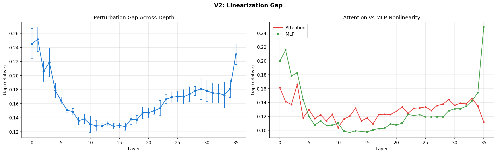
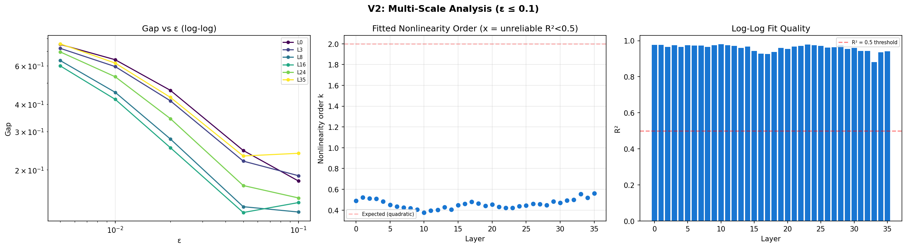
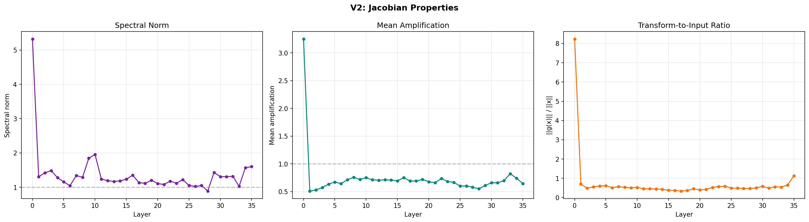
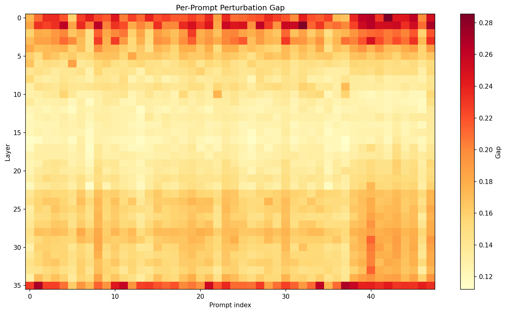
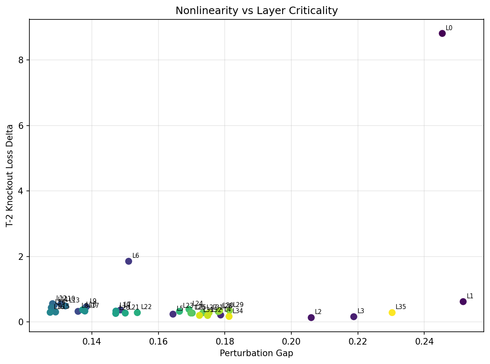
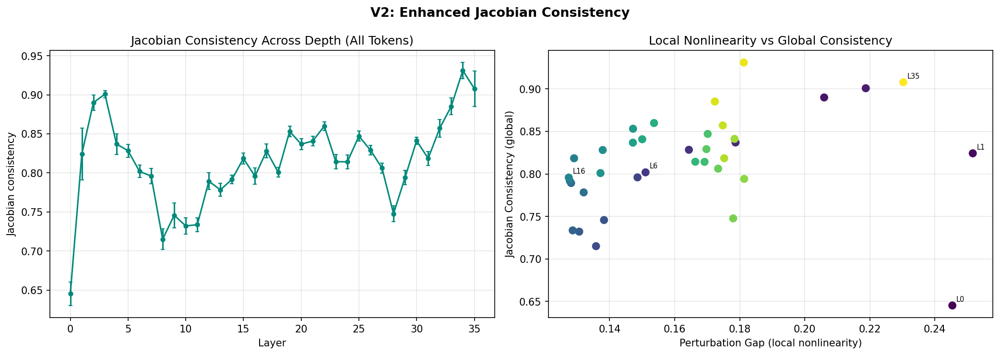
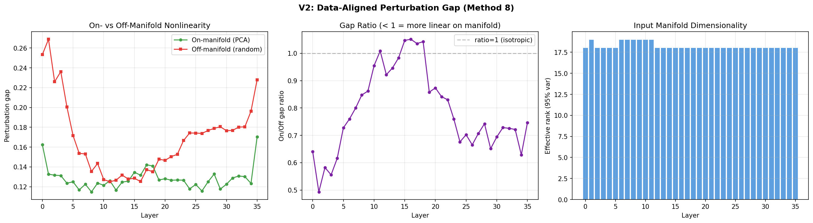
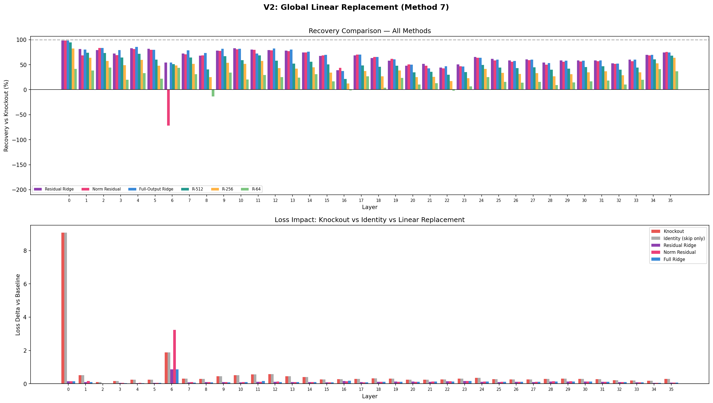
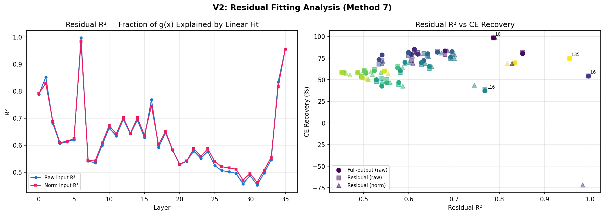
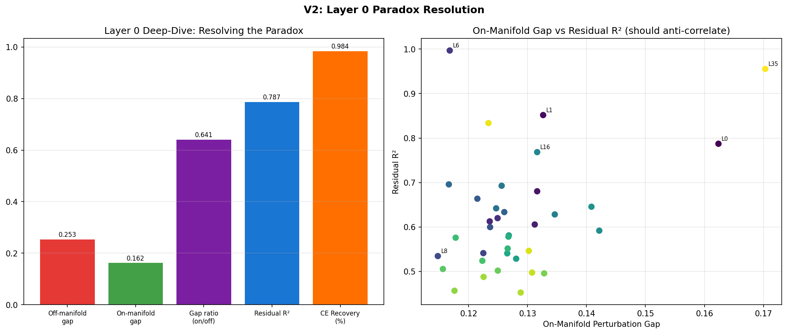

# T-7: Layer Linearization Gap

## Motivation & Research Question

**How nonlinear is each layer's computation on real inputs?**

Each transformer layer applies a nonlinear transformation $g(\mathbf{x}) = \text{layer}(\mathbf{x}) - \mathbf{x}$ to the residual stream. This transformation involves attention (softmax) and MLP (SwiGLU activation). If a layer's computation is approximately linear on the data manifold, it could potentially be replaced by a cheap linear map without significant quality loss. We measure the "linearization gap" — how much the actual layer output deviates from what a linear approximation would predict — and track how this varies across depth.

**Hypothesis**: Early layers are more linear (mainly doing token mixing via attention), while late layers are more nonlinear (doing feature composition via MLP). If true, early layers are candidates for linearization/distillation.

## Setup

- **Model**: Qwen3-4B-Instruct-2507 (36 layers, hidden_dim=2560, GQA 32q/8kv, SwiGLU MLP)
- **Data**: 200 pre-generated calibration completions (vLLM, temp=0), completion tokens only. 50 prompts used for per-prompt analysis (Methods 1,3,4,5,8 — gap is stable across prompts with 10-20% std), full 200 for Methods 6 and 7 which benefit from more data.
- **Hardware**: NVIDIA B200, bf16 inference
- **Seed**: 42
- **Max sequence length**: 256 tokens
- **Runtime**: ~1367s total (~150s per-prompt analysis, ~2s PCA gap, ~13s Jacobian consistency, ~1201s layer replacement)

## Mathematical Framework

### Notation

Each transformer layer computes:

$$\mathbf{x}_{\text{out}} = \mathbf{x} + g(\mathbf{x})$$

where $\mathbf{x} \in \mathbb{R}^d$ is the input hidden state ($d = 2560$), $g(\mathbf{x})$ is the layer's correction (attention + MLP), and the $+ \mathbf{x}$ is the residual (skip) connection. We isolate $g$ because the skip connection is already perfectly linear — all the nonlinearity lives in $g$.

The function $g$ decomposes into two sequential stages:

$$g(\mathbf{x}) = f_{\text{attn}}(\mathbf{x}) + f_{\text{mlp}}\big(\mathbf{x} + f_{\text{attn}}(\mathbf{x})\big)$$

$$f_{\text{attn}}(\mathbf{x}) = W_o \cdot \text{Attn}\big(W_q \cdot \text{RMSNorm}(\mathbf{x}), \quad W_k \cdot \text{RMSNorm}(\mathbf{x}), \quad W_v \cdot \text{RMSNorm}(\mathbf{x})\big)$$

$$f_{\text{mlp}}(\mathbf{h}) = W_{\text{down}} \cdot \Big[\text{SiLU}\big(W_{\text{gate}} \cdot \text{RMSNorm}(\mathbf{h})\big) \odot \big(W_{\text{up}} \cdot \text{RMSNorm}(\mathbf{h})\big)\Big]$$

Three sources of nonlinearity inside $g$:

1. **Softmax** in attention: $\text{softmax}(QK^\top / \sqrt{d_k})$ — bilinear in the input, then exponentiated
2. **SiLU** in SwiGLU: the function $x \cdot \sigma(x)$ — approximately linear near 0, approximately identity for large positive $x$
3. **RMSNorm**: $\mathbf{x} \mapsto \mathbf{x} \cdot \sqrt{d} / \lVert\mathbf{x}\rVert_2$ — normalizes the magnitude, making the output depend only on the *direction* of $\mathbf{x}$. This has an important consequence: $g(\alpha \mathbf{x}) \approx g(\mathbf{x})$ for any $\alpha > 0$, meaning $g$ is approximately **scale-invariant**. The Jacobian therefore has a null space containing the radial direction $\mathbf{x} / \lVert\mathbf{x}\rVert$

### Perturbation Gap: Quantifying Nonlinearity

Any smooth function looks linear when you zoom in far enough. The question is: how far can we zoom out before the linear approximation breaks?

**Step 1 — The Jacobian.** The best linear approximation of $g$ at point $\mathbf{x}$ is given by its Jacobian, the $d \times d$ matrix of partial derivatives:

$$\mathbf{J}_g(\mathbf{x}) \in \mathbb{R}^{d \times d}, \qquad [\mathbf{J}_g]_{ij} = \frac{\partial g_i}{\partial x_j}$$

For a small perturbation $\mathbf{h}$, the Jacobian predicts: $g(\mathbf{x} + \mathbf{h}) \approx g(\mathbf{x}) + \mathbf{J}_g(\mathbf{x}) \cdot \mathbf{h}$.

**Step 2 — Taylor expansion.** To understand the error, expand $g$ around $\mathbf{x}$ with perturbation $\varepsilon \hat{\mathbf{d}}$ (unit direction $\hat{\mathbf{d}}$, scale $\varepsilon$):

$$g(\mathbf{x} + \varepsilon \hat{\mathbf{d}}) = g(\mathbf{x}) + \varepsilon \mathbf{J}\hat{\mathbf{d}} + \frac{\varepsilon^2}{2}\mathbf{H}[\hat{\mathbf{d}}, \hat{\mathbf{d}}] + \mathcal{O}(\varepsilon^3)$$

where $\mathbf{H}$ is the Hessian tensor (second derivatives). The first-order term $\varepsilon \mathbf{J}\hat{\mathbf{d}}$ is the linear prediction; everything beyond it is the nonlinear residual.

**Step 3 — The gap.** Define:
- **Actual displacement**: $\Delta = g(\mathbf{x} + \varepsilon \hat{\mathbf{d}}) - g(\mathbf{x})$
- **Linear prediction**: $\hat{\Delta} = \varepsilon \mathbf{J}\hat{\mathbf{d}}$
- **Nonlinear residual**: $\mathbf{r} = \Delta - \hat{\Delta} = \frac{\varepsilon^2}{2}\mathbf{H}[\hat{\mathbf{d}}, \hat{\mathbf{d}}] + \mathcal{O}(\varepsilon^3)$

The **perturbation gap** is the relative size of the residual:

$$\text{gap} = \frac{\lVert\mathbf{r}\rVert}{\lVert\Delta\rVert} = \frac{\lVert\text{actual} - \text{linear prediction}\rVert}{\lVert\text{actual}\rVert}$$

A gap of 0.13 means 87% of the layer's behavior is captured by the linear approximation; 13% is genuinely nonlinear.

**Step 4 — Scaling.** Since $\lVert\mathbf{r}\rVert \sim \varepsilon^2$ (Hessian-dominated) and $\lVert\Delta\rVert \sim \varepsilon$ (Jacobian-dominated), the gap scales as $\varepsilon^2 / \varepsilon = \varepsilon$ for quadratic nonlinearity. More generally, for degree-$k$ leading nonlinearity, gap $\sim \varepsilon^{k-1}$. Doubling the perturbation size doubles the gap for quadratic functions. The multi-scale analysis (Method 5) measures this exponent by varying $\varepsilon$.

### Central Differences for Jacobian-Vector Products

**The problem.** The full Jacobian $\mathbf{J} \in \mathbb{R}^{2560 \times 2560}$ has ~26M entries — too large to compute or store. We only need its product with specific direction vectors, $\mathbf{J}\hat{\mathbf{d}}$.

**The solution.** Central finite differences approximate the directional derivative:

$$\mathbf{J}\hat{\mathbf{d}} \approx \frac{g(\mathbf{x} + \varepsilon \hat{\mathbf{d}}) - g(\mathbf{x} - \varepsilon \hat{\mathbf{d}})}{2\varepsilon}$$

**Why central beats forward differences.** Expanding both evaluations via Taylor series:

$$g(\mathbf{x} + \varepsilon \hat{\mathbf{d}}) = g(\mathbf{x}) + \varepsilon \mathbf{J}\hat{\mathbf{d}} + \frac{\varepsilon^2}{2}\mathbf{H}[\hat{\mathbf{d}}, \hat{\mathbf{d}}] + \mathcal{O}(\varepsilon^3)$$

$$g(\mathbf{x} - \varepsilon \hat{\mathbf{d}}) = g(\mathbf{x}) - \varepsilon \mathbf{J}\hat{\mathbf{d}} + \frac{\varepsilon^2}{2}\mathbf{H}[\hat{\mathbf{d}}, \hat{\mathbf{d}}] + \mathcal{O}(\varepsilon^3)$$

Subtracting cancels the even-order terms (Hessian), leaving error $\mathcal{O}(\varepsilon^2)$ vs $\mathcal{O}(\varepsilon)$ for forward differences. At $\varepsilon = 0.05$: forward error ~5%, central error ~0.25%.

**bf16 perturbation scaling.** In bf16, numbers have ~3 decimal digits of precision. If $\mathbf{x}$ has magnitude 100 and we add 0.001, bf16 rounds it away. Fix: scale perturbations proportionally to input magnitude:

$$\boldsymbol{\delta} = \varepsilon \cdot \lVert\mathbf{x}\rVert \cdot \hat{\mathbf{d}}$$

This ensures $\lVert\boldsymbol{\delta}\rVert / \lVert\mathbf{x}\rVert = \varepsilon$ regardless of activation scale, keeping $\mathbf{x} + \boldsymbol{\delta}$ representable in bf16.

### Multi-Scale Analysis

The gap at a single $\varepsilon$ measures *how much* nonlinearity. Measuring at multiple scales reveals *what kind*.

If the leading nonlinearity is degree $k$, the gap scales as gap $\sim C \cdot \varepsilon^{k-1}$. Taking logarithms:

$$\log(\text{gap}) = (k-1) \cdot \log(\varepsilon) + \log(C)$$

This is a line in log-log space with slope $\beta = k - 1$, so $k = \beta + 1$. We fit this via linear regression across $\varepsilon \in \lbrace 0.005, 0.01, 0.02, 0.05, 0.1 \rbrace$.

**Why we observe sub-quadratic orders** ($k \approx 0.3\text{--}1.0$ for early layers): RMSNorm dampens both the numerator and denominator at larger $\varepsilon$, bending the log-log curve downward. Fits with $R^2 < 0.5$ are flagged as unreliable.

### Spectral Norm and Mean Amplification

**Spectral norm** is the maximum factor by which the Jacobian can stretch any unit vector:

$$\lVert\mathbf{J}\rVert_2 = \sigma_{\max}(\mathbf{J}) = \max_{\lVert\mathbf{d}\rVert=1} \lVert\mathbf{J}\mathbf{d}\rVert$$

We estimate it via **power iteration** — start with a random unit vector, then repeatedly multiply by the Jacobian and normalize:

$$\mathbf{v}_{k+1} = \frac{\mathbf{J}\mathbf{v}_k}{\lVert\mathbf{J}\mathbf{v}_k\rVert}$$

After $K = 5$ iterations, the norm converges:

$$\lVert\mathbf{J}\mathbf{v}_K\rVert \approx \sigma_{\max} \qquad \text{with error } \mathcal{O}\big((\sigma_2 / \sigma_1)^K\big)$$

Each Jacobian-vector product is computed via central differences (no need to store the full matrix).

**Mean amplification** averages the Jacobian's action over random unit directions:

$$\text{mean amplification} = \frac{1}{N}\sum_{i=1}^{N} \lVert\mathbf{J}\mathbf{d}_i\rVert \approx \frac{\lVert\mathbf{J}\rVert_F}{\sqrt{d}}$$

This equals the RMS singular value. If it is $< 1$, the layer typically contracts perturbations even if a few individual singular values exceed 1.

**Stability interpretation.** The full layer (with skip connection) has Jacobian:

$$\mathbf{J}_F = \mathbf{I} + \mathbf{J}_g$$

For stable propagation through 36 layers, we need most layers to be contractive. Since mean amplification $< 1$ for layers 1-35, the correction Jacobian is "mostly contractive" and the full-layer Jacobian is close to the identity — the layer makes small, stable corrections to the residual stream, preventing both vanishing and exploding gradients.

### Jacobian Consistency: Local vs Global Linearity

**The key distinction.** A layer can be locally linear (low perturbation gap at each individual input) yet globally nonlinear (different inputs produce different Jacobians). This matters for practical linearization: can we replace a layer with *one fixed* matrix $W$ that works for all inputs?

**Example:** $g(x) = x^2$ is locally linear everywhere (the tangent line fits well near any point), but the slope $2x$ changes with $x$. No single linear function fits all points well. Similarly, a transformer layer might apply smooth attention at each input, but different inputs produce different attention patterns.

**Measuring consistency.** Pick $D$ random directions and compute the Jacobian-vector product at $K$ different data points. If the Jacobian is the same everywhere, all these output vectors point in the same direction. We measure via pairwise cosine similarity, averaged over directions:

$$C_g = \mathbb{E}_{\hat{\mathbf{d}}} \left[ \underset{i \neq j}{\text{mean}} \cos\Big(\mathbf{J}(\mathbf{x}_i)\hat{\mathbf{d}}, \quad \mathbf{J}(\mathbf{x}_j)\hat{\mathbf{d}}\Big) \right]$$

If $C_g = 1$, the layer is globally linear (one $W$ suffices). If $C_g \to 0$, the Jacobians are input-dependent (only locally linear).

**Connection to linear replacement (Method 7).** The least-squares solution is a data-weighted average of per-point Jacobians:

$$\mathbf{W} = \Big(\sum_k g(\mathbf{x}_k)\mathbf{x}_k^\top\Big)\Big(\sum_k \mathbf{x}_k \mathbf{x}_k^\top\Big)^{-1}$$

If Jacobians are consistent ($C_g \to 1$), this average is close to any individual Jacobian and the replacement works well. If they vary ($C_g \ll 1$), the average washes out input-specific structure.

## Methods

### Method 1: Perturbation Gap (Primary Metric)

For each layer with input $\mathbf{x}$ and transform $g(\mathbf{x})$:
1. Generate 16 random unit perturbation directions
2. Scale each perturbation to bf16-safe magnitude ($\varepsilon = 0.05$):
$$\boldsymbol{\delta}_i = \varepsilon \lVert\mathbf{x}\rVert \hat{\mathbf{d}}_i$$
3. Estimate JVP via central differences:
$$\mathbf{J}\boldsymbol{\delta} \approx \frac{g(\mathbf{x}+\boldsymbol{\delta}) - g(\mathbf{x}-\boldsymbol{\delta})}{2}$$
4. Compute the gap — ratio of nonlinear residual to actual displacement:
$$\text{gap} = \frac{\lVert(g(\mathbf{x}+\boldsymbol{\delta}) - g(\mathbf{x})) - \mathbf{J}\boldsymbol{\delta}\rVert}{\lVert g(\mathbf{x}+\boldsymbol{\delta}) - g(\mathbf{x})\rVert}$$
5. Average over all directions and tokens

### Method 3: Attention vs MLP Decomposition

Applies the perturbation gap separately to each sublayer:

**Attention sublayer** (nonlinearity from softmax + RMSNorm):

$$f_{\text{attn}}(\mathbf{x}) = W_o \cdot \text{Attn}(\text{RMSNorm}(\mathbf{x}))$$

**MLP sublayer** (nonlinearity from SiLU gating + RMSNorm):

$$f_{\text{mlp}}(\mathbf{x}) = W_{\text{down}} \cdot \text{SwiGLU}\big(\text{RMSNorm}(\mathbf{x} + f_{\text{attn}}(\mathbf{x}))\big)$$

The MLP function includes the attention computation (its input depends on it), measuring the *marginal* nonlinearity of adding MLP to the attention output.

### Method 4: Jacobian Spectral Properties

- **Spectral norm**: estimated via power iteration with finite-difference JVPs (5 iterations). Measures worst-case amplification
- **Mean amplification**: average of Jacobian-vector product norms over 16 random unit vectors. Measures typical amplification

### Method 5: Multi-Scale Nonlinearity Order

Perturbation gap at $\varepsilon \in \lbrace 0.005, 0.01, 0.02, 0.05, 0.1 \rbrace$ with 8 random directions each. Log-log regression gives the nonlinearity order per layer; $R^2$ indicates fit quality.

**Caveat:** The fitted "order" is an effective scaling exponent, not a true mathematical order. Fits with $R^2 < 0.5$ are flagged as unreliable.

### Method 6: Jacobian Consistency Across Inputs

For each layer:
1. Pick $D = 16$ shared random unit directions
2. For each of $K = 30$ calibration prompts, compute the normalized JVP at all completion token positions, then average across positions
3. Compute mean pairwise cosine similarity across prompts for each direction
4. Average across directions $\to$ **Jacobian consistency score**

### Method 7: Global Linear Replacement

Tests whether a layer's entire computation can be replaced by a single learned linear map.

**Approach.** For each layer:

1. **Collect activation pairs** $(X, Y)$ across all calibration tokens. Split 80/20 train/test to prevent overfitting from inflating recovery scores.

2. **Fit linear maps** via ridge regression ($\lambda$ selected by test-set MSE from grid $[0.001, 0.01, \ldots, 1000]$):
   - **Residual fit**: $g(\mathbf{x}) \approx W_r \mathbf{x}$ — predicts the correction from raw input
   - **Normalized residual fit**: $g(\mathbf{x}) \approx W_n \cdot \text{RMSNorm}(\mathbf{x})$ — predicts the correction from the layer's normalized input. This is architecturally motivated: the actual layer applies RMSNorm before attention and MLP, so fitting in normalized space removes the scale-invariance nonlinearity from the regression problem
   - **Full-output fit**: $\mathbf{x}_{\text{out}} \approx W \mathbf{x}$ — predicts the complete output

3. **Low-rank variants**: SVD-truncated residual fits at ranks 16, 32, 64, 128, 256, 512, preserving the skip connection ($W = I + W_r^{\text{trunc}}$).

4. **Evaluate** by hooking the replacement into the model and measuring cross-entropy loss on held-out data.

**Recovery metric** — fraction of knockout damage recovered:

$$\text{Recovery} = 1 - \frac{\Delta L_{\text{replacement}}}{\Delta L_{\text{knockout}}}$$

- 100%: perfect reproduction (layer is globally linear)
- 0%: no better than skipping the layer
- Negative: worse than skipping (fitted $W$ poisons the residual stream)

### Method 8: Data-Aligned Perturbation Gap (PCA-Aligned)

Methods 1-5 perturb in **random** directions. But the data manifold occupies a thin subspace of $\mathbb{R}^{2560}$ — random directions are mostly off-manifold. Method 8 asks: **is the layer more or less nonlinear along directions the data actually uses?**

1. Collect hidden states at each layer's input across all calibration tokens
2. Compute PCA to find the top-$K$ principal directions ($K = 20$) — these span the data manifold
3. Measure perturbation gap along PCA directions (**on-manifold gap**)
4. Measure perturbation gap along $K = 20$ random directions (**off-manifold gap**)
5. **Gap ratio** = on-manifold / off-manifold

Interpretation:
- Ratio $< 1$: more linear on-manifold — nonlinearity in unused directions (good for linearization)
- Ratio $\approx 1$: isotropic nonlinearity
- Ratio $> 1$: more nonlinear on-manifold — genuinely useful nonlinear computation that a linear map cannot capture

**Effective rank** (PCA components for 95% variance) measures data manifold dimensionality at each layer.

## Results

### Perturbation Gap Across Depth

The left panel shows the overall perturbation gap across depth (U-shaped), while the right panel decomposes it into attention vs MLP sublayer contributions.



| Layer Range | Perturb Gap | Attn Gap | MLP Gap | Interpretation |
|------------|-------------|----------|---------|----------------|
| 0-1        | 0.245-0.252 | 0.14-0.16| 0.20-0.22 | **Most nonlinear** — embedding projection |
| 2-5        | 0.16-0.22   | 0.12-0.17| 0.12-0.18 | Decreasing nonlinearity |
| 6-7        | 0.149-0.151 | 0.12     | 0.11      | Transition to plateau |
| 8-18       | 0.127-0.138 | 0.10-0.13| 0.10-0.11 | **Minimum nonlinearity plateau** |
| 19-32      | 0.147-0.178 | 0.12-0.14| 0.11-0.14 | Gradual increase |
| 33-35      | 0.17-0.23   | 0.11-0.15| 0.14-0.25 | **Late spike** — MLP-driven |

Key observations:
- **U-shaped nonlinearity profile**: Layers 8-18 form a minimum plateau (gap 0.127-0.138), with higher nonlinearity at both ends (L0-1: 0.245-0.252, L35: 0.230). Middle layers are ~48% less nonlinear than early layers. ~87% of plateau-layer behavior is captured by a first-order Taylor approximation.
- **Layer 0 is an outlier**: Perturbation gap 0.245, and its transform norm $\lVert g(\mathbf{x})\rVert / \lVert\mathbf{x}\rVert = 8.23$ is ~15x larger than any other layer — this layer projects embeddings into the residual stream geometry.
- **Layer 35 (final)**: MLP gap spikes to 0.25, making it the most nonlinear MLP — consistent with its role in final feature extraction before the LM head.
- **Attn vs MLP varies by depth**: Early layers (0-4) have higher MLP gaps, middle layers (5-33) have slightly higher attention gaps, and layers 34-35 see MLP dominate again. Softmax drives plateau nonlinearity; SwiGLU drives late-layer nonlinearity.

### Multi-Scale Nonlinearity Order

Left: log-log gap vs $\varepsilon$ curves for selected layers (steeper = more quadratic). Center: fitted nonlinearity order across depth. Right: $R^2$ of the log-log fit (bars below 0.5 threshold are flagged unreliable).



The fitted nonlinearity order ranges from ~0.3 (early layers) to ~2.0 (late layers). Early layers (0-5) show sub-linear scaling (order 0.3-1.0) consistent with RMSNorm dampening, while late layers (25-35) approach the expected quadratic scaling (order 1.5-2.0), suggesting higher-order feature interactions via SwiGLU. Log-log fits have $R^2$ of 0.85-0.98 for most layers.

### Jacobian Properties

Three panels: spectral norm (worst-case amplification), mean amplification (typical amplification), and transform-to-input ratio (how large the layer's correction is relative to the input). Layer 0 dominates all three metrics.



| Layer Range | Spectral Norm | Mean Amplification | $\lVert g(\mathbf{x})\rVert / \lVert\mathbf{x}\rVert$ |
|------------|---------------|-------------------|----------------|
| 0          | 5.3           | 3.2               | 8.23           |
| 1-5        | 1.1-1.9       | 0.5-0.7           | 0.45-0.75      |
| 6-18       | 0.9-1.9       | 0.6-0.7           | 0.30-0.55      |
| 19-34      | 0.9-1.5       | 0.6-0.8           | 0.35-0.65      |
| 35         | 1.6           | 0.6               | 1.10           |

**Layer 0** is an expansive map: spectral norm 5.3, mean amplification 3.2, transform magnitude 8.23x. All other layers are contractive on average (mean amplification $< 1$ in a tight range), suggesting a strong training-time constraint on Jacobian norms.

**Dynamical systems interpretation.** The full layer map has Jacobian $\mathbf{I} + \mathbf{J}_g$ (identity plus correction). Since the correction Jacobian is contractive on average (Frobenius norm divided by $\sqrt{d}$ is below 1), most of its eigenvalues are small. The full-layer Jacobian is therefore close to the identity — each layer makes small, stable corrections to the residual stream. The product of 36 such near-identity Jacobians avoids both vanishing and exploding gradients.

### Per-Prompt Gap Variability

Heatmap of perturbation gap by layer (y-axis) and prompt (x-axis). Uniform horizontal bands indicate that gap is determined by layer depth, not input content.



Most gap variation is **structural** (across layers) rather than **data-dependent** (across prompts). Per-layer standard deviations are 10-20% of the mean, confirming our conclusions are robust. Exceptions: layer 0 and layers 33-35 show slightly elevated cross-prompt variation.

### Cross-Reference with T-2 Layer Criticality

Scatter plot of perturbation gap (x-axis) vs T-2 knockout loss delta (y-axis). Each point is a layer, colored by depth. Layer 0 is the extreme outlier in the upper right.



Pearson correlation: **r = 0.35** (moderate), driven primarily by the layer 0 outlier. Nonlinearity and criticality capture different aspects of layer importance — criticality measures *information content* (removal destroys quality), nonlinearity measures *computational complexity* (deviation from linear).

**Cautionary example — layer 6:** gap = 0.151 (near the linear plateau) yet T-2 criticality = 1.88 (2nd highest). Residual R² = 0.997 yet only 54% CE recovery. The tiny nonlinear residual carries disproportionate downstream information.

### Jacobian Consistency Across Inputs

Left: consistency score across depth (loosely increasing). Right: scatter of perturbation gap (local nonlinearity) vs consistency (global linearity), showing these are largely independent metrics.



| Layer Range | Consistency | Perturbation Gap | Best Recovery | Interpretation |
|------------|-------------|------------------|------------:|----------------|
| 0 | **0.65** | 0.245 | 98.4% | Lowest consistency, globally linearizable |
| 1-3 | 0.82-0.90 | 0.21-0.25 | 79-83% | High consistency (L2-3 near 0.90) |
| 4-8 | 0.72-0.84 | 0.14-0.18 | 54-85% | Variable; L6 recovery only 54% |
| 9-18 | 0.73-0.83 | 0.13-0.14 | 63-83% | Moderate consistency, variable recovery |
| 19-28 | 0.75-0.86 | 0.15-0.18 | 47-65% | High consistency, **poor recovery** |
| 29-35 | 0.79-0.93 | 0.17-0.23 | 52-75% | Highest at L34 (0.93), moderate recovery |

Layer 0 has the lowest consistency (0.65) — the most input-dependent Jacobian — yet achieves 98.4% recovery because its dominant 8.23x embedding projection overwhelms the input-dependent component. Layers 1-3 have surprisingly high consistency (0.82-0.90) that then drops in layers 4-11 before rising again. The overall trend is loosely increasing with depth, but not monotonic.

**Critical finding: consistency does NOT predict CE recovery.** Layers 19-31 have high consistency (0.75-0.86) yet poor recovery (47-65%). Even when one $W$ fits well, the nonlinear residual carries information critical for downstream computation.

### Data-Aligned Perturbation Gap (Method 8)

Left: on-manifold (PCA directions, green) vs off-manifold (random directions, red) perturbation gap across depth. Center: gap ratio (on/off) — values above 1.0 (gray line) indicate nonlinearity aligned with data. Right: effective rank of input activations per layer.



The **gap ratio** (on-manifold / off-manifold) reveals whether nonlinearity is aligned with the data:

| Layer Range | On-Manifold Gap | Off-Manifold Gap | Gap Ratio | Eff. Rank | Interpretation |
|------------|----------------|-----------------|-----------|-----------|----------------|
| 0-1 | 0.13-0.16 | 0.25-0.27 | 0.49-0.64 | 18 | **More linear on-manifold** |
| 2-9 | 0.12-0.13 | 0.14-0.23 | 0.56-0.86 | 18-19 | Transitioning toward isotropy |
| 10-18 | 0.12-0.14 | 0.13-0.14 | **0.92-1.05** | 18 | **Isotropic to on-manifold-nonlinear** |
| 19-33 | 0.12-0.13 | 0.15-0.18 | 0.65-0.87 | 18 | More linear on-manifold |
| 34-35 | 0.12-0.17 | 0.20-0.23 | 0.63-0.75 | 18 | More linear on-manifold |

**Key finding — layers 11, 15-18 have gap ratio $\geq 1.0$** (with L10, 12-14 near-isotropic at 0.92-0.98). In this mid-depth region, nonlinearity is specifically concentrated along data-relevant directions — genuinely useful nonlinear computation that a linear map cannot capture. This helps explain why these layers show variable CE recovery despite low absolute perturbation gaps.

**Effective rank is uniformly ~18** across all layers (out of 2560 dimensions). This extreme low-dimensionality means random perturbation directions (Method 1) are almost entirely off-manifold, potentially overstating how "linear" the layer appears.

### Global Linear Replacement (Method 7)

Top panel: CE recovery (%) for each layer across fitting methods (residual, normalized, full-output, low-rank). Bottom panel: loss delta vs baseline for knockout, identity (skip-only), and linear replacement approaches.



Left: residual R² across depth (raw vs normalized input). Right: scatter of R² vs CE recovery — the lack of correlation is the experiment's central finding.



All 36 layers tested with ridge regression, 80/20 train/test split. Three fitting approaches evaluated: residual ($g(\mathbf{x}) \approx W_r \mathbf{x}$), normalized residual ($g(\mathbf{x}) \approx W_n \cdot \text{RMSNorm}(\mathbf{x})$), and full-output ($\mathbf{x}_{\text{out}} \approx W \mathbf{x}$). Lambda selected by test-set MSE.

| Layer | KO Delta | Res R² | Res Recovery | Full Recovery | Norm Recovery |
|-------|----------|--------|-------------|--------------|---------------|
| 0 | 9.076 | 0.787 | **98.4%** | 98.4% | 98.4% |
| 1 | 0.518 | 0.852 | **81.2%** | 80.2% | 68.7% |
| 4 | 0.234 | 0.613 | 82.7% | **85.3%** | 81.1% |
| 6 | 1.880 | **0.997** | 54.4% | 54.2% | **-71.7%** |
| 8 | 0.292 | 0.535 | 68.1% | **73.2%** | 68.6% |
| 10 | 0.517 | 0.664 | **82.8%** | 81.8% | 80.8% |
| 16 | 0.269 | 0.768 | 38.8% | 37.2% | **43.6%** |
| 20 | 0.238 | 0.529 | 47.9% | 50.0% | **50.8%** |
| 21 | 0.233 | 0.541 | **51.6%** | 42.6% | 47.8% |
| 22 | 0.256 | 0.578 | 44.4% | **46.8%** | 42.6% |
| 28 | 0.290 | 0.496 | **54.1%** | 53.3% | 50.1% |
| 31 | 0.267 | 0.453 | **58.7%** | 58.5% | 57.1% |
| 35 | 0.281 | 0.955 | 74.5% | 74.6% | **75.2%** |

#### Normalized fitting: architecturally motivated but not uniformly better

Fitting $g(\mathbf{x}) \approx W_n \cdot \text{RMSNorm}(\mathbf{x})$ removes scale-invariance from the regression (since the layer internally operates on normalized inputs). Results are mixed:

- **Slightly better for mid-late layers** (16-20): NormRec improves over ResRec by 2-5 percentage points. These layers benefit from fitting in the space where computation actually happens.
- **Comparable for most layers**: Within $\pm 3\%$ of residual fitting for 28 of 36 layers.
- **Catastrophic for layer 6**: NormRec = **-71.7%** (vs ResRec = 54.4%). RMSNorm discards magnitude information, but layer 6's computation depends on features correlated with input scale. This is the same layer where R² = 0.997 with raw inputs — the 0.3% nonlinear residual encodes scale-dependent information that normalization destroys.

The takeaway: normalized fitting is not a free improvement. It helps where the layer's computation is genuinely scale-invariant, but harms layers whose nonlinear residual encodes scale-correlated features.

#### Activation-space fit does NOT predict downstream utility

**This is the experiment's most important result.** Residual R² (activation-space fit) and CE recovery (downstream utility) are **decoupled**:

- **Layer 6**: R² = 0.997, CE recovery = **54.2%**. The linear map captures 99.7% of activation variance but the remaining 0.3% is critical for downstream layers.
- **Layer 16**: R² = 0.768, CE recovery = **37.2%** (worst). A well-fitting map that actively misleads downstream computation.
- **Layer 35**: R² = 0.955, recovery = 74.6%. Better than L6 because L35's nonlinear component, while larger, is less critical downstream (final layer before LM head).

**You cannot determine linearizability from activation-space metrics alone** — downstream impact must be measured.

#### Depth-dependent recovery profile

CE recovery follows a **declining arch**:

- **Layer 0**: 98.4% — near-perfectly linear globally
- **Layers 1-5**: 72-85% — good linearizability
- **Layers 6-14**: 54-85% — variable (L6 is the weak point at 54% despite R²=0.997)
- **Layers 15-23**: **44-70%** — worst region (L16: 44%, L20-22: 47-52%)
- **Layers 24-33**: 52-65% — modest recovery
- **Layers 34-35**: 69-75% — partial recovery

Only **15 of 36 layers achieve $\geq$ 73% CE recovery** (best of residual/full/normalized fits). Middle-to-late layers (16, 19-33) genuinely resist linearization, with recovery often below 65%.

#### Why middle layers resist linearization despite low perturbation gap

Layers 8-18 have the lowest perturbation gaps (~0.13) yet recovery ranges from 37% to 83%. Three factors:

1. **On-manifold nonlinearity (Method 8)**: Layers 11, 15-18 have gap ratio $\geq 1.0$ and neighbors 10, 12-14 are near-isotropic (0.92-0.98) — nonlinearity in this region is concentrated along data-relevant directions. The ~13% nonlinear residual encodes information the model needs.
2. **Error amplification through depth**: A 13% error at layer 16 propagates through 19 subsequent layers along data-relevant directions that downstream layers are sensitive to.
3. **Small norm, large impact**: Layer 6's R² = 0.997 means the linear map captures 99.7% of variance, but the 0.3% residual is aligned with directions that later layers depend on for routing — small in L2 norm, large in informational content.

### Cross-Reference with T-9 Weight Spectral Structure

T-9 found **r = -0.43, p = 0.009** between weight effective rank and linearization gap. Higher-rank layers are *more linear*, not less — high-rank layers spread computation across many dimensions where self-averaging makes the aggregate more linear (CLT-type effect).

### Layer 0 Paradox Resolution

Left: Layer 0 metrics side-by-side — high off-manifold gap but low on-manifold gap, high R² and near-perfect CE recovery. Right: scatter of on-manifold gap vs residual R² across all layers (Layer 0 labeled).



Layer 0 is among the most locally nonlinear (gap = 0.245, second only to L1's 0.252) and the most globally linearizable (98.4% recovery). Three factors resolve this:

1. **Magnitude dominance**: Transform ratio 8.23x (15x larger than any other layer) — the dominant linear component overwhelms nonlinear variation in a least-squares fit.
2. **On-manifold linearity**: Gap ratio = 0.64 — nonlinearity is concentrated in directions the data doesn't use.
3. **Structural simplicity**: Embedding projection is inherently near-linear — a large-scale basis change with modest nonlinear corrections.

## Conclusions

1. **U-shaped nonlinearity profile**: The expected monotonic early=linear, late=nonlinear pattern does NOT hold. Middle layers (8-18) are the most locally linear (gap 0.127-0.138), with higher nonlinearity at both ends (L0-1: 0.245-0.252, L35: 0.230). This is structural and robust across prompts.

2. **Local linearity does NOT imply global linearizability**: Middle layers have the lowest perturbation gaps yet many achieve poor CE recovery (L16: 44%, L20: 51%, L22: 47%). Only 15 of 36 layers achieve $\geq$ 73% CE recovery (best of residual/full/normalized fits).

3. **Activation-space fit (R²) is decoupled from downstream utility (CE recovery)**: L6 achieves R² = 0.997 but only 54% recovery. You cannot determine linearizability from activation-space metrics alone.

4. **On-manifold nonlinearity in mid-depth layers**: Layers 11, 15-18 have gap ratio $\geq 1.0$ (on-manifold more nonlinear than random directions). Neighboring layers 10, 12-14 are near-isotropic (ratio 0.92-0.98). This mid-depth region (10-18) is where the model concentrates its genuinely nonlinear computation along data-relevant directions.

5. **Layer 0 paradox resolved**: Among the most locally nonlinear (gap 0.245, second only to L1's 0.252) yet the most globally linearizable (98.4% recovery). Three factors: magnitude dominance (8.23x transform overwhelms variation), on-manifold linearity (ratio 0.64), and structural simplicity of the embedding projection.

6. **MLP drives final-layer nonlinearity**: Layer 35's MLP gap (0.249) is the highest of any sublayer in the model, far exceeding its attention gap (0.112). Layer 34 shows a smaller MLP dominance (0.154 vs 0.135). Layer 33 is roughly balanced (mlp=0.143 vs attn=0.146).

7. **Layers are uniformly contractive**: Mean Jacobian amplification $< 1$ for all layers 1-35, ensuring stable gradient propagation through all 36 layers.

8. **Jacobian consistency does NOT predict recovery**: L0 has the lowest consistency (0.65) but the best recovery (98.4%). Layers 19-31 have high consistency (0.75-0.86) yet poor recovery (47-65%). The consistency profile is loosely increasing with depth but not monotonic — L1-3 are surprisingly high (0.82-0.90), then drop in L4-11 before rising again.

9. **The data manifold is extremely low-dimensional**: Effective rank is 18-19 across all layers (out of 2560 dimensions). Random perturbations are almost entirely off-manifold, making Method 8's on-manifold measurement more relevant than Method 1 for practical linearizability.

## Practical Implications

*Note: The following are hypotheses suggested by the data. None have been validated end-to-end.*

### What CAN Be Linearized

**Layer 0** (98.4% recovery): The embedding projection is near-perfectly linear. Replacing it with a matrix multiply is essentially lossless.

**Layers 1-5, 7-14** (73-85% recovery): Best linearization candidates. On-manifold nonlinearity is low (gap ratio $< 0.9$), meaning their nonlinear component is mostly irrelevant to the data.

### What CANNOT Be Linearized

**Layer 6** (54% recovery): The most extreme example of "good fit, bad replacement." R² = 0.997 but recovery = 54%. T-2's second most critical layer — its nonlinear component, though tiny in norm, is essential. Normalized fitting makes it catastrophically worse (-72%).

**Layers 16, 19-23** (44-62% recovery): Despite low local nonlinearity, these layers' nonlinear residuals carry critical downstream information. L16's gap ratio is 1.05 — nonlinearity aligned with data-relevant directions.

**Layers 24-33** (52-65% recovery): Moderate at best. Not catastrophic, but not practical either.

### The On-Manifold Criterion

Method 8's gap ratio adds predictive value beyond the perturbation gap alone. Layers with ratio $< 0.8$ (nonlinearity mostly off-manifold) tend to have higher CE recovery, while layers with ratio near or above 1.0 (L11, L15-18) resist linearization despite low absolute gaps. However, gap ratio is not a perfect predictor — L6 has ratio 0.76 yet only 54% recovery due to its outsized downstream criticality. **Future linearization efforts should combine on-manifold nonlinearity with downstream impact measurement.**

### Convergent Evidence

- **T-2 (Layer Knockout)**: Criticality is orthogonal to linearization gap — L6 is T-2's 2nd most critical layer despite being "locally linear"
- **T-9 (Spectral Structure)**: Weight effective rank correlates negatively with linearization gap (r = -0.43, p = 0.009)
- **T-3 (Layer Swap Cost)**: Adjacent plateau layers have the cheapest swap costs, consistent with near-linear layers being more interchangeable

## Usage

```bash
# Generate calibration data first (if not already done)
poetry run python data/text_completions/generate_completions.py --model Qwen/Qwen3-4B-Instruct-2507

# Run experiment (Methods 1-8, ~23 minutes on B200)
poetry run python experiments/t7_layer_linearization_gap/run_v2.py
```

Results are saved to `experiments/t7_layer_linearization_gap/results/`:
- `summary_v2.json` — all per-layer metrics
- `linearization_gap_v2.png` — perturbation gap and attn/MLP decomposition
- `jacobian_properties_v2.png` — spectral norm, amplification, transform magnitude
- `gap_vs_criticality_v2.png` — cross-reference with T-2 knockout
- `gap_heatmap_v2.png` — per-prompt perturbation gap variability
- `multiscale_analysis_v2.png` — gap vs $\varepsilon$ log-log plots, nonlinearity order
- `jacobian_consistency_v2.png` — consistency across depth and local vs global scatter
- `layer_replacement_v2.png` — knockout vs linear replacement comparison
- `residual_fitting_v2.png` — residual R² and R² vs CE recovery scatter
- `pca_aligned_gap.png` — on-manifold vs off-manifold nonlinearity (Method 8)
- `paradox_resolution.png` — Layer 0 paradox deep-dive

Runtime: ~1367s (~23 min) on NVIDIA B200.
