# T-9: Weight Matrix Spectral Structure

## Motivation & Research Question

How much of their theoretical capacity do transformer weight matrices actually use? By computing the SVD of every weight matrix (Q, K, V, O, gate, up, down) at each layer, we can characterize:

1. **Effective rank** — Do matrices use their full dimensionality, or are they compressible?
2. **Power-law decay** — Do singular values follow power laws, and does the decay rate change across depth?
3. **Q/K vs V/O rank structure** — Is "where to attend" (routing) lower-rank than "what to extract" (value processing)?
4. **LoRA-friendliness** — Which layers/matrices have low effective rank and would benefit most from low-rank adaptation?
5. **Depth trends** — How does spectral structure change from early to late layers?
6. **Plateau vs late layers** — Does spectral structure differ between the weight-norm plateau layers (0-16) and the later layers identified in the shuffle experiment?
7. **Cross-experiment connections** — How does weight spectral structure relate to layer criticality (T-2), linearization gap (T-7), and representation geometry (T-4)?

## Setup

- **Model**: Qwen3-4B-Instruct-2507 (36 layers, hidden=2560)
- **Hardware**: NVIDIA B200, CUDA 12.8
- **Precision**: bf16 for model storage, float32 for SVD computation (numerical stability)
- **Analysis**: Full SVD via `torch.linalg.svdvals()` on all 7 weight matrices x 36 layers = 252 SVDs
- **Runtime**: ~80 seconds

### Weight Matrix Dimensions

| Matrix | Shape | Max Rank | Role |
|--------|-------|----------|------|
| q_proj | 4096 x 2560 | 2560 | Query projection (32 heads x 128 dim) |
| k_proj | 1024 x 2560 | 1024 | Key projection (8 GQA heads x 128 dim) |
| v_proj | 1024 x 2560 | 1024 | Value projection (8 GQA heads x 128 dim) |
| o_proj | 2560 x 4096 | 2560 | Output projection (concat heads -> hidden) |
| gate_proj | 9728 x 2560 | 2560 | SwiGLU gate (controls information flow) |
| up_proj | 9728 x 2560 | 2560 | SwiGLU up-projection |
| down_proj | 2560 x 9728 | 2560 | MLP down-projection (intermediate -> hidden) |

Note: Q has 32 heads but K/V have only 8 (grouped-query attention), so K/V are 4x smaller. The max rank is min(rows, cols), which is 1024 for K/V and 2560 for all others.

## Mathematical Framework

### Why Spectral Analysis?

Every weight matrix in a transformer is a linear map: it takes an input vector and produces an output vector. But not all directions in the input space matter equally. Some directions get amplified strongly (the matrix "cares" about them), while others get shrunk to near-zero (the matrix effectively ignores them). **Spectral analysis reveals which directions matter and by how much**, answering a fundamental question: how much of its theoretical capacity does each weight matrix actually use?

This has direct practical consequences:
- If a matrix only uses 25% of its capacity, you can compress it (LoRA, pruning, factorization) with minimal quality loss.
- If certain matrix types (Q vs V) systematically differ in capacity usage, that reveals something about what computation each matrix performs.
- If capacity usage changes across depth, that tells us which layers are doing simple vs complex work.

The tool for this analysis is the **Singular Value Decomposition (SVD)**.

### Singular Value Decomposition

**The core idea.** Any matrix can be decomposed into a sequence of simple operations: rotate the input, scale each coordinate independently, then rotate the output. The scaling factors (singular values) tell us how much each independent "channel" of the matrix amplifies its input.

**Formal definition.** For a weight matrix $W \in \mathbb{R}^{m \times n}$ with $m \ge n$:

$$W = U \cdot \text{diag}(\sigma_1, \ldots, \sigma_n) \cdot V^\top$$

where:
- $V \in \mathbb{R}^{n \times n}$ is orthogonal — it defines $n$ "input directions" (right singular vectors)
- $U \in \mathbb{R}^{m \times n}$ has orthonormal columns — it defines $n$ "output directions" (left singular vectors)
- The **singular values**, sorted from largest to smallest, are:

$$\sigma_1 \ge \sigma_2 \ge \cdots \ge \sigma_n \ge 0$$

**Geometric picture.** When $W$ acts on an input $x$:

1. $V^\top$ rotates $x$ into the matrix's "natural coordinate system" (input basis)
2. Each coordinate $i$ is scaled by $\sigma_i$
3. $U$ rotates the result into the output space

So $\sigma_i$ measures the gain along the $i$-th independent channel. A large $\sigma_1$ with small $\sigma_n$ means the matrix strongly prefers certain input directions over others.

**Why this matters for compression.** The best rank-$r$ approximation to $W$ (Eckart-Young-Mirsky theorem) is obtained by keeping only the top $r$ singular values and zeroing the rest:

$$W_r = U_r \cdot \text{diag}(\sigma_1, \ldots, \sigma_r) \cdot V_r^\top$$

The approximation error is the energy left in the discarded singular values:

$$\|W - W_r\|_F^2 = \sigma_{r+1}^2 + \sigma_{r+2}^2 + \cdots + \sigma_n^2$$

If singular values decay fast, a small $r$ captures most of the matrix's action — this is the theoretical foundation for LoRA and low-rank factorization.

### Effective Rank (Participation Ratio)

**The problem.** A matrix's mathematical rank (number of nonzero singular values) is almost always equal to $\min(m, n)$ for trained neural networks — numerically, no singular value is exactly zero. But many singular values may be negligibly small. We need a continuous measure of "how many singular values actually matter."

**Step 1: Turn singular values into a probability distribution.** Define:

$$p_i = \frac{\sigma_i^2}{\sum_{j=1}^n \sigma_j^2}$$

Here $\sigma_i^2$ is the energy (variance) carried by the $i$-th channel, so $p_i$ is the fraction of total energy in channel $i$. Since all $p_i \ge 0$ and

$$\sum_i p_i = 1$$

this is a valid probability distribution — it describes how energy is distributed across singular value modes.

**Step 2: Measure concentration.** If energy is spread uniformly, all $p_i = 1/n$ and the distribution is "flat." If energy is concentrated in a few modes, a few $p_i$ are large and the rest are near zero. The **sum of squared probabilities**

$$\sum_i p_i^2$$

measures this concentration (known as the Simpson index in ecology, or the Herfindahl index in economics):

- Maximally concentrated (all energy in one mode): $\sum p_i^2 = 1$
- Maximally spread (uniform across $n$ modes): $\sum p_i^2 = n \cdot (1/n)^2 = 1/n$

**Step 3: Invert to get an effective count.** The **participation ratio** inverts this concentration measure:

$$\text{PR}(W) = \frac{1}{\sum_i p_i^2} = \frac{\left(\sum_i \sigma_i^2\right)^2}{\sum_i \sigma_i^4}$$

The second form follows by substituting

$$p_i = \sigma_i^2 / \sum_j \sigma_j^2$$

and simplifying.

**Intuition.** PR answers: "if the energy distribution were uniform across some number of modes, how many modes would that be?" Equivalently, it counts the number of "effectively participating" modes.

**Boundary cases:**
- All energy in one singular value ($\sigma_1 \gg 0$, rest $\approx 0$): $\text{PR} = 1$
- Energy uniform across $k$ modes: $\text{PR} = k$
- Range: $1 \le \text{PR} \le n$ where $n = \min(m, n)$

**Step 4: Normalize.** To compare matrices of different sizes, divide by the maximum possible rank:

$$\rho(W) = \frac{\text{PR}(W)}{\min(m, n)} \in [0, 1]$$

This is the **effective rank ratio** — the main metric reported throughout this experiment. A ratio of 0.25 means the matrix uses about 25% of its available dimensionality.

**Connection to entropy.** PR is the exponential of twice the Renyi-2 entropy:

$$\text{PR} = \exp(2 H_2), \quad \text{where } H_2 = -\log\left(\sum_i p_i^2\right)$$

Renyi-2 entropy weights the dominant modes more heavily than Shannon entropy, making PR more sensitive to the "head" of the distribution (the largest singular values) than to the "tail" (the smallest ones).

### Stable Rank

**Why another rank measure?** Participation ratio treats all singular values via the energy distribution $p_i$. But sometimes we want to know specifically: how dominant is the single largest singular value? If $\sigma_1$ is huge and everything else is small, that's a qualitatively different situation from energy being spread across many modes.

**Definition.** The stable rank compares total energy to the energy of the top mode:

$$\text{srank}(W) = \frac{\|W\|_F^2}{\|W\|_2^2} = \frac{\sum_i \sigma_i^2}{\sigma_1^2}$$

where $\|W\|_F$ is the Frobenius norm (total energy) and

$$\|W\|_2 = \sigma_1$$

is the operator norm (largest singular value).

**Intuition.** Stable rank answers: "how many copies of the dominant mode would it take to account for all the energy?" If $\sigma_1$ contains half the total energy, then $\text{srank} = 2$.

**Properties:**
- Always $\ge 1$ (since the largest squared singular value cannot exceed the sum of all squared singular values)
- Always $\le \text{rank}(W)$ (equality only if all nonzero SVs are equal)
- More robust to tiny perturbations in the tail than PR — adding noise to the smallest SVs barely changes $\sigma_1^2$

**Stable rank vs PR.** Both measure spectral concentration, but from different angles:
- **Stable rank** asks: "how spread is the energy relative to the top mode?" — it is anchored to $\sigma_1$
- **PR** asks: "how spread is the energy relative to a perfectly uniform distribution?" — it considers the full shape of the distribution

In practice, $\text{srank} \le \text{PR}$ for typical neural network spectra, because trained matrices develop a few dominant singular values (a "spike") while the remaining energy is spread across many small modes. The spike pulls stable rank down (large denominator) while PR stays higher (the many small modes each contribute to participation).

### Spectral Entropy

**Why entropy?** PR (via Renyi-2) emphasizes the head of the distribution. Shannon entropy provides a complementary view that is more sensitive to the tail — it penalizes even small modes that carry a tiny fraction of energy.

**Definition.** The Shannon entropy of the energy distribution $p_i$:

$$H(W) = -\sum_{i=1}^{n} p_i \log(p_i)$$

**Normalized** to $[0, 1]$ by dividing by the maximum entropy (attained when all $p_i$ are equal):

$$H_{\text{norm}}(W) = \frac{H(W)}{\log(n)}, \quad n = \min(m, n)$$

**Connection to effective rank.** Just as $\text{PR} = \exp(2 H_2)$, we can define a Shannon-entropy effective rank:

$$\text{rank}_{\text{Shannon}} = \exp(H(W))$$

This is the "perplexity" of the SV distribution. Because Shannon entropy is more sensitive to the tail than Renyi-2 entropy, $\text{rank}_{\text{Shannon}} \ge \text{PR}$ — the Shannon measure always counts more "effective" modes because it gives more credit to the small modes in the tail.

### Power-Law Fit

**Why fit a power law?** The singular values, ordered as

$$\sigma_1 \ge \sigma_2 \ge \cdots \ge \sigma_n$$

decay from large to small, but *how fast* they decay determines compressibility. A power law is the simplest parametric model for this decay rate.

**Model.** We assume singular values follow a Zipf-like power law:

$$\sigma_i \approx C \cdot i^{-\alpha}$$

where $C$ is a constant and $\alpha > 0$ is the **decay exponent**. Taking logarithms linearizes this:

$$\log \sigma_i = -\alpha \log i + \log C$$

So $\alpha$ is the slope of a log-log plot of singular values vs their index. We fit this by ordinary least squares on all $n$ points $(\log i, \log \sigma_i)$ and report $\alpha$ and the fit quality $R^2$.

**What $\alpha$ tells us:**
- $\alpha > 1$: Fast decay — energy concentrates heavily in the top modes, very compressible
- $\alpha \approx 0.5$--$1$: Moderate decay — typical for trained neural networks
- $\alpha < 0.5$: Slow decay — energy is spread broadly, hard to compress
- $\alpha = 0$: No decay — all SVs equal, maximum effective rank, incompressible

**Random matrix baseline (Marchenko-Pastur).** A key question is: how does the trained spectrum compare to what we'd see from a random (untrained) matrix? For a random Gaussian matrix $W \in \mathbb{R}^{m \times n}$ with i.i.d. $\mathcal{N}(0, 1)$ entries, the squared singular values

$$\lambda_i = \sigma_i^2$$

follow the **Marchenko-Pastur (MP) distribution** in the large-matrix limit. The MP density is:

$$\rho_{\text{MP}}(\lambda) = \frac{\sqrt{(\lambda_+ - \lambda)(\lambda - \lambda_-)}}{2\pi \gamma \lambda}$$

where $\gamma = n/m$ (aspect ratio) and the support edges are $\lambda_{\pm} = (1 \pm \sqrt{\gamma})^2$.

The MP distribution is **not** a power law — it has a bounded support with a characteristic "semicircle-like" shape. What training does is create **outlier singular values** (learned features) that stick out above the MP bulk. The power-law exponent $\alpha$ quantifies how strongly these outliers dominate: larger $\alpha$ means more energy in outliers relative to the bulk.

**Fit quality ($R^2 = 0.69$--$0.77$).** The moderate $R^2$ tells us the power-law is a useful approximation but not the full story. The spectrum is really a superposition: a few spiked outliers (learned features) + a bulk that resembles MP (residual random structure). A "spiked covariance" model would fit better, but the simple power-law captures the essential compressibility information we need.

### Cumulative Energy

**Why cumulative energy?** The metrics above summarize the spectrum as a single number. But for practical compression decisions (choosing a LoRA rank), we need to know: "if I keep the top $r$ singular values, how much of the matrix's action do I preserve?"

**Definition.** The fraction of total Frobenius energy captured by the top $r$ singular values:

$$E(r) = \frac{\sum_{i=1}^{r} \sigma_i^2}{\sum_{i=1}^{n} \sigma_i^2}$$

This is a cumulative distribution function (CDF) that rises from $E(1) = p_1$ to $E(n) = 1$. The faster it rises, the more compressible the matrix.

**Energy thresholds.** We report the rank $r$ needed to capture specific fractions of total energy:
- $r_{50}$: Rank for 50% energy — minimum for a crude approximation
- $r_{90}$: Rank for 90% energy — typical LoRA/factorization target
- $r_{99}$: Rank for 99% energy — near-lossless approximation

These numbers directly translate to parameter budgets: a rank-$r$ factorization $W \approx AB$ with $A \in \mathbb{R}^{m \times r}$, $B \in \mathbb{R}^{r \times n}$ uses $r(m+n)$ parameters instead of $mn$, a saving whenever $r < mn/(m+n)$.

### Condition Number

**Why condition number?** Even if a matrix has high effective rank (many active modes), it can be numerically fragile if the ratio between the largest and smallest singular values is extreme. A tiny perturbation to the input along the $\sigma_n$ direction gets amplified differently than one along the $\sigma_1$ direction.

**Definition:**

$$\kappa(W) = \frac{\sigma_1}{\sigma_n}$$

**Interpretation:**
- $\kappa = 1$: Perfectly conditioned — all directions treated equally
- $\kappa \gg 1$: Ill-conditioned — the matrix nearly annihilates some input directions while strongly amplifying others
- $\kappa = \infty$: Singular matrix (rank-deficient)

High condition numbers cause numerical instability: small floating-point errors along the $\sigma_n$ direction get amplified by $\kappa$ relative to the $\sigma_1$ direction. For bf16 inference with ~3 digits of precision, $\kappa > 1000$ means some directions are essentially lost to rounding noise.

## Methods

### Per-Matrix Analysis (252 SVDs)

For each of the 7 weight matrices at each of the 36 layers, we compute the full singular value spectrum via `torch.linalg.svdvals()` in float32 and derive all metrics above.

### Cross-Reference Analyses

- **T-2 Layer Knockout Criticality**: Pearson correlation between per-layer mean effective rank ratio (averaged over all 7 matrices) and the loss delta when that layer is knocked out. Also computed per-matrix to identify which weight types drive the relationship.
- **T-7 Linearization Gap**: Correlation between mean effective rank and JVP-based linearization gap (how nonlinear each layer's transformation is). Tests the hypothesis that high-rank layers are also more nonlinear.
- **T-4 Residual Stream Geometry**: Correlation between weight effective rank and representation isotropy/participation ratio. Tests whether weight structure predicts representation structure.

### Plateau vs Late Layer Comparison

Based on the layer shuffle experiment, layers 0-16 form a "plateau" with similar weight norms, while layers 17-35 diverge. We test whether spectral structure also differs between these groups using Welch's t-test (unequal variance, two-sample t-test):

$$t = \frac{\overline{x}_P - \overline{x}_L}{\sqrt{s_P^2 / n_P + s_L^2 / n_L}}$$

where subscripts $P$ = plateau, $L$ = late, $n_P = 17$ (plateau layers), $n_L = 19$ (late layers), and the degrees of freedom are computed via the Welch-Satterthwaite equation.

## Results

### Effective Rank Across All Matrices

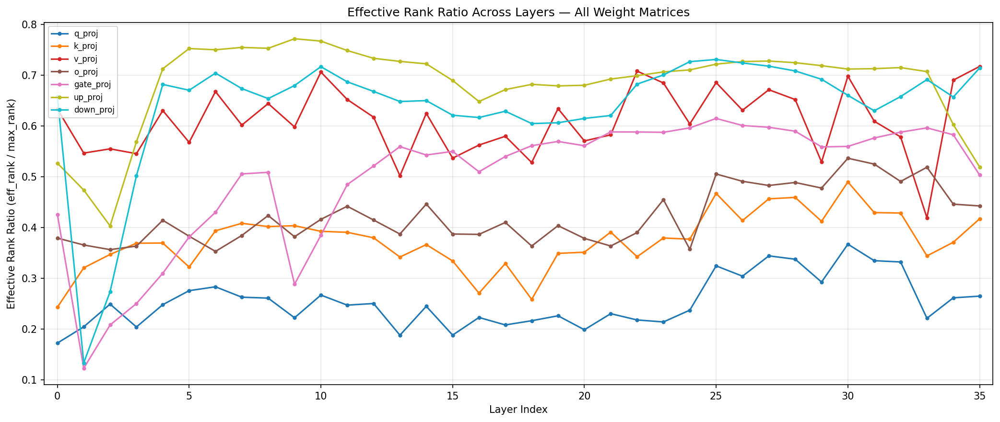

### Key Finding 1: Q/K Routing is Dramatically Lower-Rank Than V/O Value Processing

| Matrix Group | Mean Eff Rank Ratio | Interpretation |
|-------------|-------------------|----------------|
| Q/K (routing) | **0.3146** | Low-rank — "where to attend" is a simpler computation |
| V/O (value) | **0.5163** | Higher-rank — "what to extract" requires more capacity |
| Attention (all 4) | 0.4154 | |
| MLP (all 3) | **0.6070** | MLP uses the most capacity |

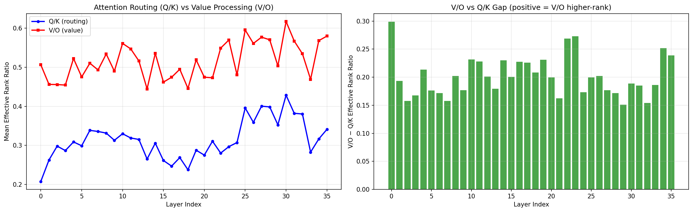

**Q/K is lower-rank than V/O in all 36 layers (36/36).** This strongly confirms that attention routing is a simpler function than value extraction. The Q/K matrices can be seen as implementing a low-dimensional "address lookup" while V/O implements a higher-dimensional "content retrieval".

**Why Q is lower-rank than K:** Q has 32 heads vs K's 8 (GQA), but Q has max rank 2560 while K has max rank 1024. Despite Q having more parameters and higher max rank, its effective rank ratio (0.25) is lower than K's (0.38). This means Q is using an even smaller fraction of its available capacity — the 32 query heads are more redundant than the 8 key heads.

### Per-Matrix Spectral Statistics

| Matrix | Eff Rank Ratio | Power-Law $\alpha$ | $R^2$ | Rank for 90% Energy |
|--------|---------------|-----------------|-----|---------------------|
| q_proj | 0.2535 | 0.616 +/- 0.051 | 0.766 | ~1240 |
| k_proj | 0.3756 | 0.548 +/- 0.058 | 0.751 | ~550 |
| v_proj | 0.6101 | 0.403 +/- 0.056 | 0.689 | ~650 |
| o_proj | 0.4225 | 0.561 +/- 0.041 | 0.719 | ~1340 |
| gate_proj | 0.4984 | 0.353 +/- 0.058 | 0.768 | ~1750 |
| up_proj | 0.6836 | 0.309 +/- 0.054 | 0.694 | ~1810 |
| down_proj | 0.6390 | 0.322 +/- 0.033 | 0.709 | ~1800 |

**Rank ordering** (most to least compressible): q_proj (0.25) < k_proj (0.38) < o_proj (0.42) < gate_proj (0.50) < v_proj (0.61) < down_proj (0.64) < up_proj (0.68)

### Key Finding 2: Power-Law Behavior With Two Regimes

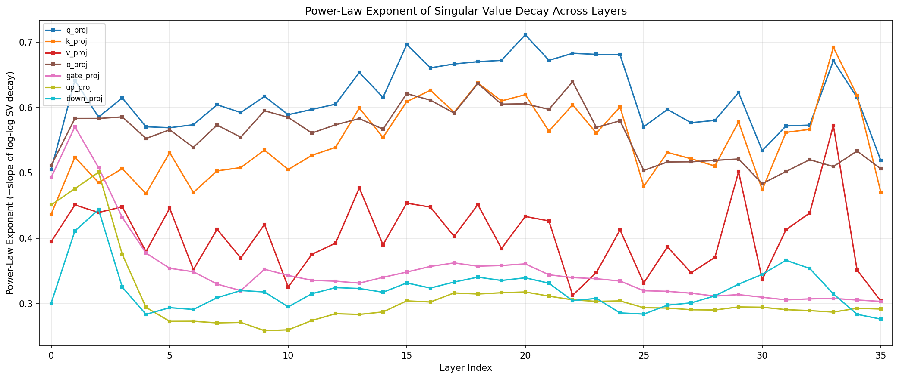

All matrices show moderate power-law decay ($\alpha = 0.3\text{--}0.7$) with $R^2 \sim 0.69\text{--}0.77$. Two distinct spectral regimes emerge:

**Regime A — Steep decay (attention routing, $\alpha \sim 0.55\text{--}0.62$):** Q, K, O projections have faster SV decay, concentrating energy in fewer dimensions. These matrices implement relatively simple linear maps (low intrinsic dimensionality). The steeper $\alpha$ means the top singular vectors capture a disproportionate share of the computation.

**Regime B — Flat decay (MLP + value, $\alpha \sim 0.31\text{--}0.40$):** V, gate, up, down projections have slower SV decay, spreading energy more uniformly. These matrices use more of their available capacity for richer transformations. The flatter $\alpha$ is closer to random-matrix behavior (MP distribution), suggesting these matrices have less "spiked" structure.

**Connection to Marchenko-Pastur:** For a random $m \times n$ matrix $W$ with i.i.d. $N(0, 1)$ entries ($m \ge n$), the expected participation ratio is $\text{PR} = mn/(m+n+1) \approx mn/(m+n)$, giving an effective rank ratio of $\text{PR}/n \approx m/(m+n) = 1/(1+\gamma)$ where $\gamma = n/m$. For our matrices:
- K/V ($1024 \times 2560$): $\gamma = 1024/2560 = 0.40$ — MP predicts eff rank ratio $\sim$ **0.71**
- Q/O ($4096 \times 2560$ or $2560 \times 4096$): $\gamma = 2560/4096 = 0.625$ — MP predicts eff rank ratio $\sim$ **0.62**
- MLP ($9728 \times 2560$ or $2560 \times 9728$): $\gamma = 2560/9728 = 0.263$ — MP predicts eff rank ratio $\sim$ **0.79**

Actual Q eff rank (0.25) is well below the MP prediction for its shape (0.62), indicating heavy learned structure/compression — the Q projection concentrates information into far fewer directions than a random matrix would. K (0.38) is also well below its MP baseline (0.71). In contrast, V (0.61) and the MLP matrices (0.50-0.68) are closer to but still below their MP baselines (0.62-0.79), indicating they use a larger fraction of their available capacity while still showing some learned structure. All weight matrices are below their random baselines, confirming that training compresses information into fewer modes everywhere — but the degree of compression varies dramatically between routing (Q/K, ~40-60% of random baseline) and content processing (V/MLP, ~77-86% of random baseline).

### Key Finding 3: Plateau vs Late Layers Are Spectrally Distinct

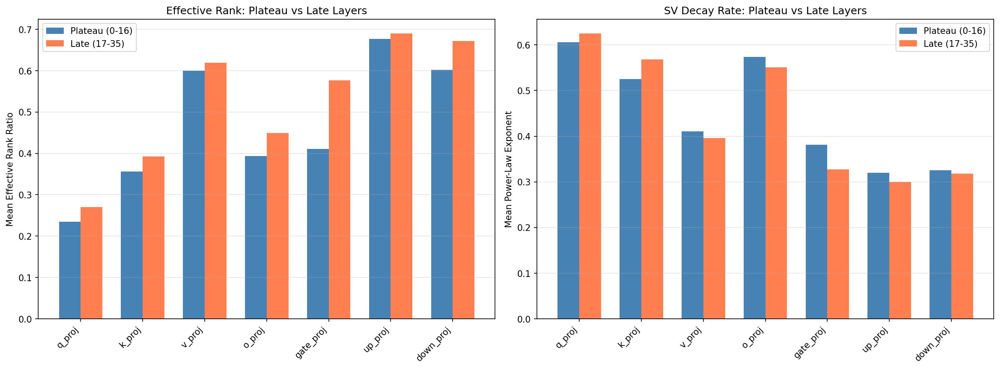

| Matrix | Plateau (0-16) | Late (17-35) | Diff | p-value | Significant? |
|--------|---------------|-------------|------|---------|-------------|
| q_proj | 0.2348 | 0.2702 | +0.0354 | 0.0270 | Yes |
| k_proj | 0.3562 | 0.3930 | +0.0368 | 0.0415 | Yes |
| v_proj | 0.5995 | 0.6196 | +0.0201 | 0.3666 | No |
| o_proj | 0.3932 | 0.4488 | +0.0555 | 0.0012 | Yes |
| gate_proj | 0.4108 | 0.5768 | +0.1660 | 0.0001 | Yes |
| up_proj | 0.6766 | 0.6899 | +0.0133 | 0.6596 | No |
| down_proj | 0.6022 | 0.6720 | +0.0698 | 0.0971 | Marginal |

**Late layers have significantly higher effective rank** for Q, K, O, and gate projections (p < 0.05 for 4 of 7 matrices). The strongest effect is in **gate_proj** (+0.17, p < 0.0001) — late-layer MLP gating uses dramatically more capacity than plateau layers.

**Interpretation:** The plateau/late distinction from the shuffle experiment's weight norms has a clear spectral counterpart. The matrices that show significant differences (Q, K, O, gate) are exactly the ones that implement "routing" and "gating" — i.e., the decision-making components. The "content" matrices (V, up) maintain consistently high rank regardless of depth. This suggests that as depth increases, the model needs more complex routing decisions but roughly similar capacity for content transformation.

### Key Finding 4: Depth Trends in Detail

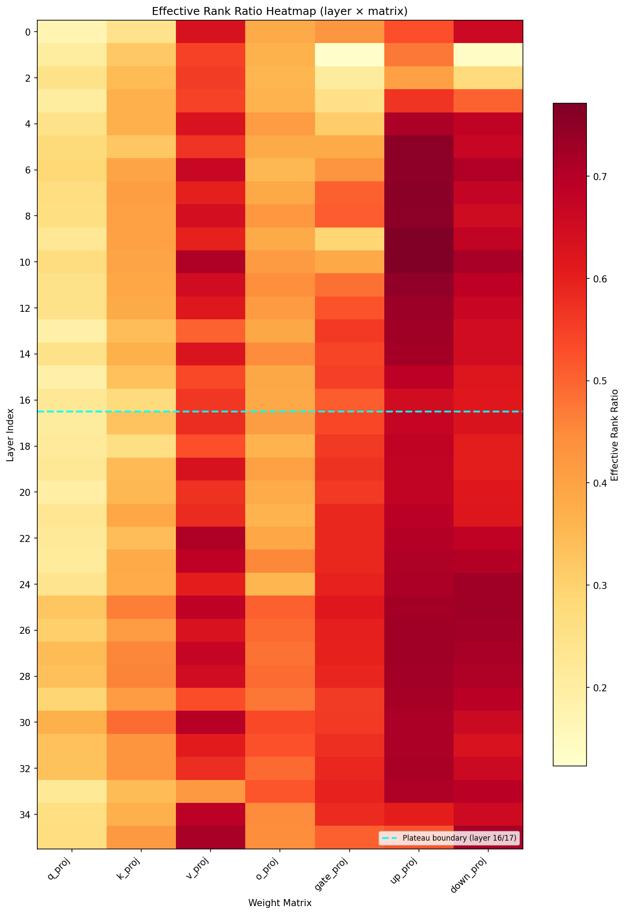

- **Q_proj effective rank jumps sharply at layer 24→25**: From 608 to 831 (+36.7% in a single layer), then stays elevated through layer 32 (peak at layer 30: 940/2560). This marks a discrete transition in attention routing complexity. The jump reverses at layer 33 (567), suggesting a specialized final-layers regime.
- **Late-layer MLP compression (layers 34-35)**: Despite the general trend of increasing rank in late layers, up_proj drops sharply in the final two layers (0.71→0.60→0.52 for layers 33-35). This unexpected reversal may reflect a specialized role of the final layers in preparing for the output projection.
- **MLP down_proj dips in layers 13-21**: Effective rank drops from ~1800 to ~1550, then recovers. This corresponds to the weight-norm plateau region.
- **Layer 1 MLP anomaly**: The entire MLP at layer 1 is degenerate — both down_proj (eff rank 341, ratio 0.13) and gate_proj (eff rank 315, ratio 0.12) are severely compressed, making them the two most compressible matrices in the model. Up_proj is also slightly lower than layer 0. Layers 2-3 show suppressed down_proj rank (700, 1285) with partial recovery. This is consistent with the "residual stream" view: layer 1 makes minimal corrections to the embedding, with its MLP operating in a nearly degenerate regime.
- **Condition number extremes**: K-projection at layer 5 has κ = 2424 (vs mean ~106), indicating near-singularity and potential numerical fragility. Gate_proj at layer 1 also has elevated κ = 466, consistent with the MLP degeneracy there.

### Spectral Entropy

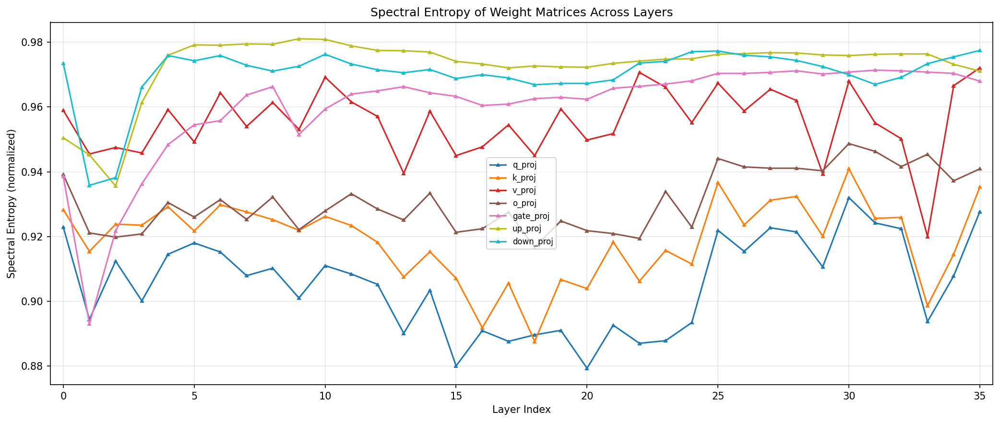

### Effective vs Stable Rank

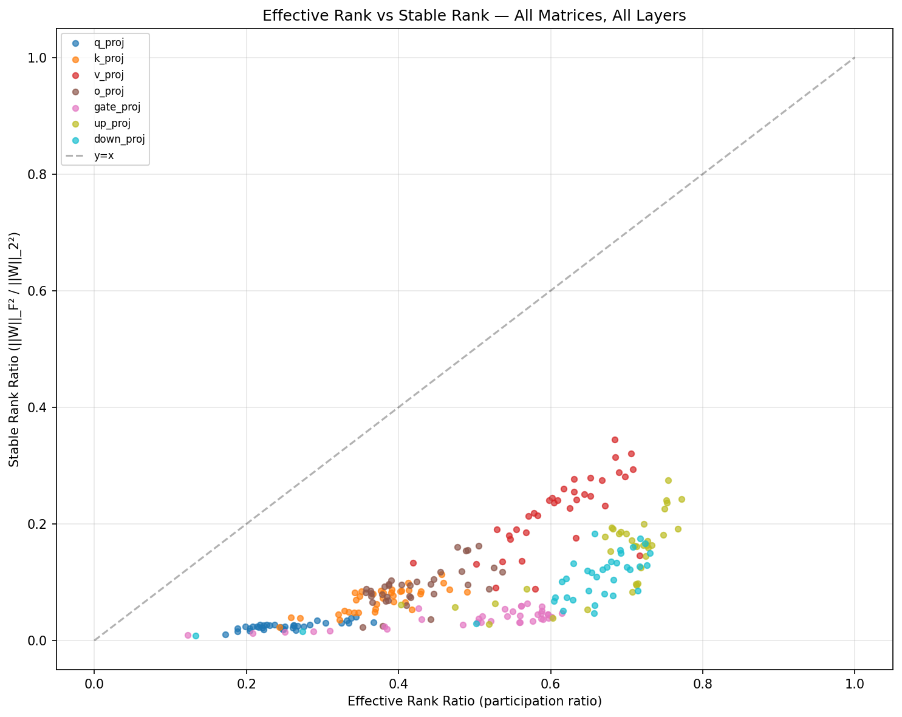

### Singular Value Spectra

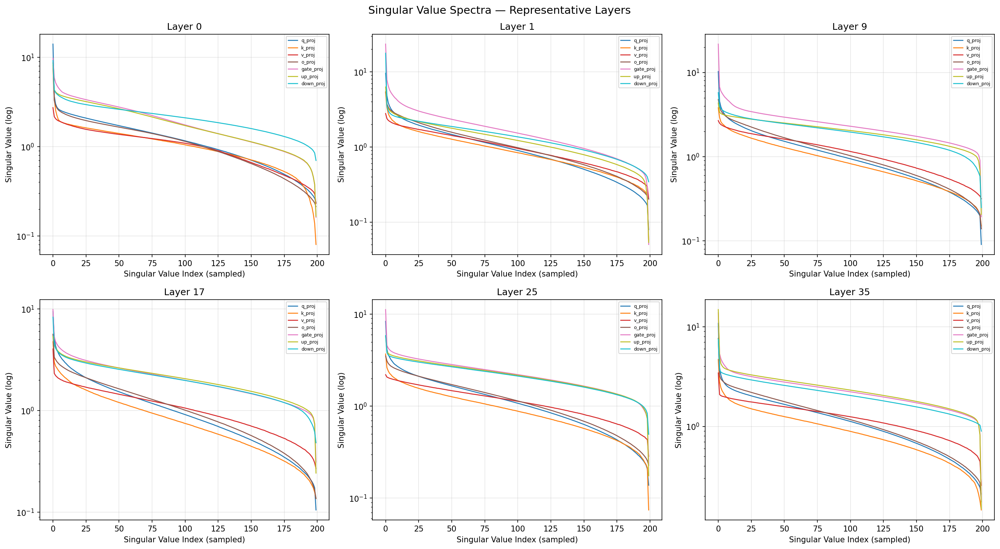

Representative spectra for layers 0, 1, 9, 17, 25, and 35 showing the decay patterns. Note the markedly different decay rates between Q/K (steep) and V/MLP (flat), and the anomalous layer 1 down_proj with its sharp spectral cutoff.

### Cumulative Energy

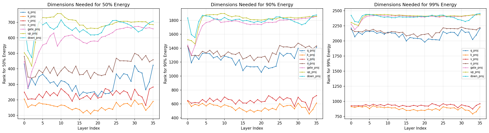

### Key Finding 5: Cross-Experiment Correlations

#### T-2 Layer Criticality (Knockout Loss Delta)

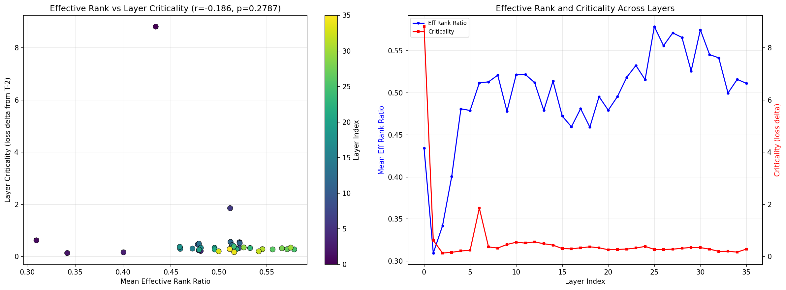

Overall correlation: **r = -0.186, p = 0.28** (not significant). However, per-matrix analysis reveals a significant relationship for **k_proj** (r = -0.401, p = 0.015): layers with lower K-projection rank tend to be more critical when knocked out. This is counterintuitive — it suggests that layers where routing is most constrained (low-rank K) are also the hardest to remove, possibly because they implement highly specific, non-redundant attention patterns.

| Matrix | r | p |
|--------|------|------|
| k_proj | **-0.401** | **0.015** |
| q_proj | -0.273 | 0.107 |
| up_proj | -0.270 | 0.111 |
| o_proj | -0.186 | 0.277 |
| gate_proj | -0.128 | 0.457 |
| v_proj | 0.091 | 0.599 |
| down_proj | 0.036 | 0.833 |

**Interpretation:** The negative correlation for K suggests a "specialization-criticality tradeoff": layers that compress their key space into fewer dimensions are performing more unique computations that cannot be compensated by other layers. Conversely, layers with high K-rank (many attention patterns) are more redundant and easier to remove.

**Update from T-7 Method 7 (Layer Replacement):** T-2's linear surrogate experiment adds another dimension: low-rank replacements (rank 64, 256) substantially underperform full-rank — even for layers whose full-rank linear replacement works well (early layers 0-3 and late layers 32-33, 35 at 87-99% recovery; layer 34 is a notable exception at -45%). Rank-256 achieves partial recovery for a few layers (up to ~77% for layers 0, 2, 6) but falls far short of full-rank replacement everywhere. This confirms that despite low Q/K effective rank ratios, the *aggregate* layer computation requires near-full rank to approximate linearly. The low effective rank of individual matrices (especially Q at 0.25) does not translate to a low-rank layer-level computation because the composition of attention routing + value extraction + MLP involves interactions across all dimensions.

#### T-7 Linearization Gap

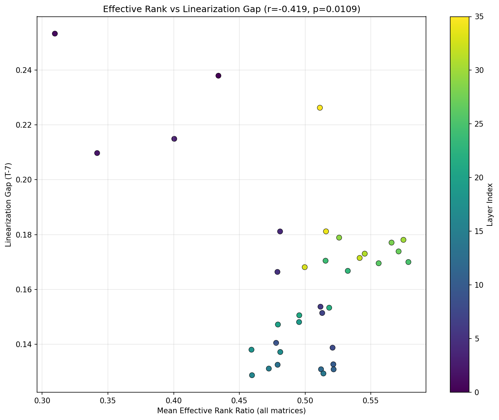

Correlation: **r = -0.43, p = 0.009** (significant). Higher effective rank associates with *lower* linearization gap (more linear behavior).

**Why this is surprising:** Naively, high-rank = more complex computation = more nonlinear. But the data suggests the opposite. The explanation lies in how nonlinearity interacts with dimensionality:

- **Low-rank layers** concentrate their computation in fewer dimensions. Within those dimensions, the nonlinear activations (softmax, SiLU) have stronger relative effect — a few dimensions doing nonlinear work dominate the signal.
- **High-rank layers** spread computation across many dimensions. Each dimension contributes a small perturbation, and by the law of large numbers, the sum of many small nonlinear contributions approximates a linear map. This is related to the "self-averaging" property in high-dimensional statistics.

Formally, if a layer applies $n$ independent nonlinear channels with gain $\epsilon$ each, the aggregate nonlinearity scales as $O(1/\sqrt{n})$ by CLT-type averaging, while the aggregate linear part scales as $O(1)$. So higher $n$ (rank) means more linear aggregate behavior.

**Critical refinement — the correlation is MLP-driven, not attention:** Per-matrix analysis reveals that the rank-linearity relationship is entirely concentrated in MLP matrices: up_proj (r = -0.74, p < 0.001), down_proj (r = -0.49, p = 0.003), gate_proj (r = -0.48, p = 0.003). All four attention projections (Q, K, V, O) show r ≈ 0 with the linearization gap. This means the self-averaging explanation applies specifically to the SwiGLU MLP, not to softmax attention — nonlinearity at the layer level is primarily determined by the MLP's spectral structure.

#### T-4 Representation Geometry

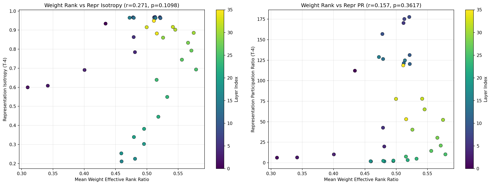

- Weight rank vs representation isotropy: r = 0.271, p = 0.11 (not significant)
- Weight rank vs representation participation ratio: r = 0.157, p = 0.36 (not significant)

Weight spectral structure does not significantly predict representation geometry. This makes sense: the residual stream at layer l is the sum of contributions from all layers 0 through l-1. Each layer's weight spectrum constrains what that layer can contribute, but the accumulated representation depends on the composition of all upstream transformations plus the input data distribution. Local weight structure is necessary but not sufficient to determine global representation geometry.

## Conclusions & Key Findings

1. **Routing is simpler than extraction**: Q/K matrices are consistently lower-rank than V/O across all 36 layers (0/36 exceptions). "Where to attend" is a lower-dimensional computation than "what to extract." All matrices are below their Marchenko-Pastur baselines, but Q/K are compressed to ~40-60% of random-matrix levels while V/MLP retain ~77-86%, indicating routing undergoes far more learned compression.

2. **MLP uses the most capacity**: MLP matrices have the highest effective rank ratios (0.50-0.68), closest to their MP baselines (~0.79), suggesting they retain the most capacity for complex per-token transformations. The MLP is where the model "does the work."

3. **Late layers are spectrally distinct from plateau layers**: Q, K, O, and gate projections all have significantly higher effective rank in layers 17-35 vs 0-16 (p < 0.05 for 4/7 matrices). The gate_proj effect is strongest (+0.17, p < 0.0001). Routing complexity increases with depth while content processing stays constant.

4. **Moderate power-law decay in two regimes**: Attention routing matrices ($\alpha \sim 0.55\text{--}0.62$) decay faster than MLP/value matrices ($\alpha \sim 0.31\text{--}0.40$). $R^2 \sim 0.7$ indicates approximate but not perfect power-law behavior — the true distribution is likely MP-bulk + spiked outliers.

5. **K-projection rank anticorrelates with layer criticality**: Layers with lower K-rank are harder to knock out (r = -0.40, p = 0.015). Constrained routing creates specialized, non-redundant computations.

6. **High-rank layers are more linear — and the effect is MLP-specific**: Weight effective rank anticorrelates with T-7 linearization gap (r = -0.43, p = 0.009), but the relationship decomposes entirely into MLP matrices (up: r = -0.74, down: r = -0.49, gate: r = -0.48) while all attention projections show r ≈ 0. High-rank MLP layers spread computation across many dimensions where self-averaging makes the aggregate more linear (CLT-type effect). Layer-level nonlinearity is primarily determined by MLP spectral structure.

7. **Layer 1 MLP anomaly**: The entire layer 1 MLP is degenerate — both down_proj (eff rank 341) and gate_proj (315) are severely compressed, with the two lowest effective rank ratios in the model (0.13 and 0.12 respectively).

8. **Stable rank reveals extreme energy concentration**: Stable rank is only 7-36% of effective rank across all matrices, with gate_proj being the most extreme (mean ratio 7.5%). This means energy is heavily concentrated in the top singular value — gate_proj is especially "spiked" (one dominant mode). For practical rank selection (LoRA, factorization), stable rank provides a more conservative and arguably realistic target than effective rank.

## Practical Implications

### Compression & LoRA

**1. LoRA-friendliness ranking** (most to least compressible):
1. **q_proj (0.25)** — Best LoRA target, uses only 25% of capacity
2. **k_proj (0.38)** — Second-best, routing is inherently low-rank
3. **o_proj (0.42)** — Output projection moderately compressible
4. **gate_proj (0.50)** — MLP gating at 50%; note late layers need more rank (0.58 vs 0.41)
5. **v_proj (0.61)** — Value extraction needs more rank
6. **down_proj (0.64)** — MLP down-projection high-rank
7. **up_proj (0.68)** — Least compressible, needs most capacity

**Quantitative LoRA rank guidance:** The rank needed for 90% energy capture varies by matrix type. For q_proj: $r_{90} \sim 1240$ (out of max rank 2560). For up_proj: $r_{90} \sim 1810$. Standard LoRA uses ranks 4-64, which is far below even q_proj's $r_{90}$ — this works because LoRA only needs to capture the *task-specific delta*, not the full pre-trained weight.

**Stable rank provides a more conservative bound:** Stable rank ratios are dramatically lower than effective rank ratios (7-36% of effective rank), with gate_proj most extreme (stable rank only 7.5% of effective rank, i.e., ~0.038 ratio vs 0.50 effective rank ratio). This means energy is heavily concentrated in the top singular value. For rank selection based on actual energy distribution rather than participation ratio, stable rank suggests much smaller ranks may suffice: gate_proj stable rank ≈ 97 (vs effective rank 1276).

**2. Layer-adaptive LoRA.** The plateau/late spectral split directly informs non-uniform rank allocation:

| Component | Plateau (0-16) | Late (17-35) | Rationale |
|-----------|---------------|-------------|-----------|
| Q, K | rank 8-16 | rank 16-32 | Lowest eff rank; late routing more complex |
| gate_proj | rank 16-32 | rank 32-64 | Largest plateau/late gap (+0.17, p<0.0001) |
| V, up, down | rank 32-64 | rank 32-64 | High rank everywhere; keep uniform |

Uniform-rank LoRA wastes parameters on redundant plateau layers and under-fits complex late layers.

### Static Factorization

**3. Low-rank factorization of Q/K.** Q uses only 25% and K only 38% of effective rank — the most compressible matrices. Factoring $W_q = AB$ with rank $r \sim 1240$ (vs 2560) captures 90% of energy; for K, $r \sim 550$ captures 90% (vs max rank 1024). This is a static SVD-based decomposition applicable directly at inference with no retraining.

**4. Multi-head pruning via Q-redundancy.** 32 query heads with only 25% effective rank means heavy redundancy. Plateau layers (Q eff rank ratio 0.23) are the best pruning targets — fewer heads with minimal impact on output quality.

### Pruning Guidance

**5. K-rank as a pruning signal.** Layers with high K-rank are more redundant and safer to remove (see conclusion #5). This aligns with T-7: redundant, linear, and non-critical layers are the same layers. Note from T-7 Method 7: while these layers can be *removed* (low knockout damage), they cannot be cheaply *replaced* by a low-rank linear map — the full layer computation requires near-full rank even though individual K/Q matrices are low-rank. Pruning (full removal) is viable; low-rank factored replacement is not.

**6. Do not compress layers 0, 33-35.** These carry load-bearing nonlinear computation (see conclusions #7, Key Finding 4). Additionally, layers 34-35 show unexpected up_proj rank compression (0.60→0.52 vs ~0.68 average), suggesting specialized output-preparation computation. K-proj at layer 5 has κ = 2424 (vs mean ~106) — compression there risks amplifying numerical instability.

### Architectural Insights

**7. Asymmetric latent attention (Tri-latent MLA).** DeepSeek-V2/V3's MLA uses a shared KV latent ($d_c = 512$). Our spectral data shows K and V have very different effective ranks (0.38 vs 0.61), motivating *separate* latent spaces sized by measured rank:
| Latent | Dimension | Fraction of Hidden |
|--------|-----------|-------------------|
| $c_q$ | ~640 | 25% |
| $c_k$ | ~970 | 38% |
| $c_v$ | ~1560 | 61% |
Depth-varying: the Q-rank jump at layer 24→25 (see Key Finding 4) motivates widening late-layer Q latent accordingly.

**8. Shared-Q blocks for plateau layers.** Plateau Q eff rank ratio is just 0.23 — the lowest anywhere. Adjacent plateau layers' Q projections are largely the same linear map. Groups of 2-3 layers can share a single Q projection with per-layer low-rank residuals (rank 16-32), saving ~66% of Q parameters in plateau blocks.

### Convergent Evidence

- **T-7 (Linearization Gap)**: Plateau layers are both low-rank and near-linear, making them doubly suitable for compression (see cross-reference above)
- **T-2 (Layer Knockout)**: Low K-rank predicts high criticality (see cross-reference above); plateau layers have low criticality overall. T-7 Method 7 shows that per-matrix low effective rank (Q at 0.25, K at 0.38) does not enable low-rank layer replacement — the layer's aggregate computation requires near-full rank even when individual components are compressible
- **T-3 (Layer Swap Cost)**: Adjacent plateau layers have cheap swap costs, consistent with low Q-rank making them interchangeable

## Usage

```bash
poetry run python experiments/t9_weight_spectral_structure/run.py
```

No prerequisites needed — analysis works directly on model weights without calibration data. Cross-references T-2, T-4, and T-7 results if available. Takes ~80 seconds on B200.

Results in `experiments/t9_weight_spectral_structure/results/`:

**Core plots:**
- `effective_rank_ratio_all.png` — Effective rank ratio across layers for all 7 matrices
- `power_law_exponent_all.png` — Power-law exponent across layers
- `qk_vs_vo_comparison.png` — Direct Q/K vs V/O comparison with difference bars
- `cumulative_energy_ranks.png` — Dimensions needed for 50/90/99% energy
- `spectral_entropy_all.png` — Spectral entropy across layers

**Expanded analysis:**
- `heatmap_effective_rank.png` — Layer x matrix heatmap with plateau boundary marked
- `sv_spectra_representative.png` — Full SV decay curves for 6 representative layers
- `effective_vs_stable_rank.png` — Effective rank vs stable rank scatter
- `plateau_vs_late_comparison.png` — Grouped bar chart comparing plateau vs late layers
- `crossref_t2_criticality.png` — Effective rank vs T-2 knockout criticality
- `crossref_t7_linearization.png` — Effective rank vs T-7 linearization gap
- `crossref_t4_geometry.png` — Weight rank vs representation isotropy and participation ratio
